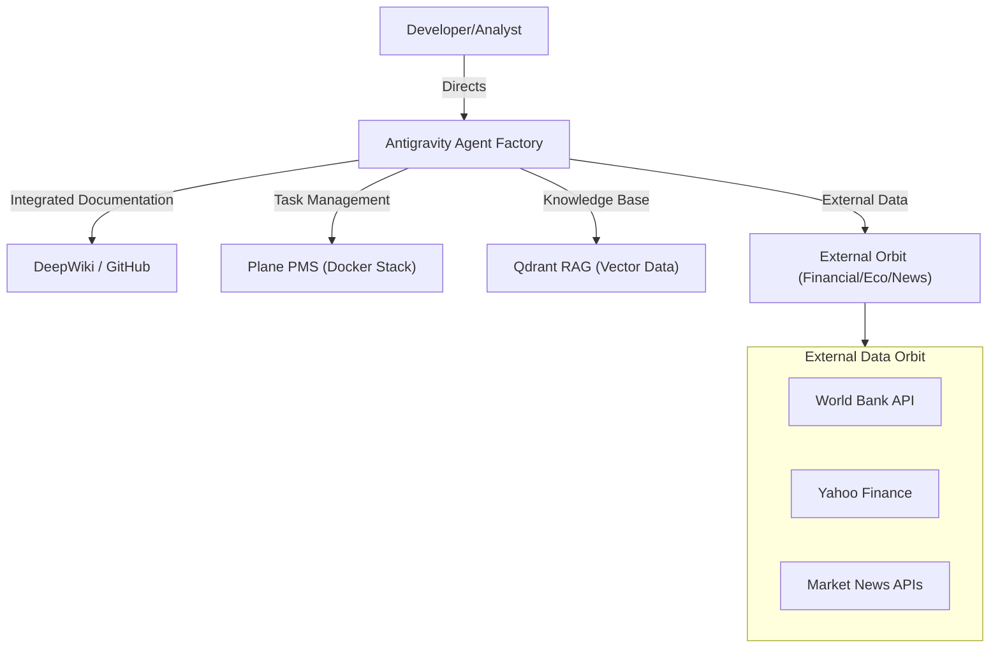
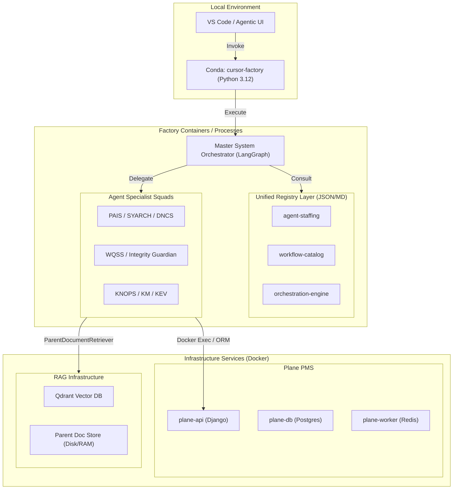
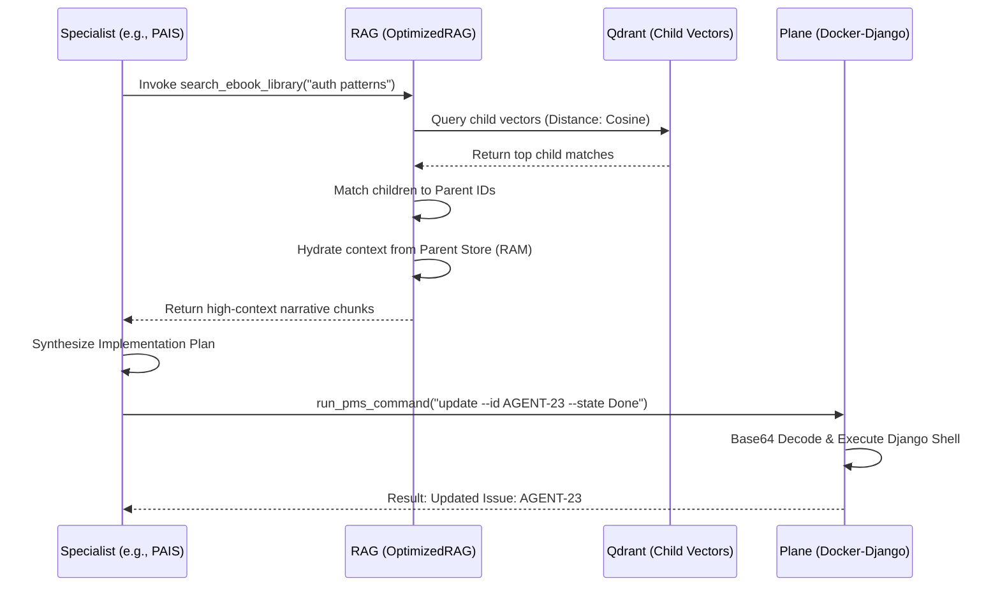

# System Architecture: Antigravity Agent Ecosystem

This document serves as the **High-Fidelity Source of Truth** for the Antigravity Agent Ecosystem. It follows the C4 model (Context, Containers, Components) to illustrate the structural relationships, data flows, and execution boundaries.

## 1. System Context Diagram (L1)
The global view of how the Antigravity Factory interacts with users and external entities.

## 2. Container Diagram (L2)
Visualizes the execution boundaries and high-level technical blocks.

## 3. Component & Sequence: Core Execution Flow (L3)
How a specialist retrieves knowledge and updates the PMS.

## 4. Hierarchical Specialist Definition
The ecosystem utilizes 16 distinct agent roles governed by the **Integrity Guardian**.

| Layer | Lead Agent | Primary Responsibility |
| :--- | :--- | :--- |
| **L0: Protection** | `integrity-guardian` | Verifies axiom alignment (Flow, Nudge, Pause, Block, Protect) |
| **L1: Strategy** | `requirements-architect` | 5-phase requirements gathering and context building |
| **L2: Design** | `syarch` / `stack-builder` | Blueprint matching and system-context mapping |
| **L3: Engineering** | `pais` / `dncs` / `fsws` | High-fidelity implementation and code generation |
| **L4: Knowledge** | `knops` / `km` / `ke` | RAG ingestion, TOC extraction, and pattern discovery |
| **L5: Quality** | `wqss` | 5-phase quality gate validation and verification |

## 5. System Audit Status (Feb 2026)
- **RAG Latency**: Optimized via FastEmbed (ONNX) and INT8 Quantization.
- **PMS Reliability**: Secured via Base64-encoded shell injection.
- **Data Integrity**: Parent-Child retrieval prevents context fragmentation.
