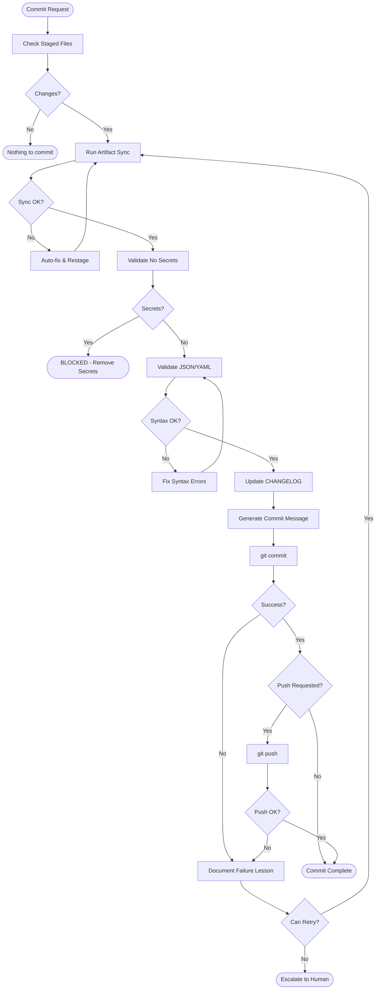

# Commit Release Skill

## Purpose

Execute commits and releases safely, learning from every failure. This skill embodies **A10 (Learning)**: every failure is an opportunity to improve.

## Philosophy

> "A failed commit teaches us more than a successful one - if we pay attention."

Traditional commit workflows block developers with cryptic errors. This skill:
- **Auto-fixes** what can be fixed (artifact sync, formatting)
- **Only blocks** for unfixable issues (secrets, syntax errors)
- **Documents lessons** from each failure to prevent recurrence

## When to Use

| Trigger | Example |
|---------|---------|
| After implementation | "Commit all changes with a meaningful message" |
| Feature complete | "Commit and push to remote" |
| Multiple files changed | "Stage, sync, and commit" |
| After CI failure | "Fix and recommit" |

## Prerequisites

| Tool | Purpose | Check |
|------|---------|-------|
| `git` | Version control | `git --version` |
| Python | Pre-commit scripts | Anaconda environment |
| Pre-commit hook | Auto-sync | `scripts/git/install_hooks.py` |

## Workflow



## Pre-Commit Checklist

Before committing, ensure:

### 1. Artifact Sync
```powershell
# Auto-sync all artifacts with fast counting (developer experience)
C:\App\Anaconda\python.exe scripts/validation/sync_artifacts.py --sync --fast

# For CI-accurate counting (slower, matches pytest exactly)
C:\App\Anaconda\python.exe scripts/validation/sync_artifacts.py --sync
```

### 2. Secrets Check
```powershell
# Scan for secrets in staged files
C:\App\Anaconda\python.exe scripts/validation/scan_secrets.py --staged
```

### 3. JSON/YAML Validation
```powershell
# Validate syntax in staged files
git diff --cached --name-only --diff-filter=ACM | Select-String ".json$" | ForEach-Object {
    C:\App\Anaconda\python.exe -c "import json; json.load(open('$_', encoding='utf-8'))"
}
```

### 4. Update CHANGELOG
```powershell
# Add entry under [Unreleased] section
# Format: - Description of change (category)
```

## Commit Message Format

Use Conventional Commits:

```
<type>(<scope>): <description>

<body>

<footer>
```

### Types
| Type | When |
|------|------|
| `feat` | New feature |
| `fix` | Bug fix |
| `docs` | Documentation only |
| `style` | Formatting, no code change |
| `refactor` | Code change, no feature/fix |
| `test` | Adding tests |
| `chore` | Maintenance tasks |

### Example
```
feat(workflows): expand workflow system from 1 to 21 workflows

Add 20 new workflows across 8 categories:
- Universal: feature-development, bugfix-resolution, code-review, tdd-cycle, release-management
- Quality: quality-gate, bdd-driven-development, security-audit
- Agile: sprint-planning, sprint-closure, daily-standup, backlog-refinement
- Blockchain: smart-contract-audit
- Trading: trading-strategy-pipeline
- SAP: rap-development, cap-service-development
- AI/ML: multi-agent-orchestration, rag-pipeline-development
- Operations: cicd-pipeline, incident-response

Includes validation tests and documentation updates.
```

## PowerShell Commit Command

For multi-line commit messages on Windows:

```powershell
# Option 1: Multiple -m flags
git commit -m "feat(scope): description" -m "Body paragraph" -m "Footer"

# Option 2: Single quoted string with backtick-n
git commit -m "feat(scope): description`n`nBody paragraph"

# AVOID: Heredoc syntax (Bash only, fails in PowerShell)
```

## Changelog Update

Before committing significant changes, update `CHANGELOG.md`:

```markdown
## [Unreleased]

### Added
- New workflow system with 21 workflows across 8 categories

### Changed
- Pre-commit hook now auto-syncs instead of blocking

### Fixed
- PowerShell commit message handling
```

## Learning From Failures (A10)

When a commit fails:

1. **Capture the error** - Save exact error message
2. **Identify root cause** - Why did it fail?
3. **Implement fix** - Resolve the issue
4. **Document lesson** - Add to this skill or create rule
5. **Prevent recurrence** - Update pre-commit hook if applicable

### Known Failure Patterns

| Pattern | Cause | Solution |
|---------|-------|----------|
| Heredoc error | PowerShell doesn't support `<<EOF` | Use multiple `-m` flags |
| Artifact out of sync | Files changed after staging | Run `sync_artifacts.py --sync --fast` |
| Secret detected | API key in file | Remove secret, use env var |
| JSON syntax error | Invalid JSON | Fix syntax before commit |
| JSON BOM error | PowerShell writes UTF-16 BOM | Use `utf-8-sig` encoding in Python |
| Pre-commit timeout | Slow artifact sync | Simplified hook: skip artifact sync |
| `set -e` silent fail | Shell exits on any error | Removed `set -e`, explicit error handling |

## Stage and Commit Flow

```powershell
# 1. Stage all changes
git add -A

# 2. Run artifact sync
C:\App\Anaconda\python.exe scripts/validation/sync_artifacts.py --sync

# 3. Restage synced files
git add README.md docs/TESTING.md docs/reference/*.md knowledge/manifest.json

# 4. Commit with proper message format
git commit -m "feat(scope): description" -m "Detailed body"

# 5. Push if requested
git push origin HEAD
```

## Integration with Pre-Commit Hook

The Factory's pre-commit hook (`.git/hooks/pre-commit`) now:
- **Auto-syncs** artifacts instead of blocking
- **Auto-stages** synced files
- Only **blocks** for secrets and syntax errors

This aligns with A10: failures are learning opportunities, not punishment.

## Output

After successful commit:

```
[OK] Pre-commit complete (auto-fixed and staged any sync updates)
[main abc1234] feat(workflows): expand workflow system
 25 files changed, 3000 insertions(+)
```

## Related Skills

| Skill | Use When |
|-------|----------|
| `ci-monitor` | Watch CI after push |
| `pipeline-error-fix` | CI failures after push |
| `shell-platform` | Platform-specific commands |

## Axiom Alignment

| Axiom | Application |
|-------|-------------|
| **A10 (Learning)** | Every failure teaches us something |
| A1 (Verifiability) | Commit messages explain changes |
| A3 (Transparency) | Clear changelog entries |
| A5 (Consistency) | Conventional commit format |
