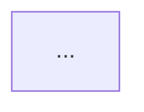

# Agent Generation

Agent definition file generation with mandatory schema validation against schemas/agent.schema.json

Generates agent definition files that are **schema-compliant by construction**. Every generated agent MUST pass `schemas/agent.schema.json` validation before being written to disk.

## Canonical Schema Reference (schemas/agent.schema.json)

**CRITICAL**: Every agent MUST comply with this schema. Memorize these constraints:

### Required Frontmatter Fields

| Field | Type | Constraints |
|-------|------|-------------|
| `name` | string | Pattern: `^[a-z0-9-]+$`, min 3 chars, must match filename without `.md` |
| `description` | string | Min 20 chars |
| `type` | const | Must be `"agent"` |
| `version` | string | Semantic version: `^\\d+\\.\\d+\\.\\d+$` (e.g. `1.0.0`) |
| `domain` | enum | **ONLY**: `ai-ml`, `development`, `testing`, `review`, `documentation`, `debugging`, `deployment`, `analysis`, `orchestration`, `trading`, `sap`, `dotnet`, `java`, `web`, `devops`, `onboarding`, `factory` |
| `skills` | array | Min 2 items, each matching `^[a-z0-9-]+(/[a-z0-9-]+)*$` |
| `knowledge` | array | Min 2 items, each matching `^[a-z0-9-]+\\.json$` (NO path prefixes like `schemas/`) |
| `tools` | array | Min 1 item (use `["none"]` if no tools) |
| `workflows` | array | Min 1 item (use `["none"]` if no workflows) |
| `blueprints` | array | Min 1 item (use `["none"]` if no blueprints) |

### Optional Fields

| Field | Type | Description |
|-------|------|-------------|
| `mcp_servers` | array of strings | MCP servers this agent uses |
| `agent_team` | array of strings | Other agents this agent coordinates with |

### Domain Mapping Guide

Use this mapping when the natural domain doesn't match an allowed value:

| Natural Domain | Use Instead |
|---------------|-------------|
| data-science | `analysis` |
| security | `testing` |
| integration | `orchestration` |
| general | `development` (for coders), `documentation` (for writers), `deployment` (for infra) |
| meta | `factory` |

## Process

1. Review the task requirements.
2. Apply the skill's methodology.
3. Validate the output against the defined criteria.
### Step 1: Load Agent Pattern
For each requested agent:
1. Load pattern from `{directories.patterns}/agents/{agent-id}.json`
2. Parse metadata, frontmatter, and sections
3. Identify customization points

### Step 2: Validate Against Schema BEFORE Writing

**CRITICAL VALIDATION CHECKLIST** - verify each constraint:

```
[ ] name: lowercase kebab-case, >= 3 chars, matches filename
[ ] description: >= 20 characters
[ ] type: exactly "agent"
[ ] version: semantic version format (e.g. "1.0.0")
[ ] domain: is in the allowed enum list above
[ ] skills: array with >= 2 items, each lowercase kebab-case
[ ] knowledge: array with >= 2 items, each "name.json" format (no paths)
[ ] tools: array with >= 1 item (use ["none"] for no tools)
[ ] workflows: array with >= 1 item (use ["none"] for no workflows)
[ ] blueprints: array with >= 1 item (use ["none"] for no blueprints)
```

### Step 3: Render Markdown

```markdown
---
name: {name}
description: {description}
type: agent
version: 1.0.0
domain: {domain from allowed enum}
skills: [{skill-1}, {skill-2}, ...]
knowledge: [{file-1}.json, {file-2}.json, ...]
tools: [{tool-1}, ...]
workflows: [{workflow-1} or "none"]
blueprints: [{blueprint-1} or "none"]
---

# {Title} Agent

## Purpose

{purpose}

## Philosophy

> "{philosophy quote}"

## When Activated

| Trigger Phrase | Context |
|---------------|---------|
| ... | ... |

## Skills Used

| Skill | Purpose |
|-------|---------|
| ... | ... |

## Workflow Diagram



## Knowledge Used

| Knowledge File | Content |
|---------------|---------|
| ... | ... |

## Collaboration

| Agent | Interaction |
|-------|------------|
| ... | ... |

## Important Rules

1. ...
```

### Step 4: Write File
Write to target location:
- Path: `{TARGET}/{directories.agents}/{name}.md`
- Encoding: UTF-8

### Step 5: Post-Creation Sync (Factory Only)

**CRITICAL:** After creating agents in the Cursor Agent Factory, run the repo-sync:

```powershell
{PYTHON_PATH} {directories.scripts}/validation/schema_validator.py --summary
{PYTHON_PATH} {directories.scripts}/validation/validate_readme_structure.py --update
{PYTHON_PATH} {directories.scripts}/build_knowledge_crossref.py
```

## Common Schema Violations and Fixes

| Error | Cause | Fix |
|-------|-------|-----|
| `domain: 'X' is not one of [...]` | Invalid domain value | Use mapping guide above |
| `blueprints: [] should be non-empty` | Empty array | Change to `["none"]` |
| `knowledge.N does not match pattern` | Path prefix in ref | Remove `schemas/` prefix |
| `skills: should have at least 2 items` | Too few skills | Add related skills |

## Important Rules

1. **ALWAYS validate against schema BEFORE writing** - Never create an agent without checking all required fields
2. **Use `{directories.XXX}` path variables** - NEVER hardcode directory paths
3. **Lowercase kebab-case filenames** - All files use `my-agent.md` format
4. **Knowledge refs are basename only** - Use `file.json` not `schemas/file.json`
5. **Empty arrays forbidden** - Use `["none"]` instead of `[]` for tools/workflows/blueprints
6. **Run schema_validator.py after creation** - Catch any remaining issues
7. **Update knowledge-cross-reference.json** - Run build_knowledge_crossref.py after adding agents
8. **Update README counts** - Run validate_readme_structure.py after adding agents

## References

- `schemas/agent.schema.json` - Canonical schema (source of truth)
- `{directories.knowledge}/knowledge-cross-reference.json` - Knowledge mapping
- `{directories.knowledge}/agent-taxonomy.json` - Agent classification
- `{directories.scripts}/validation/schema_validator.py` - Validation script
- `{directories.scripts}/build_knowledge_crossref.py` - Cross-reference builder

## When to Use
This skill should be used when strict adherence to the defined process is required.

## Prerequisites
- Basic understanding of the agent factory context.
- Access to the necessary tools and resources.

## Best Practices
- Always follow the established guidelines.
- Document any deviations or exceptions.
- Regularly review and update the skill documentation.
