# CI Monitor Skill

## Purpose

Continuously monitor CI/CD pipeline status and automatically detect, analyze, and fix errors. This skill implements a **watch-detect-fix loop** that runs until the pipeline is green.

## Philosophy

> "A watched pipeline never fails... and if it does, we fix it immediately."

Traditional debugging is reactive - wait for failure, then investigate. This skill is **proactive** - continuously monitoring and fixing as issues appear.

## When to Use

| Trigger | Example |
|---------|---------|
| After push | "Watch the pipeline until it's green" |
| CI failure | "Fix the pipeline and keep trying until green" |
| Deployment | "Monitor the deployment pipeline" |
| Background | "Watch CI in background, alert on failure" |

## Prerequisites

### Required Tools

| Tool | Purpose | Installation |
|------|---------|--------------|
| `gh` CLI | GitHub Actions access | `winget install GitHub.cli` |
| `git` | Local repository access | Pre-installed |
| Python | Script execution | Anaconda environment |
| `ruff` | Linting | `pip install ruff` |

### Authentication

```bash
# GitHub CLI authentication (one-time setup)
gh auth login
# Choose: GitHub.com → HTTPS → Authenticate with browser
```

## Workflow

```mermaid
flowchart TD
    Start([Start Monitoring]) --> CheckStatus[Check CI Status]
    CheckStatus --> IsComplete{Run Complete?}
    
    IsComplete -->|No| Wait[Wait 30s]
    Wait --> CheckStatus
    
    IsComplete -->|Yes| IsSuccess{Success?}
    
    IsSuccess -->|Yes| Complete([Pipeline Green ✅])
    IsSuccess -->|No| FetchLogs[Fetch Error Logs]
    
    FetchLogs --> ParseErrors[Parse All Errors]
    ParseErrors --> Categorize[Categorize Errors]
    
    Categorize --> FixLoop[For Each Error]
    FixLoop --> Analyze[Analyze Root Cause]
    Analyze --> Fix[Implement Fix]
    Fix --> MoreErrors{More Errors?}
    
    MoreErrors -->|Yes| FixLoop
    MoreErrors -->|No| LocalTest[Run Local Tests]
    
    LocalTest --> TestPass{Tests Pass?}
    TestPass -->|No| FixLoop
    TestPass -->|Yes| Commit[Commit & Push]
    
    Commit --> CheckStatus
```



## Execution Steps

### Step 1: Initialize Monitoring

```bash
# Check GitHub CLI is authenticated
gh auth status

# Get latest CI run
gh run list --repo {owner}/{repo} --limit 1
```

### Step 2: Wait for Completion

```bash
# Poll until complete (30-second intervals)
while true; do
    status=$(gh run list --limit 1 --json status --jq '.[0].status')
    if [ "$status" = "completed" ]; then break; fi
    sleep 30
done
```

### Step 3: Check Result

```bash
# Get conclusion
conclusion=$(gh run list --limit 1 --json conclusion --jq '.[0].conclusion')
if [ "$conclusion" = "success" ]; then
    echo "Pipeline green!"
    exit 0
fi
```

### Step 4: Fetch Error Logs

```bash
# Get run ID and fetch failed job logs
runId=$(gh run list --limit 1 --json databaseId --jq '.[0].databaseId')
gh run view $runId --log-failed 2>&1 | \
    grep -E "ERROR|FAILED|AssertionError|error:" > errors.txt
```

### Step 5: Parse and Categorize Errors

| Error Type | Pattern | Category |
|------------|---------|----------|
| Linter | `F401`, `F541`, `F821` | code_quality |
| Test Failure | `AssertionError`, `FAILED` | test_failure |
| Import Error | `ImportError`, `ModuleNotFoundError` | dependency |
| Syntax Error | `SyntaxError` | syntax |
| Sync Drift | `Out of sync` | documentation |
| Dependency Graph | `Broken references` | architecture |

### Step 6: Fix Each Error

For each error category, apply targeted fix:

#### Code Quality (Linter)
```bash
ruff check --fix .
git add -A
```

#### Test Failure
- Analyze test and code under test
- Identify root cause
- Implement minimal fix

#### Sync Drift
```bash
python scripts/validation/sync_artifacts.py --sync
git add README.md docs/TESTING.md docs/reference/*.md knowledge/manifest.json
```

#### Dependency Graph
- Check manifest.json for missing entries
- Verify skill/agent references exist
- Add missing dependencies

### Step 7: Local Verification

```bash
# Run fast tests locally
pytest tests/unit tests/validation -x --tb=short

# Run linter
ruff check .
```

### Step 8: Commit and Push

```bash
git add -A
git commit -m "fix: <description of fixes>"
git push
```

### Step 9: Loop Back

Return to Step 1 and continue monitoring until green.

## Error Categories and Strategies

### Linter Errors (ruff)

| Code | Meaning | Auto-Fix |
|------|---------|----------|
| F401 | Unused import | Remove import |
| F541 | f-string without placeholder | Use regular string |
| F821 | Undefined name | Check imports |
| F841 | Unused variable | Prefix with `_` |

### Test Failures

| Pattern | Strategy |
|---------|----------|
| `AssertionError: Out of sync` | Run sync scripts |
| `Broken references` | Add missing entries to manifest |
| `ModuleNotFoundError` | Add to requirements |
| Logic failure | Analyze and fix code |

### Documentation Sync

| File | Sync Command |
|------|--------------|
| README.md counts | `sync_artifacts.py --sync` |
| manifest.json | Add missing file entries |
| skill-catalog.json | Add new skill entries |

## Monitoring Modes

### Active Mode (Foreground)

```
User: Watch the pipeline until it's green

CI Monitor:
━━━━━━━━━━━━━━━━━━━━━━━━━━━━━━━━━━━━━━━━━━━━━━━
🔍 MONITORING: Run #21551915327
━━━━━━━━━━━━━━━━━━━━━━━━━━━━━━━━━━━━━━━━━━━━━━━

[22:24:30] Status: in_progress
[22:25:00] Status: in_progress
[22:25:30] Status: completed ❌

━━━━━━━━━━━━━━━━━━━━━━━━━━━━━━━━━━━━━━━━━━━━━━━
🔬 ERRORS DETECTED: 3
━━━━━━━━━━━━━━━━━━━━━━━━━━━━━━━━━━━━━━━━━━━━━━━

1. [LINTER] F401: Unused import 'json' in adapter.py
2. [SYNC] Out of sync: skills count 35 -> 44
3. [TEST] AssertionError in test_artifacts.py

━━━━━━━━━━━━━━━━━━━━━━━━━━━━━━━━━━━━━━━━━━━━━━━
🔧 FIXING...
━━━━━━━━━━━━━━━━━━━━━━━━━━━━━━━━━━━━━━━━━━━━━━━

✓ Fixed F401: Removed unused import
✓ Fixed sync: Updated README.md counts
✓ Verified: Local tests pass

━━━━━━━━━━━━━━━━━━━━━━━━━━━━━━━━━━━━━━━━━━━━━━━
📤 PUSHING FIX...
━━━━━━━━━━━━━━━━━━━━━━━━━━━━━━━━━━━━━━━━━━━━━━━

Commit: fix: Resolve linter and sync errors
Pushed to: main

[Returning to monitoring...]
```

### Passive Mode (Background)

```
User: Monitor CI in background, alert on failure

CI Monitor:
[Background] Monitoring run #21551915327...
[Background] Will alert on completion or failure.

... (user continues working) ...

[ALERT] 🔴 CI Failed: 2 errors detected
  - F401 in adapter.py
  - Sync drift in README.md
  
Would you like me to fix these automatically? [Y/n]
```

## Integration with Debug Conductor

The `ci-monitor` skill is used by the `debug-conductor` agent:

```yaml
# In debug-conductor.md
skills: [pipeline-error-fix, ci-monitor, extend-workflow, grounding-verification]
```

When debug-conductor receives "fix the pipeline":
1. Activates `ci-monitor` skill
2. Monitors until complete
3. On failure, invokes `pipeline-error-fix` skill
4. Loops until green

## Commands Reference

```bash
# Check CI status
gh run list --repo {owner}/{repo} --limit 5

# Get run details
gh run view {run_id} --repo {owner}/{repo}

# Get failed job logs
gh run view {run_id} --repo {owner}/{repo} --log-failed

# Watch run in real-time
gh run watch {run_id} --repo {owner}/{repo}

# Re-run failed jobs
gh run rerun {run_id} --repo {owner}/{repo} --failed
```

## Escalation

| Condition | Action |
|-----------|--------|
| > 3 fix attempts | Escalate to user with analysis |
| Security issue | Stop and alert immediately |
| Flaky test | Document and suggest stabilization |
| External dependency | Note and suggest workaround |

## Learning Hooks

After each fix cycle, capture:

1. **Error pattern** - What type of error?
2. **Root cause** - What caused it?
3. **Fix applied** - How was it fixed?
4. **Prevention** - How to prevent in future?

Store in `knowledge/debug-patterns.json` for future reference.

## Related Artifacts

- **Agent**: `.cursor/agents/debug-conductor.md`
- **Skill**: `.cursor/skills/pipeline-error-fix/SKILL.md`
- **Knowledge**: `knowledge/debug-patterns.json`
- **Workflow**: `workflows/operations/debug-pipeline.md`
