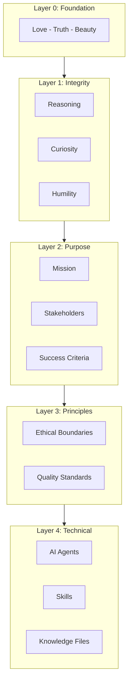

# Antigravity Agent Factory

**Build AI-powered development systems with purpose and integrity.**

> **Quick Start:** Run `python cli/factory_cli.py --quickstart` to get running in 5 minutes.


Welcome! The Antigravity Agent Factory helps you create AI development environments grounded in purpose, principles, and care.

---

## Start Here

| I want to... | Here's your path |
|--------------|------------------|
| **See it work in 5 min** | `python cli/factory_cli.py --quickstart` |
| **Installation** | [Installation Guide](docs/INSTALLATION.md) |
| **User Guide** | [User Guide](docs/USER_GUIDE.md) |
| **Quick Start** | [Quick Start Guide](docs/QUICKSTART.md) |
| **Testing** | [Testing Guide](docs/TESTING.md) |
| **Troubleshooting** | [Troubleshooting](docs/TROUBLESHOOTING.md) |
| **Porting from Cursor** | [Porting Guide](docs/PORTING_GUIDE.md) |

---

## How It Works

Every project we generate is built on a **5-layer architecture** grounded in Love, Truth, and Beauty:



---

## Quick Start (CLI)

```powershell
# List available blueprints
python cli/factory_cli.py --list-blueprints

# Generate from a blueprint
python cli/factory_cli.py --blueprint python-fastapi --output C:\Projects\my-api

# Interactive mode
python cli/factory_cli.py --interactive --output C:\Projects\my-project
```

---

## Project Structure

```
antigravity-agent-factory/
├── .agent/
│   ├── agents/                  # Factory's own agents (11 agents)
│   │   └── *.md                 # debug-conductor, integrity-guardian, knowledge-evolution, etc.
│   └── skills/                  # Factory's own skills (36 skills)
│       ├── agent-generation/
│       ├── ai-agent-dev/
│       ├── algo-trading/
│       ├── alignment-check/
│       ├── analyze-knowledge-gaps/
│       ├── axiom-selection/
│       ├── ci-monitor/
│       └── ...                       # + more skills
├── patterns/                    # Reusable patterns (75+ files)
│   ├── axioms/                  # Layer 0 axiom definitions
│   ├── principles/              # Layer 2 principle patterns
│   ├── methodologies/           # Layer 3 methodology templates
│   ├── enforcement/             # Enforcement patterns
│   ├── practices/               # Practice patterns
│   ├── agents/                  # Agent pattern definitions
│   ├── skills/                  # Skill pattern definitions
│   ├── games/                   # Workshop game definitions
│   ├── workshops/               # Workshop pattern definitions
│   ├── team-formats/            # Team size adaptations
│   ├── stacks/                  # Stack blueprint patterns
│   ├── templates/               # Template patterns
│   └── workflows/               # Workflow patterns
├── blueprints/                  # Technology stack blueprints (27 blueprints)
│   ├── python-fastapi/
│   ├── python-streamlit/
│   ├── ai-agent-development/
│   ├── multi-agent-systems/
│   ├── typescript-react/
│   ├── nextjs-fullstack/
│   ├── java-spring/
│   ├── kotlin-spring/
│   ├── csharp-dotnet/
│   ├── n8n-automation/
│   ├── sap-abap/
│   ├── sap-rap/
│   ├── sap-cap/
│   ├── sap-cpi-pi/
│   └── google-agent-system/
├── knowledge/                   # Reference data (75+ files)
│   └── *.json                   # Stack, workflow, MCP, security, AI patterns
├── templates/                   # Code and document templates (200+ files)
│   ├── factory/                 # Factory templates (agentrules, PURPOSE.md, etc.)
│   ├── ai/                      # AI agent templates
│   ├── python/                  # Python templates (FastAPI, Streamlit)
│   ├── typescript/              # TypeScript templates (Next.js)
│   ├── java/                    # Java Spring templates
│   ├── csharp/                  # C# Clean Architecture templates
│   ├── abap/                    # SAP ABAP/RAP templates
│   ├── cap/                     # SAP CAP templates
│   ├── integration/             # SAP CPI/PI integration templates
│   ├── automation/              # n8n automation templates
│   ├── workflows/               # CI/CD workflow templates
│   ├── methodology/             # Methodology templates
│   └── docs/                    # Documentation templates
├── docs/                        # Documentation
│   ├── reference/               # Detailed reference docs
│   ├── research/                # Research paper series
│   ├── examples/                # Example walkthroughs
│   └── *.md                     # Guides and tutorials
├── diagrams/                    # Architecture diagrams (Mermaid)
├── scripts/                     # Utility scripts
├── cli/                         # CLI interface
│   └── factory_cli.py
├── tests/                       # Test suite
│   ├── unit/
│   ├── integration/
│   ├── validation/
│   └── fixtures/
├── .github/
│   └── workflows/               # CI/CD workflows
├── .agentrules                 # Factory behavior rules
├── CHANGELOG.md                 # Version history
└── README.md                    # This file
```

---

## Integrity Guardian (Layer 0)

Every generated project includes an **Integrity Guardian** that ensures AI agents align with core axioms. It monitors for destructive commands, exposed secrets, and axiom violations.

---

## Memory System

The Factory includes a **Memory System** that learns from your interactions and stores user-validated knowledge for future sessions. All memories require user approval (Axiom A2).

---

## License

This project is licensed under the MIT License - see the [LICENSE](LICENSE) file for details.
For detailed testing documentation, see [docs/TESTING.md](docs/TESTING.md).

### Test Suite Structure

```
tests/
├── conftest.py                 # Shared pytest fixtures
├── unit/                       # Unit tests (60 tests)
│   ├── test_project_config.py  # ProjectConfig dataclass tests
│   ├── test_project_generator.py # ProjectGenerator class tests
│   └── test_pattern_loading.py # Pattern/blueprint loading tests
├── integration/                # Integration tests (38 tests)
│   ├── test_cli.py             # CLI command tests
│   └── test_generation.py      # End-to-end generation tests
├── validation/                 # Schema validation tests (33 tests)
│   ├── test_blueprint_schema.py
│   ├── test_pattern_schema.py
│   └── test_knowledge_schema.py
└── fixtures/                   # Test fixture files
    ├── sample_config.yaml
    ├── sample_config.json
    └── minimal_blueprint.json
```

### Manual CLI Testing

```powershell
# Run the CLI help
C:\App\Anaconda\python.exe cli\factory_cli.py --help

# List blueprints
C:\App\Anaconda\python.exe cli\factory_cli.py --list-blueprints

# List patterns
C:\App\Anaconda\python.exe cli\factory_cli.py --list-patterns
```

### Testing Generation

```powershell
# Generate test project from blueprint
C:\App\Anaconda\python.exe cli\factory_cli.py --blueprint python-fastapi --output C:\Temp\test-project

# Generate from config file
C:\App\Anaconda\python.exe cli\factory_cli.py --config tests\fixtures\sample_config.yaml --output C:\Temp\yaml-project
```

### Continuous Integration

The project uses GitHub Actions for CI/CD. Tests run automatically on:
- Push to `main` or `develop` branches
- Pull requests to `main` or `develop` branches

The CI pipeline includes:
- **Test Matrix**: Python 3.10, 3.11, 3.12 on Ubuntu and Windows
- **Code Quality**: Ruff linter checks
- **JSON Validation**: Syntax validation for all JSON files
- **Generation Test**: End-to-end project generation verification

See `.github/workflows/ci.yml` for the full configuration.


## Documentation

### Core Reference

| Document | Description |
|----------|-------------|
| [User Guide](docs/USER_GUIDE.md) | Detailed usage instructions and examples |
| [Installation Guide](docs/INSTALLATION.md) | Setup and environment requirements |
| [Quick Start](docs/QUICKSTART.md) | Get running in 5 minutes |
| [Testing Guide](docs/TESTING.md) | Test suite documentation and testing practices |
| [Troubleshooting](docs/TROUBLESHOOTING.md) | Common issues and solutions |
| [Knowledge Files](docs/reference/KNOWLEDGE_FILES.md) | Knowledge file synchronization and structure |
| [Workflow Patterns](docs/reference/WORKFLOW_PATTERNS.md) | Available workflow definitions |
| [Porting Guide](docs/PORTING_GUIDE.md) | Migrating from Cursor Agent Factory |

## Contributing

1. Fork the repository
2. Create a feature branch
3. Add patterns, blueprints, or skills
4. Test generation
5. Submit pull request

## Keywords

`cursor-ide` `ai-agents` `llm-automation` `code-generation` `agent-orchestration` `meta-programming` `project-scaffolding` `development-workflow` `mcp-servers` `ai-assisted-development` `cursor-rules` `agent-factory` `skill-composition` `knowledge-management` `prompt-engineering`

**Categories:**
- **AI Development Tools**: Antigravity IDE agent system generator, LLM behavior configuration
- **Code Generation**: Project scaffolding, template-based generation, multi-stack support
- **Agent Architecture**: Agent/skill composition patterns, knowledge-grounded workflows
- **Enterprise Integration**: SAP, Jira, Confluence, GitHub via MCP servers


## License

MIT License

---

*Antigravity Agent Factory v2.1.0*  
*Meta-system for generating Antigravity AI agent development systems*  
*Now with 5-layer architecture: Integrity -> Purpose -> Principles -> Methodology -> Technical*  
*50+ MCP servers across 6 categories with starter packs and role-based recommendations*
