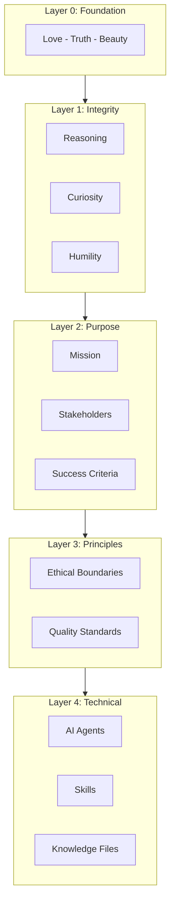

# Antigravity Agent Factory

**Build AI-powered development systems with purpose and integrity.**

> **Quick Start:** Run `python cli/factory_cli.py --quickstart` to get running in 5 minutes.


Welcome! The Antigravity Agent Factory helps you create AI development environments grounded in purpose, principles, and care.

---

## Start Here

| I want to... | Here's your path |
|--------------|------------------|
| **See it work in 5 min** | `python cli/factory_cli.py --quickstart` |
| **Setup guide** | [Installation Guide](docs/INSTALLATION.md) |
| **How to use** | [User Guide](docs/USER_GUIDE.md) |
| **Porting from Cursor** | [Porting Guide](docs/PORTING_GUIDE.md) |

---

## How It Works

Every project we generate is built on a **5-layer architecture** grounded in Love, Truth, and Beauty:



---

## Quick Start (CLI)

```powershell
# List available blueprints
python cli/factory_cli.py --list-blueprints

# Generate from a blueprint
python cli/factory_cli.py --blueprint python-fastapi --output C:\Projects\my-api

# Interactive mode
python cli/factory_cli.py --interactive --output C:\Projects\my-project
```

---

## Project Structure

```
antigravity-agent-factory/
├── .agent/
│   ├── agents/                  # Factory's own agents (11 agents)
│   │   └── *.md                 # debug-conductor, integrity-guardian, knowledge-evolution, etc.
│   └── skills/                  # Factory's own skills (35 skills)
│       ├── agent-generation/
│       ├── algo-trading/
│       ├── alignment-check/
│       ├── analyze-knowledge-gaps/
│       ├── axiom-selection/
│       ├── ci-monitor/
│       ├── commit-release/
│       └── ...                       # + more skills
├── patterns/                    # Reusable patterns (75+ files)
│   ├── axioms/                  # Layer 0 axiom definitions
│   ├── principles/              # Layer 2 principle patterns
│   ├── methodologies/           # Layer 3 methodology templates
│   ├── enforcement/             # Enforcement patterns
│   ├── practices/               # Practice patterns
│   ├── agents/                  # Agent pattern definitions
│   ├── skills/                  # Skill pattern definitions
│   ├── games/                   # Workshop game definitions
│   ├── workshops/               # Workshop pattern definitions
│   ├── team-formats/            # Team size adaptations
│   ├── stacks/                  # Stack blueprint patterns
│   ├── templates/               # Template patterns
│   └── workflows/               # Workflow patterns
├── blueprints/                  # Technology stack blueprints (27 blueprints)
│   ├── python-fastapi/
│   ├── python-streamlit/
│   ├── ai-agent-development/
│   ├── multi-agent-systems/
│   ├── typescript-react/
│   ├── nextjs-fullstack/
│   ├── java-spring/
│   ├── kotlin-spring/
│   ├── csharp-dotnet/
│   ├── n8n-automation/
│   ├── sap-abap/
│   ├── sap-rap/
│   ├── sap-cap/
│   └── sap-cpi-pi/
├── knowledge/                   # Reference data (75+ files)
│   └── *.json                   # Stack, workflow, MCP, security, AI patterns
├── templates/                   # Code and document templates (200+ files)
│   ├── factory/                 # Factory templates (agentrules, PURPOSE.md, etc.)
│   ├── ai/                      # AI agent templates
│   ├── python/                  # Python templates (FastAPI, Streamlit)
│   ├── typescript/              # TypeScript templates (Next.js)
│   ├── java/                    # Java Spring templates
│   ├── csharp/                  # C# Clean Architecture templates
│   ├── abap/                    # SAP ABAP/RAP templates
│   ├── cap/                     # SAP CAP templates
│   ├── integration/             # SAP CPI/PI integration templates
│   ├── automation/              # n8n automation templates
│   ├── workflows/               # CI/CD workflow templates
│   ├── methodology/             # Methodology templates
│   └── docs/                    # Documentation templates
├── docs/                        # Documentation
│   ├── reference/               # Detailed reference docs
│   ├── research/                # Research paper series
│   ├── examples/                # Example walkthroughs
│   └── *.md                     # Guides and tutorials
├── diagrams/                    # Architecture diagrams (Mermaid)
├── scripts/                     # Utility scripts
├── cli/                         # CLI interface
│   └── factory_cli.py
├── tests/                       # Test suite
│   ├── unit/
│   ├── integration/
│   ├── validation/
│   └── fixtures/
├── .github/
│   └── workflows/               # CI/CD workflows
├── .agentrules                 # Factory behavior rules
├── CHANGELOG.md                 # Version history
└── README.md                    # This file
```

---

## Integrity Guardian (Layer 0)

Every generated project includes an **Integrity Guardian** that ensures AI agents align with core axioms. It monitors for destructive commands, exposed secrets, and axiom violations.

---

## Memory System

The Factory includes a **Memory System** that learns from your interactions and stores user-validated knowledge for future sessions. All memories require user approval (Axiom A2).

---

## License

This project is licensed under the MIT License - see the LICENSE file for details.
  - tdd
mcp_servers:
  - name: atlassian
    url: https://mcp.atlassian.com/v1/sse
    purpose: Jira/Confluence integration
```

## Extending the Factory

### Adding New Blueprints

1. Create directory: `blueprints/{blueprint-id}/`
2. Create `blueprint.json` with:
   - Metadata (name, description, tags)
   - Stack configuration
   - Agent and skill references
   - Template paths

### Adding New Patterns

1. Create pattern JSON in appropriate `patterns/` directory
2. Follow the pattern schema in `patterns/{type}/{type}-pattern.json`
3. Reference pattern in blueprints

### Adding New Skills

1. Create skill directory: `.agent/skills/{skill-name}/`
2. Create `SKILL.md` with frontmatter and process documentation
3. Add to factory's skill registry

## Development

### Requirements

- Python 3.10+
- Antigravity IDE
- PyYAML (for YAML config support)

> **Tool Paths:** Commands below use default Windows paths from `.agent/config/tools.json`.
> See [Configuration Guide](docs/CONFIGURATION.md) to customize for your environment.

### Installing Development Dependencies

```powershell
# Install test dependencies
C:\App\Anaconda\Scripts\pip.exe install -r requirements-dev.txt
```

### Running Tests

The project includes a comprehensive pytest-based test suite with unit tests, integration tests, and validation tests.

```powershell
# Run all tests
C:\App\Anaconda\python.exe -m pytest tests/ -v

# Run with coverage report
C:\App\Anaconda\python.exe -m pytest tests/ --cov=scripts --cov=cli --cov-report=html

# Run specific test categories
C:\App\Anaconda\python.exe -m pytest tests/unit/ -v           # Unit tests
C:\App\Anaconda\python.exe -m pytest tests/integration/ -v    # Integration tests
C:\App\Anaconda\python.exe -m pytest tests/validation/ -v     # Schema validation tests

# Run specific test file
C:\App\Anaconda\python.exe -m pytest tests/unit/test_project_config.py -v

# Run tests matching a pattern
C:\App\Anaconda\python.exe -m pytest tests/ -k "blueprint" -v
```

For detailed testing documentation, see [docs/TESTING.md](docs/TESTING.md).

### Test Suite Structure

```
tests/
├── conftest.py                 # Shared pytest fixtures
├── unit/                       # Unit tests (60 tests)
│   ├── test_project_config.py  # ProjectConfig dataclass tests
│   ├── test_project_generator.py # ProjectGenerator class tests
│   └── test_pattern_loading.py # Pattern/blueprint loading tests
├── integration/                # Integration tests (38 tests)
│   ├── test_cli.py             # CLI command tests
│   └── test_generation.py      # End-to-end generation tests
├── validation/                 # Schema validation tests (33 tests)
│   ├── test_blueprint_schema.py
│   ├── test_pattern_schema.py
│   └── test_knowledge_schema.py
└── fixtures/                   # Test fixture files
    ├── sample_config.yaml
    ├── sample_config.json
    └── minimal_blueprint.json
```

### Manual CLI Testing

```powershell
# Run the CLI help
C:\App\Anaconda\python.exe cli\factory_cli.py --help

# List blueprints
C:\App\Anaconda\python.exe cli\factory_cli.py --list-blueprints

# List patterns
C:\App\Anaconda\python.exe cli\factory_cli.py --list-patterns
```

### Testing Generation

```powershell
# Generate test project from blueprint
C:\App\Anaconda\python.exe cli\factory_cli.py --blueprint python-fastapi --output C:\Temp\test-project

# Generate from config file
C:\App\Anaconda\python.exe cli\factory_cli.py --config tests\fixtures\sample_config.yaml --output C:\Temp\yaml-project
```

### Continuous Integration

The project uses GitHub Actions for CI/CD. Tests run automatically on:
- Push to `main` or `develop` branches
- Pull requests to `main` or `develop` branches

The CI pipeline includes:
- **Test Matrix**: Python 3.10, 3.11, 3.12 on Ubuntu and Windows
- **Code Quality**: Ruff linter checks
- **JSON Validation**: Syntax validation for all JSON files
- **Generation Test**: End-to-end project generation verification

See `.github/workflows/ci.yml` for the full configuration.

## Example Walkthroughs

Complete, step-by-step examples showing the factory in action with real technology stacks:

| Example | Blueprint | Description |
|---------|-----------|-------------|
| [REST API Service](docs/examples/01-rest-api-service/) | python-fastapi | Python FastAPI with Jira integration |
| [Full-Stack Next.js](docs/examples/02-fullstack-nextjs-app/) | nextjs-fullstack | Next.js 14 with Prisma and auth |
| [RAG Chatbot](docs/examples/03-rag-chatbot-agent/) | ai-agent-development | LangChain RAG with Streamlit |
| [Multi-Agent System](docs/examples/04-multi-agent-research-system/) | multi-agent-systems | LangGraph supervisor/worker pattern |
| [SAP Fiori](docs/examples/05-sap-fiori-integration/) | sap-abap | RAP application with MCP grounding |
| [.NET Enterprise](docs/examples/06-dotnet-enterprise-api/) | csharp-dotnet | Clean Architecture with EF Core |
| [Kotlin Microservice](docs/examples/07-kotlin-spring-microservice/) | kotlin-spring | Reactive Spring Boot with coroutines |
| [SAP CPI Integration](docs/examples/08-sap-cpi-integration/) | sap-cpi-pi | Groovy scripting with iFlow patterns |

Each example includes a complete walkthrough, sample answers, and expected output files for verification.

## Documentation

### Comprehensive Reference

| Document | Description |
|----------|-------------|
| **[Factory Reference](docs/FACTORY_REFERENCE.md)** | **Start here** - Complete overview of the factory with links to detailed references |
| [Blueprints Reference](docs/reference/BLUEPRINTS.md) | All 17 technology blueprints with detailed specifications |
| [Patterns Reference](docs/reference/PATTERNS.md) | Agent, skill, axiom, methodology, and other patterns |
| [Knowledge Files Reference](docs/reference/KNOWLEDGE_FILES.md) | All 74 knowledge files categorized and explained |
| [Factory Components Reference](docs/reference/FACTORY_COMPONENTS.md) | Factory's own 12 agents and 36 skills (plus PM subsystem) |
| [Generated Output Reference](docs/reference/GENERATED_OUTPUT.md) | What gets generated: structure, formats, examples |

### Guides and Tutorials

| Document | Description |
|----------|-------------|
| [Usage Guide](docs/USAGE_GUIDE.md) | Detailed usage instructions and examples |
| [Team Workshop Guide](docs/TEAM_WORKSHOP_GUIDE.md) | Complete facilitator's manual for team workshops |
| [Example Walkthroughs](docs/examples/) | Complete end-to-end examples with real stacks |
| [Layered Architecture](docs/LAYERED_ARCHITECTURE.md) | 5-layer architecture guide |
| [Onboarding Concept](docs/LAYERED_ONBOARDING_CONCEPT.md) | Full implementation blueprint |
| [Extension Guide](docs/EXTENSION_GUIDE.md) | How to extend the factory with new blueprints, patterns, and skills |
| [Testing Guide](docs/TESTING.md) | Test suite documentation and testing practices |
| [SAP Grounding Design](docs/SAP_GROUNDING_DESIGN.md) | SAP-specific grounding architecture and MCP integration |

### Research Paper Series

Comprehensive academic documentation of the methodology (~150 pages, CC0 licensed):

| Paper | Description |
|-------|-------------|
| [Axiom-Based Agent Architecture](docs/research/AXIOM_BASED_AGENT_ARCHITECTURE.md) | Core methodology: 5-layer system, axioms A1-A10, derivation rules |
| [Sacred Psychology in Software Engineering](docs/research/SACRED_PSYCHOLOGY_SOFTWARE_ENGINEERING.md) | Psychological enforcement, philosophical techniques |
| [Constitutional AI - Convergent Discovery](docs/research/CONSTITUTIONAL_AI_CONVERGENT_DISCOVERY.md) | Comparison with Anthropic Constitutional AI |
| [Building Value-Aligned Agents](docs/research/BUILDING_VALUE_ALIGNED_AGENTS.md) | Practical step-by-step implementation guide |
| [Future of Value-Aligned AI](docs/research/FUTURE_OF_VALUE_ALIGNED_AI.md) | Synthesis, unified framework, recommendations |
| [Architecture Diagrams](docs/research/ARCHITECTURE_DIAGRAMS.md) | Visual diagrams of all architectures |

## Contributing

1. Fork the repository
2. Create a feature branch
3. Add patterns, blueprints, or skills
4. Test generation
5. Submit pull request

## Keywords

`cursor-ide` `ai-agents` `llm-automation` `code-generation` `agent-orchestration` `meta-programming` `project-scaffolding` `development-workflow` `mcp-servers` `ai-assisted-development` `cursor-rules` `agent-factory` `skill-composition` `knowledge-management` `prompt-engineering`

**Categories:**
- **AI Development Tools**: Antigravity IDE agent system generator, LLM behavior configuration
- **Code Generation**: Project scaffolding, template-based generation, multi-stack support
- **Agent Architecture**: Agent/skill composition patterns, knowledge-grounded workflows
- **Enterprise Integration**: SAP, Jira, Confluence, GitHub via MCP servers

## Acknowledgements & Inspirations

This project incorporates ideas and patterns from several valuable sources:

| Source | Contribution |
|--------|--------------|
| **[Anthropic](https://www.anthropic.com)** | Constitutional AI research demonstrating convergent discovery with our axiom-based approach. The [Claude "soul document"](https://www.anthropic.com/news/claude-new-constitution) (January 2026) and [Model Context Protocol (MCP)](https://modelcontextprotocol.io/) specification. |
| **[Cursor](https://cursor.com)** | AI-native IDE whose agent mode and skills features enable this entire ecosystem. |
| **[Augmented Coding Patterns](https://lexler.github.io/augmented-coding-patterns/)** | Active Partner, Check Alignment, Chain of Small Steps, and other AI collaboration patterns. Created by Lada Kesseler, Nitsan Avni, Ivett Ordog, Llewellyn Falco, and contributors. |
| **[Leon Chlon](https://github.com/lchlon)** | Inspiration for the Strawberry Verification skill - information-theoretic approach to hallucination detection in AI outputs. |
| **[ai-dev-agent](https://github.com/gitwalter/ai-dev-agent)** | Pedagogical toolkit for AI agent systems that inspired the layered architecture and methodology integration concepts. |
| **Ancient Wisdom & Philosophy** | Taoist philosophy (Wu Wei response protocol), Hilbert's axiomatic method (5-layer architecture foundation), and sacred value psychology research (Haidt, Tetlock). |

For complete academic references, see [docs/research/REFERENCES.md](docs/research/REFERENCES.md).

## License

MIT License

---

*Antigravity Agent Factory v2.0.0*  
*Meta-system for generating Antigravity AI agent development systems*  
*Now with 5-layer architecture: Integrity -> Purpose -> Principles -> Methodology -> Technical*  
*50+ MCP servers across 6 categories with starter packs and role-based recommendations*
