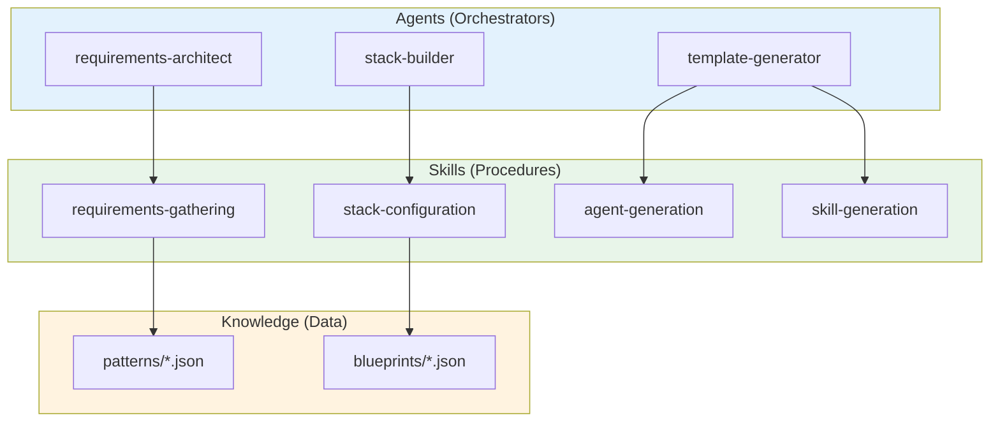
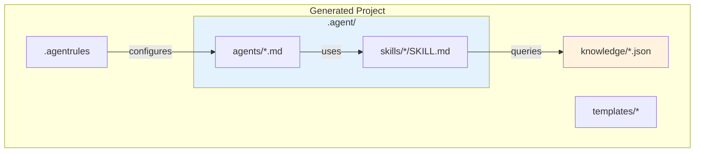

# Antigravity Agent Factory

**Build AI-powered development systems that truly understand your project.**

> **Quick Start:** New here? See [docs/guides/quickstart.md](docs/guides/quickstart.md) or run `python cli/factory_cli.py --quickstart` to get running in 5 minutes.


Welcome! Whether you're a solo developer exploring new possibilities or a team building something meaningful together, we're here to help you create an AI development environment grounded in purpose, principles, and care.
---

---

## Quick Start Options

### Option 1: Instant Demo (5 minutes)

See the factory in action with zero configuration:

```powershell
python cli/factory_cli.py --quickstart
```

This creates a complete demo project showing what you'll get. Perfect for exploration!

---

## Overview


## Overview

The Antigravity Agent Factory is a **meta-system** that generates complete AI agent development systems. It uses a 5-layer deductive-inductive architecture to create agent systems that are technically capable and grounded in clear values.

### The 5 Layers (+ Foundation)

| Layer | Name | Purpose | Artifact |
|-------|------|---------|----------|
| **A0** | Love & Trust | Foundation of all being and doing | `.agentrules` foundation |
| **0** | Integrity & Logic | Foundational axioms (A1-A5) | `.agentrules` L0 section |
| **1** | Purpose | Mission, stakeholders, success | `PURPOSE.md` |
| **2** | Principles | Ethical boundaries, quality standards | `.agentrules` principles |
| **3** | Methodology | Agile/Kanban/R&D, enforcement, practices | `methodology.yaml` |
| **4** | Technical | Stack, agents, skills, templates | `.agent/`, `knowledge/` |

### What You Get

Generated projects include:

- **Purpose documentation** (`PURPOSE.md`) - Your mission and success criteria
- **5-layer .agentrules** - AI guidance with axioms, principles, and methodology
- **AI agent definitions** (`.agent/agents/`) - Specialized assistants for your workflow
- **Reusable skill definitions** (`.agent/skills/`) - Procedures your agents can follow
- **Structured knowledge files** (`knowledge/`) - Domain expertise in JSON format
- **Code and document templates** (`templates/`) - Consistent starting points
- **21 ready-to-use workflows** (`workflows/`) - Automated development, testing, PM, and deployment
- **Methodology configuration** (`workflows/methodology.yaml`) - How your team works
- **Integrity Guardian** - Layer 0 protection for all operations
- **Memory System** - User-validated learning from interactions

**Workflow Categories:**

| Category | Examples |
|----------|----------|
| Development | Feature development, bugfix resolution, code review, TDD |
| Quality | Quality gate, BDD, security audit |
| Agile/PM | Sprint planning, closure, standups, backlog refinement |
| Domain | Smart contract audit, trading strategies, SAP RAP/CAP, RAG pipelines |
| Operations | CI/CD pipeline, release management, incident response |

### Layer 0: Integrity Guardian

Every generated project includes an **Integrity Guardian** - an active Layer 0 protector that ensures AI agents align with core axioms.

**Motto**: SDG - Love - Truth - Beauty

| Level | Name | Trigger | Response |
|-------|------|---------|----------|
| 0 | Flow | Natural alignment | Continue normally |
| 1 | Nudge | Slight drift | Self-correct subtly |
| 2 | Pause | Boundary approached | Explain, ask user |
| 3 | Block | Clear violation | Stop, explain with love |
| 4 | Protect | Imminent harm | Prevent, then explain |

The Guardian monitors for:
- Destructive commands (`rm -rf /`, `DROP DATABASE`)
- Exposed secrets (API keys, passwords, connection strings)
- Axiom violations (hidden logic, deception, instruction overrides)

**Invoke manually**: `"Guardian, check this"` or `"check my alignment"`

See **guardian-coordination.md** for complete documentation.

### Memory System

The Factory includes a **Memory System** that learns from your interactions and stores user-validated knowledge for future sessions.

| Memory Type | Description |
|-------------|-------------|
| **Semantic** | Long-term user-approved knowledge |
| **Episodic** | Session-based observations (temporary) |
| **Pending** | Awaiting your approval |
| **Rejected** | Prevents re-proposing rejected memories |

**Key Features:**
- All memories require user approval (Axiom A2: User Primacy)
- Layers 0-2 remain immutable - only knowledge files can be extended
- Works offline after initial setup (no API keys required)
- Chat-based interaction for memory management

**Chat Commands:**

```
"Show my memories"              → List stored memories
"What do you remember about X?" → Semantic search
"Delete the memory about X"     → Remove a memory
"Accept/Reject"                 → Respond to proposals
```

See **MEMORY_SYSTEM.md** for complete documentation.

### Formal Verification System

The Factory includes **mathematically proven guarantees** that the core architecture satisfies its foundational axioms. Using Lean 4, we prove:

| Component | What's Proven |
|-----------|--------------|
| **Axioms (A0-A5)** | Formalized with derivation rules |
| **Integrity Guardian** | State preservation, user notification, harm prevention |
| **Memory System** | User consent required for all permanent memories |
| **Layer Architecture** | L0-L2 (Axioms, Purpose, Principles) are immutable |

**Trust Chain**: Factory proofs → Project proofs → Team extensions → All verifiable

**Quick Commands:**

```bash
cd proofs && lake build       # Verify all proofs
scripts/proofs/generate_attestation.sh  # Create cryptographic attestation
```

See **docs/VERIFICATION.md** for complete documentation.

### Agent Society Verification

A complete **dynamic multi-agent verification system** (`lib/society/`) extending formal proofs to runtime behavior. Enables verified agent communication, contracts, and behavior in multi-agent societies.

| Module | Purpose |
|--------|---------|
| `events/` | Event sourcing with cryptographic hash chains |
| `verification/` | Axiom compliance monitoring (A0-A5 verifiers) |
| `contracts/` | Agent contracts with capability/obligation verification |
| `trust/` | Identity, reputation scoring, trust delegation |
| `society/` | 5 governance patterns + 3 communication protocols |
| `blockchain/` | Merkle tree anchoring, Solana integration |
| `hybrid/` | Unified verification with escalation management |

**Quick Usage:**

```python
from lib.society import HybridVerificationSystem
system = HybridVerificationSystem.create_default()
result = system.record_event(event)  # Verify against all axioms
```

See **docs/design/AGENT_SOCIETY_VERIFICATION.md** for architecture and **docs/SOCIETY_USAGE.md** for complete usage guide.

## Knowledge Evolution System

The Factory includes an automatic **Knowledge Evolution System** that keeps blueprints, patterns, and knowledge files current with the latest best practices from trusted sources.

### Features

| Feature | Description |
|---------|-------------|
| **Multi-Source Updates** | GitHub, PyPI, NPM, official docs, community sources |
| **Configurable Modes** | Stability-first, awareness-hybrid, freshness-first, subscription |
| **Full Control** | Preview, approve, apply, or rollback any update |
| **Traceability** | Every change tracked with source attribution |

### Update Modes

| Mode | Best For | Description |
|------|----------|-------------|
| `stability_first` | Enterprise | Lock versions, explicit approval required |
| `awareness_hybrid` | Most Teams | Notify of updates, user approves (default) |
| `freshness_first` | Startups | Auto-apply non-breaking changes |
| `subscription` | Focused Teams | Subscribe to specific knowledge files |

### Quick Usage

```
"Check for knowledge updates"        # See what's available
"Apply pending updates"              # Apply with confirmation
"Configure knowledge evolution"      # Change settings
```

Configure in `.agent/config/settings.json` or use the `system-configuration` skill.

See **docs/KNOWLEDGE_EVOLUTION.md** for complete documentation.

### Factory -> Generated Project Updates

Generated projects can receive updates from the Factory:

```
"Check for Factory updates"    # In your generated project
"Sync with Factory"            # Apply available updates
```

| Component | Purpose |
|-----------|---------|
| `factory-updates` agent | Fetches and applies updates from Factory |
| `knowledge/project-info.json` | Tracks Factory origin and installed versions |
| Update channels: `stable` / `latest` | Choose your update preference |

This creates a connection between the Factory and generated projects, allowing teams to benefit from ongoing Factory improvements.

---

## Architecture Diagrams

For visual documentation, see the [diagrams/](diagrams/) folder:

| Diagram | Description |
|---------|-------------|
| [Factory Workflow](diagrams/factory-workflow.md) | Complete generation workflow |
| [Verification Flow](diagrams/verification-flow.md) | Hallucination detection pipeline |
| [Agent/Skill Architecture](diagrams/agent-skill-architecture.md) | Agent hierarchy and composition |
| [SAP Grounding](diagrams/sap-grounding-architecture.md) | SAP-specific integration |

## Project Structure

```
antigravity-agent-factory/
├── .agent/
│   ├── agents/                  # Factory's own agents (10 agents)
│   │   └── *.md                 # debug-conductor, git-specialist, integrity-guardian, etc.
│   └── skills/                  # Factory's own skills (187 skills)
│       ├── agent-generation/
│       ├── ai-agent-dev/
│       ├── algo-trading/
│       ├── alignment-check/
│       ├── analyze-knowledge-gaps/
│       ├── axiom-selection/
│       └── ...                       # + more skills
│   ├── patterns/                    # Reusable patterns (113+ files)
│   ├── templates/                   # Code templates (307+ files)
│   ├── blueprints/                  # Technology stack blueprints (34 blueprints)
│   ├── knowledge/                   # Knowledge base (261 files)
│   └── workflows/                   # Workflow definitions
│       ├── python-fastapi/
│   ├── python-streamlit/
│   ├── ai-agent-development/
│   ├── multi-agent-systems/
│   ├── typescript-react/
│   ├── nextjs-fullstack/
│   ├── java-spring/
│   ├── kotlin-spring/
│   ├── csharp-dotnet/
│   ├── n8n-automation/
│   ├── sap-abap/
│   ├── sap-rap/
│   ├── sap-cap/
│   └── sap-cpi-pi/
├── knowledge/                   # Reference data (305+ files)
│   └── *.json                   # Stack, workflow, MCP, security, AI patterns
├── templates/                   # Code and document templates (305+ files)
│   ├── factory/                 # Factory templates (cursorrules, PURPOSE.md, etc.)│   ├── ai/                      # AI agent templates
│   ├── python/                  # Python templates (FastAPI, Streamlit)
│   ├── typescript/              # TypeScript templates (Next.js)
│   ├── java/                    # Java Spring templates
│   ├── csharp/                  # C# Clean Architecture templates
│   ├── abap/                    # SAP ABAP/RAP templates
│   ├── cap/                     # SAP CAP templates
│   ├── integration/             # SAP CPI/PI integration templates
│   ├── automation/              # n8n automation templates
│   ├── workflows/               # CI/CD workflow templates
│   ├── methodology/             # Methodology templates
│   └── docs/                    # Documentation templates
├── docs/                        # Documentation
│   ├── reference/               # Detailed reference docs
│   ├── research/                # Research paper series
│   ├── examples/                # Example walkthroughs
│   └── *.md                     # Guides and tutorials
├── diagrams/                    # Architecture diagrams (Mermaid)
├── scripts/                     # Utility scripts
├── cli/                         # CLI interface
│   └── factory_cli.py
├── tests/                       # Test suite
│   ├── unit/
│   ├── integration/
│   ├── validation/
│   └── fixtures/
├── .github/
│   └── workflows/               # CI/CD workflows
├── .agentrules                 # Factory behavior rules├── CHANGELOG.md                 # Version history
└── README.md                    # This file
```

## Available Blueprints

The factory includes **27 blueprints** organized by category. For detailed documentation including use cases, technology stacks, and configuration options, see [Blueprints Reference](docs/reference/BLUEPRINTS.md).

### Python & AI

| Blueprint | Stack | Description |
|-----------|-------|-------------|
| `python-fastapi` | FastAPI, SQLAlchemy | REST API development |
| `python-streamlit` | Streamlit, Pandas | Data apps and dashboards |
| `ai-agent-development` | LangChain, LangGraph | AI agent systems (single agents) |
| `multi-agent-systems` | LangGraph, LangChain | Orchestrated multi-agent systems |
| `python-ml-experimentation` | PyTorch, scikit-learn, MLflow | ML research and experimentation |
| `python-deep-learning` | Transformers, PEFT, Accelerate | Deep learning with Hugging Face |
| `python-rag-system` | LangChain, ChromaDB, RAGAS | Production RAG systems |
| `python-multi-agent` | CrewAI, AutoGen | Multi-agent orchestration |
| `python-fine-tuning` | PEFT, TRL, LoRA | LLM fine-tuning |

### Starter (Beginner-Friendly)

| Blueprint | Stack | What You'll Learn |
|-----------|-------|-------------------|
| `starter-ml-classification` | scikit-learn | Train/test split, metrics, basic ML |
| `starter-chatbot` | OpenAI, Streamlit | Chat completions, streaming, prompts |
| `starter-rag` | LangChain, ChromaDB | Chunking, embeddings, retrieval |

### Blockchain & Trading

| Blueprint | Stack | Description |
|-----------|-------|-------------|
| `solidity-ethereum` | Solidity, Hardhat, Foundry | Ethereum smart contracts |
| `defi-protocols` | Solidity, Chainlink, OpenZeppelin | DeFi protocols (AMM, lending) |
| `solana-rust` | Rust, Anchor, Solana SDK | Solana program development |
| `quantitative-trading` | Python, vectorbt, pandas | Algorithmic trading and backtesting |
| `financial-ai-agents` | LangChain, vectorbt | AI agents for trading |

### Web & Frontend

| Blueprint | Stack | Description |
|-----------|-------|-------------|
| `typescript-react` | TypeScript, React, Vite | Web application development |
| `nextjs-fullstack` | Next.js 14+, Prisma | Full-stack React development |

### Enterprise & Backend

| Blueprint | Stack | Description |
|-----------|-------|-------------|
| `java-spring` | Java, Spring Boot, JPA | Enterprise Java applications |
| `kotlin-spring` | Kotlin, Spring Boot 3, WebFlux | Reactive Kotlin microservices |
| `csharp-dotnet` | C#, .NET 8+, Entity Framework | Enterprise .NET development |
| `n8n-automation` | n8n, JavaScript, REST | Workflow automation |

### SAP

| Blueprint | Stack | Description |
|-----------|-------|-------------|
| `sap-abap` | ABAP, Clean ABAP | SAP ABAP development |
| `sap-rap` | ABAP, RAP, Fiori | SAP RESTful ABAP Programming |
| `sap-cap` | Node.js/Java, CDS, SAP BTP | SAP Cloud Application Programming |
| `sap-cpi-pi` | Groovy, Java, SAP CPI/PI | SAP integration development |

## Team Workshop System

### Axiom 0: Love, Truth, and Beauty

The Team Workshop System is grounded in **Axiom 0**:

> "All being and doing is grounded in Love, Truth, and Beauty."

This foundational axiom precedes all technical axioms (A1-A5) and ensures that collaborative design emerges from:
- **Love**: Genuine care for humanity and those who depend on our work
- **Truth**: Honesty, transparency, and verifiability in all things
- **Beauty**: Harmony, elegance, and wholeness in what we create
- **Trust emerges** naturally when Love meets Truth over time

### Workshop Series Overview

| Workshop | Duration | Games | Output |
|----------|----------|-------|--------|
| **Vision Quest** | 2-3h | Future Headlines, Stakeholder Safari | Team Charter |
| **Ethics Arena** | 2h | Dilemma Duel, Value Auction | Ethics Framework |
| **Stack Safari** | 2-3h | Trade-Off Tetris, Architecture Pictionary | Stack Configuration |
| **Agent Assembly** | 3-4h | Agent Trading Cards, Skill Bingo | Agent Roster |
| **Integration Celebration** | 1.5-2h | Demo Derby, Gratitude Circle | Complete System |

### Game Library

**Creative Games** (Vision & Ideation):
- **Future Headlines**: Write newspaper headlines from 5 years in the future
- **Stakeholder Safari**: Role-play as different stakeholders
- **Dream Demo**: Describe the ideal product demo without constraints

**Strategic Games** (Ethics & Decisions):
- **Dilemma Duel**: Debate ethical scenarios with no perfect answer
- **Value Auction**: Bid limited points on values to reveal priorities
- **Trade-Off Tetris**: Fit constraints into limited capacity

**Collaborative Games** (Design & Celebration):
- **Agent Trading Cards**: Create collectible cards for each agent
- **Skill Bingo**: Fill bingo cards with needed skills
- **Architecture Pictionary**: Draw and guess system components
- **Demo Derby**: Showcase all workshop artifacts
- **Gratitude Circle**: Express appreciation to team members

### Team Size Adaptations

| Size | Format |
|------|--------|
| Small (2-5) | Everyone participates in everything, intimate discussions |
| Medium (6-12) | Breakout groups for games, plenary for synthesis |
| Large (13+) | Representative groups, async pre-work, sync synthesis |

For complete facilitation instructions, see **docs/TEAM_WORKSHOP_GUIDE.md**.


## Factory Agents

| Agent | Purpose |
|-------|---------|
| `requirements-architect` | Gather and validate project requirements through 5-phase questionnaire |
| `stack-builder` | Configure technology stack and select appropriate blueprints |
| `workflow-designer` | Design development workflows and trigger integrations |
| `knowledge-manager` | Structure domain knowledge and generate knowledge files |
| `template-generator` | Generate code and document templates |
| `workshop-facilitator` | Facilitate team workshops for collaborative agent system design |
| `onboarding-architect` | Orchestrate onboarding of existing repositories into the factory ecosystem |

## Available Pattern Agents

These agents can be included in generated projects:

| Agent | Purpose |
|-------|---------|
| `code-reviewer` | Review code against best practices, style guides, and quality standards |
| `test-generator` | Generate unit tests, integration tests, and test plans |
| `explorer` | Explore and understand codebases |
| `documentation-agent` | Generate and maintain README, API docs, and ADRs |

## Factory Skills

| Skill | Description |
|-------|-------------|
| `requirements-gathering` | 5-phase interactive requirements elicitation |
| `team-workshop-onboarding` | Collaborative 5-workshop series with games for teams |
| `stack-configuration` | Technology stack selection and configuration |
| `workflow-generation` | Workflow pattern generation and customization |
| `agent-generation` | Agent definition file generation |
| `skill-generation` | Skill definition with references generation |
| `knowledge-generation` | JSON knowledge file generation |
| `template-generation` | Code and document template generation |
| `cursorrules-generation` | .agentrules file generation |
| `axiom-selection` | Layer 0 axiom configuration including A0 |
| `purpose-definition` | Layer 1 purpose definition (mission, stakeholders, success) |
| `methodology-selection` | Layer 3 methodology selection (Agile/Kanban/R&D) |
| `enforcement-selection` | Enforcement pattern selection (quality, safety, integrity) |
| `practice-selection` | Practice pattern selection (daily, craft, alignment) |
| `pattern-feedback` | Inductive learning from pattern usage |
| `onboarding-flow` | Onboard existing repositories into factory ecosystem |
| `alignment-check` | Verify understanding and alignment before implementations |
| `shell-platform` | Platform-specific shell command handling |
| `readme-validation` | Validate README structure matches actual filesystem |
| `workshop-export` | Export learning workshops to standalone projects with AI assistance |

## Available Pattern Skills

These skills can be included in generated projects:

| Skill | Category | Description |
|-------|----------|-------------|
| `bugfix-workflow` | workflow | Ticket-based bug fix workflow with Jira integration |
| `feature-workflow` | workflow | Specification-based feature implementation |
| `tdd` | testing | Test-driven development workflow |
| `grounding` | verification | Verify data structures before implementation |
| `strawberry-verification` | verification | Hallucination detection using information theory |
| `code-templates` | core | Stack-specific code generation |
| `security-audit` | verification | OWASP-based security vulnerability detection |
| `code-review` | workflow | Structured code review process |

### Agent vs Skill Relationship



## Layered Requirements Gathering

### Depth Options

| Option | Phases | Best For |
|--------|--------|----------|
| **Quick Start** | Pre-Phase + Phase 0 + Phases 1-5 | Rapid prototyping |
| **Standard** | All phases with templates | Most projects |
| **Comprehensive** | All phases + enforcement/practices | Enterprise, critical |

### Pre-Phase: Layer 0 - Axiom Configuration
- Select core axioms (A1-A5 always included)
- Choose optional axioms (A6-A10)
- Configure derivation rules

### Phase 0: Layer 1 - Purpose Definition
- Mission statement (verifiable)
- Primary stakeholders (specific)
- Success criteria (measurable)

### Phases 0.6-0.7: Layers 2-3 (Standard+)
- Ethical boundaries and quality standards
- Methodology selection (Agile/Kanban/R&D/Enterprise)
- Team size and coordination patterns

### Phases 0.8-0.9: Enforcement & Practices (Comprehensive)
- Quality, safety, integrity enforcement
- Daily, craft, alignment practices

### Phases 1-5: Layer 4 - Technical
- Project context and domain
- Technology stack and frameworks
- Workflow triggers and artifacts
- Knowledge domain and conventions
- Agent and skill capabilities

## Generated Project Structure

Generated projects include all 5-layer artifacts:

```
{PROJECT_NAME}/
├── .agent/
│   ├── agents/               # AI agent definitions
│   └── skills/               # Reusable skill definitions
├── knowledge/                # Structured reference data (JSON)
├── templates/                # Code and document templates
├── workflows/
│   └── methodology.yaml      # Layer 3: Methodology config
├── src/                      # Source code
├── tests/                    # Test files
├── docs/                     # User documentation
├── .agentrules              # 5-layer agent rules (L0-L4)
├── PURPOSE.md                # Layer 1: Mission & purpose
├── enforcement.yaml          # Enforcement patterns (Comprehensive)
├── practices.yaml            # Team practices (Comprehensive)
└── README.md                 # Project documentation
```

### Key Generated Files

| File | Layer | Description |
|------|-------|-------------|
| `.agentrules` | 0-4 | Complete 5-layer agent behavior rules |
| `PURPOSE.md` | 1 | Mission, stakeholders, success criteria |
| `enforcement.yaml` | 2+ | Quality, safety, integrity enforcement |
| `practices.yaml` | 3+ | Daily, craft, alignment practices |
| `methodology.yaml` | 3 | Methodology ceremonies and coordination |



## MCP Server Integration

The factory includes **50+ MCP servers** across 6 categories. See the full **MCP Servers Guide** for details.

### Starter Packs

| Pack | Servers | Best For |
|------|---------|----------|
| **Minimal** | filesystem, git, memory | Any project |
| **Web Developer** | + github, postgresql, playwright | Web apps |
| **Data Science** | + jupyter, bigquery, pinecone | Data/ML projects |
| **AI Agent** | + langgraph, knowledge-graph, chromadb | Agent development |
| **Enterprise** | + atlassian, slack, sentry | Team projects |
| **DevOps** | + docker, terraform, datadog | Infrastructure |

### Categories

| Category | Servers |
|----------|---------|
| **Core** | filesystem, git, memory, time, fetch, brave-search, sequentialthinking |
| **Code** | github, gitlab, sentry, playwright, deepwiki, sap-documentation |
| **Data** | postgresql, mongodb, bigquery, snowflake, pinecone, chromadb |
| **Cloud** | docker, terraform, pulumi, datadog |
| **Collab** | atlassian, linear, notion, slack, figma |
| **AI/ML** | huggingface, mlflow, langgraph, ollama, neo4j |

### Quick Start

```json
{
  "mcpServers": {
    "filesystem": {
      "command": "npx",
      "args": ["-y", "@modelcontextprotocol/server-filesystem", "."]
    },
    "git": {
      "command": "npx",
      "args": ["-y", "@modelcontextprotocol/server-git", "--repository", "."]
    },
    "memory": {
      "command": "npx",
      "args": ["-y", "@modelcontextprotocol/server-memory"]
    }
  }
}
```

For detailed setup instructions, see **docs/MCP-SERVERS.md**.

## Configuration File Format

You can create projects from YAML or JSON configuration:

```yaml
# project-config.yaml
project_name: my-api-project
project_description: REST API with FastAPI
domain: web-development
primary_language: python
frameworks:
  - fastapi
  - sqlalchemy
triggers:
  - jira
  - confluence
agents:
  - code-reviewer
  - test-generator
skills:
  - bugfix-workflow
  - feature-workflow
  - tdd
mcp_servers:
  - name: atlassian
    url: https://mcp.atlassian.com/v1/sse
    purpose: Jira/Confluence integration
```

## Extending the Factory

### Adding New Blueprints

1. Create directory: `blueprints/{blueprint-id}/`
2. Create `blueprint.json` with:
   - Metadata (name, description, tags)
   - Stack configuration
   - Agent and skill references
   - Template paths

### Adding New Patterns

1. Create pattern JSON in appropriate `patterns/` directory
2. Follow the pattern schema in `patterns/{type}/{type}-pattern.json`
3. Reference pattern in blueprints

### Adding New Skills

1. Create skill directory: `.agent/skills/{skill-name}/`
2. Create `SKILL.md` with frontmatter and process documentation
3. Add to factory's skill registry

## Development

### Requirements

- Python 3.10+
- Antigravity IDE
- PyYAML (for YAML config support)

> **Tool Paths:** Commands below use default Windows paths from `.agent/config/tools.json`.
> See [Configuration Guide](docs/setup/configuration.md) to customize for your environment.
> See [Path Configuration Guide](docs/setup/configuration.md) for directory customization and environment variables.

### Installing Development Dependencies

```powershell
# Install test dependencies
C:\App\Anaconda\Scripts\pip.exe install -r requirements-dev.txt
```

### Running Tests

The project includes a comprehensive pytest-based test suite with unit tests, integration tests, and validation tests.

```powershell
# Run all tests
C:\App\Anaconda\python.exe -m pytest tests/ -v

# Run with coverage report
C:\App\Anaconda\python.exe -m pytest tests/ --cov=scripts --cov=cli --cov-report=html

# Run specific test categories
C:\App\Anaconda\python.exe -m pytest tests/unit/ -v           # Unit tests
C:\App\Anaconda\python.exe -m pytest tests/integration/ -v    # Integration tests
C:\App\Anaconda\python.exe -m pytest tests/validation/ -v     # Schema validation tests

# Run specific test file
C:\App\Anaconda\python.exe -m pytest tests/unit/test_project_config.py -v

# Run tests matching a pattern
C:\App\Anaconda\python.exe -m pytest tests/ -k "blueprint" -v
```
For detailed testing documentation, see [docs/testing/testing.md](docs/testing/testing.md).

### Test Suite Structure

```
tests/
├── conftest.py                 # Shared pytest fixtures
├── unit/                       # Unit tests (74 tests)
│   ├── test_project_config.py  # ProjectConfig dataclass tests
│   ├── test_project_generator.py # ProjectGenerator class tests
│   └── test_pattern_loading.py # Pattern/blueprint loading tests
├── integration/                # Integration tests (71 tests)
│   ├── test_cli.py             # CLI command tests
│   └── test_generation.py      # End-to-end generation tests
├── validation/                 # Schema validation tests (71 tests)
│   ├── test_blueprint_schema.py
│   ├── test_pattern_schema.py
│   └── test_knowledge_schema.py
└── fixtures/                   # Test fixture files
    ├── sample_config.yaml
    ├── sample_config.json
    └── minimal_blueprint.json
```

### Manual CLI Testing

```powershell
# Run the CLI help
C:\App\Anaconda\python.exe cli\factory_cli.py --help

# List blueprints
C:\App\Anaconda\python.exe cli\factory_cli.py --list-blueprints

# List patterns
C:\App\Anaconda\python.exe cli\factory_cli.py --list-patterns
```

### Testing Generation

```powershell
# Generate test project from blueprint
C:\App\Anaconda\python.exe cli\factory_cli.py --blueprint python-fastapi --output C:\Temp\test-project

# Generate from config file
C:\App\Anaconda\python.exe cli\factory_cli.py --config tests\fixtures\sample_config.yaml --output C:\Temp\yaml-project
```

### Continuous Integration

The project uses GitHub Actions for CI/CD. Tests run automatically on:
- Push to `main` or `develop` branches
- Pull requests to `main` or `develop` branches

The CI pipeline includes:
- **Test Matrix**: Python 3.10, 3.11, 3.12 on Ubuntu and Windows
- **Code Quality**: Ruff linter checks
- **JSON Validation**: Syntax validation for all JSON files
- **Generation Test**: End-to-end project generation verification

See `.github/workflows/ci.yml` for the full configuration.


## Documentation

### Comprehensive Reference

| Document | Description |
|----------|-------------|
| ****Factory Reference**** | **Start here** - Complete overview of the factory with links to detailed references |
| [Blueprints Reference](docs/reference/BLUEPRINTS.md) | All 17 technology blueprints with detailed specifications |
| [Patterns Reference](docs/reference/PATTERNS.md) | Agent, skill, axiom, methodology, and other patterns |
| **Knowledge Files Reference** | All 74 knowledge files categorized and explained |
| **Factory Components Reference** | Factory's own 12 agents and 36 skills (plus PM subsystem) |
| **Generated Output Reference** | What gets generated: structure, formats, examples |

### Guides and Tutorials

| Document | Description |
|----------|-------------|
| **Usage Guide** | Detailed usage instructions and examples |
| **Team Workshop Guide** | Complete facilitator's manual for team workshops |
| **Example Walkthroughs** | Complete end-to-end examples with real stacks |
| **Layered Architecture** | 5-layer architecture guide |
| **Onboarding Concept** | Full implementation blueprint |
| [Extension Guide](docs/guides/extension-guide.md) | How to extend the factory with new blueprints, patterns, and skills |
| **Formal Verification** | Lean 4 proofs, attestation, and trust chain documentation |
| **Agent Society Verification** | Dynamic multi-agent verification architecture design |
| **Society Usage Guide** | Complete usage guide for lib/society/ module |
| [Testing Guide](docs/testing/testing.md) | Test suite documentation and testing practices |
| **SAP Grounding Design** | SAP-specific grounding architecture and MCP integration |

### Research Paper Series

Comprehensive academic documentation of the methodology (~150 pages, CC0 licensed):

| Paper | Description |
|-------|-------------|
| **Axiom-Based Agent Architecture** | Core methodology: 5-layer system, axioms A1-A10, derivation rules |
| **Sacred Psychology in Software Engineering** | Psychological enforcement, philosophical techniques |
| **Constitutional AI - Convergent Discovery** | Comparison with Anthropic Constitutional AI |
| **Building Value-Aligned Agents** | Practical step-by-step implementation guide |
| **Future of Value-Aligned AI** | Synthesis, unified framework, recommendations |
| **Architecture Diagrams** | Visual diagrams of all architectures |
## Contributing

1. Fork the repository
2. Create a feature branch
3. Add patterns, blueprints, or skills
4. Test generation
5. Submit pull request

## Keywords

`cursor-ide` `ai-agents` `llm-automation` `code-generation` `agent-orchestration` `meta-programming` `project-scaffolding` `development-workflow` `mcp-servers` `ai-assisted-development` `cursor-rules` `agent-factory` `skill-composition` `knowledge-management` `prompt-engineering`

**Categories:**
- **AI Development Tools**: Antigravity IDE agent system generator, LLM behavior configuration- **Code Generation**: Project scaffolding, template-based generation, multi-stack support
- **Agent Architecture**: Agent/skill composition patterns, knowledge-grounded workflows
- **Enterprise Integration**: SAP, Jira, Confluence, GitHub via MCP servers

## Acknowledgements & Inspirations

This project incorporates ideas and patterns from several valuable sources:

| Source | Contribution |
|--------|--------------|
| **[Anthropic](https://www.anthropic.com)** | Constitutional AI research demonstrating convergent discovery with our axiom-based approach. The [Claude "soul document"](https://www.anthropic.com/news/claude-new-constitution) (January 2026) and [Model Context Protocol (MCP)](https://modelcontextprotocol.io/) specification. |
| **[Antigravity](https://cursor.com)** | AI-native IDE whose agent mode and skills features enable this entire ecosystem. |
| **[Augmented Coding Patterns](https://lexler.github.io/augmented-coding-patterns/)** | Active Partner, Check Alignment, Chain of Small Steps, and other AI collaboration patterns. Created by Lada Kesseler, Nitsan Avni, Ivett Ordog, Llewellyn Falco, and contributors. |
| **[Leon Chlon](https://github.com/lchlon)** | Inspiration for the Strawberry Verification skill - information-theoretic approach to hallucination detection in AI outputs. |
| **[ai-dev-agent](https://github.com/gitwalter/antigravity-agent-factory)** | Pedagogical toolkit for AI agent systems that inspired the layered architecture and methodology integration concepts. |
| **Ancient Wisdom & Philosophy** | Taoist philosophy (Wu Wei response protocol), Hilbert's axiomatic method (5-layer architecture foundation), and sacred value psychology research (Haidt, Tetlock). |

For complete academic references, see **docs/research/REFERENCES.md**.
## License

MIT License

---

*Antigravity Agent Factory v1.1.2*
*Meta-system for generating Antigravity AI agent development systems*
*Now with 5-layer architecture: Integrity -> Purpose -> Principles -> Methodology -> Technical*
*50+ MCP servers across 6 categories with starter packs and role-based recommendations*
*Formally verified axiom compliance with Lean 4 mathematical proofs*
*Agent Society Verification implementation for dynamic multi-agent systems*
