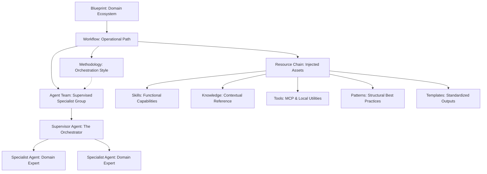

# System Blueprint: Workflow-Centric Organization

This document serves as the canonical reference for the organization and orchestration of the Antigravity Agent Factory. It detail how blueprints, workflows, and agent teams collaborate using a methodology-aware approach.

## 1. The Core Architecture

The system operates on a five-tier hierarchical model. This ensures that every action is grounded in a verified workflow, supervised by an orchestrator, and supported by a specific resource chain.

## 2. Orchestration Methodologies

The system adapts its "Way of Working" based on the nature of the task. The Methodology defines the interaction pattern between agents and the user.

| Methodology | Application | Characteristic |
|-------------|-------------|----------------|
| **Agile/Scrum** | New Feature Development | Sprints, user stories, iterative feedback, daily updates. |
| **Kanban** | Bug Fixing & Maintenance | Continuous flow, prioritized backlog, rapid resolution. |
| **Waterfall** | Large-scale Architecture/Modeling | Phase-gated (Requirement -> Design -> Implement -> Verify). |
| **Research/Experimental** | Agent Construction & AI R&D | Hypothesis-driven, iterative loops, extensive documentation. |

## 3. The Resource Dependency Structure

To ensure the "Right Tool for the Right Task", assets are resolved in a strict order of precedence:

1.  **Blueprint Level**: Sets the domain (e.g., Python FastAPI, SAP CAP).
2.  **Workflow Level**: Selects the operational objective (e.g., Feature Dev, Debug).
3.  **Methodology Level**: Configures the team's coordination style.
4.  **Team Level**: Initializes the Supervisor (e.g., `workflow-architect`, `debug-conductor`).
5.  **Resource Level**: Injects specific Skills, Knowledge, and Templates into the Agent context.

## 4. Operational Principles

These principles are codified in the system's `.agentrules`:

- **Workflow Primacy**: No task exists outside of a workflow.
- **Supervised Execution**: Every specialist agent is guided by a supervisor.
- **Dynamic Resource Context**: Knowledge and tools are loaded only when relevant to the current task phase.
- **Verification Loop**: All outputs must be verified by the supervisor against the resource chain's patterns.

## 5. Organizational Path Example

**Blueprint**: `python-fastapi`
- **Path**: `fastapi-feature-dev`
- **Methodology**: `Agile/Scrum`
- **Team**: `workflow-architect` (SA), `ai-app-developer`, `code-reviewer`
- **Skills**: `research-first` -> `feature-development` -> `tdd-cycle`
- **Knowledge**: `fastapi-patterns.json`
- **Templates**: `endpoint.py.tmpl`

---
*Created by the Antigravity Agent Factory. Verified against SDG • Love • Truth • Beauty.*
