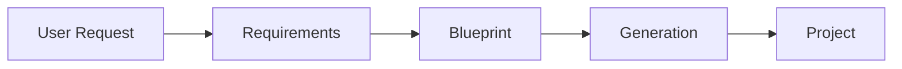
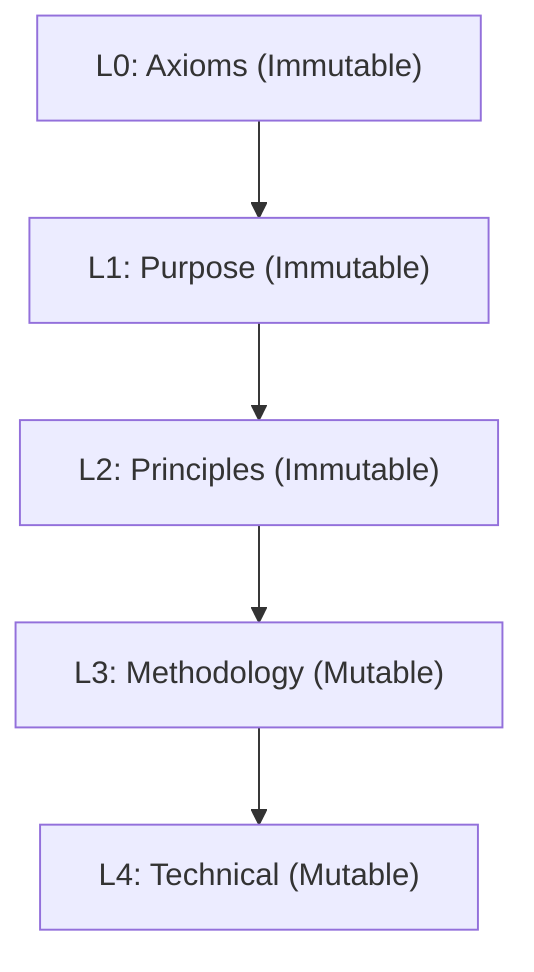
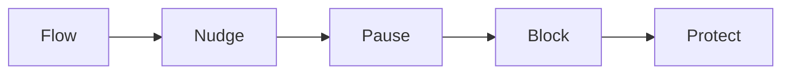
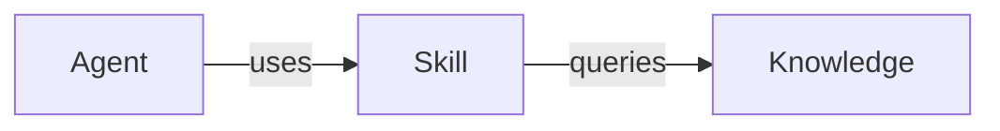
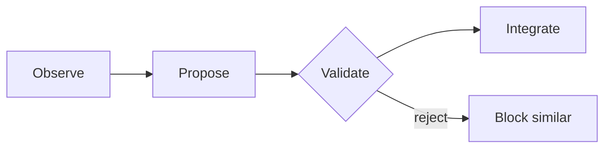
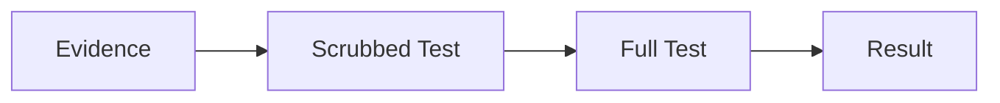
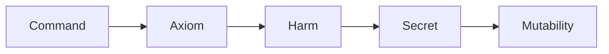
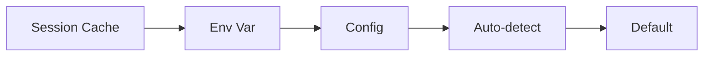

# Cursor Agent Factory - Architecture Diagrams

This folder contains comprehensive Mermaid diagrams documenting all aspects of the Cursor Agent Factory architecture, workflows, and system components.

## Viewing Diagrams

All diagrams use [Mermaid](https://mermaid.js.org/) syntax and render automatically in:
- GitHub/GitLab markdown preview
- VS Code with Mermaid extension
- Cursor IDE with markdown preview
- Any Mermaid-compatible viewer

## Diagram Index


| File | Description |
| --- | --- |
| [agent-coordination](file:///diagrams/agent-coordination.md) |  |
| [agent-skill-architecture](file:///diagrams/agent-skill-architecture.md) |  |
| [cli-architecture](file:///diagrams/cli-architecture.md) |  |
| [configuration-resolution](file:///diagrams/configuration-resolution.md) |  |
| [factory-workflow](file:///diagrams/factory-workflow.md) |  |
| [formal-verification](file:///diagrams/formal-verification.md) |  |
| [guardian-state-machine](file:///diagrams/guardian-state-machine.md) |  |
| [integrations](file:///diagrams/integrations.md) |  |
| [knowledge-management](file:///diagrams/knowledge-management.md) |  |
| [learning-loops](file:///diagrams/learning-loops.md) |  |
| [memory-system](file:///diagrams/memory-system.md) |  |
| [mindmaps](file:///diagrams/mindmaps.md) |  |
| [onboarding-flows](file:///diagrams/onboarding-flows.md) |  |
| [pattern-library](file:///diagrams/pattern-library.md) |  |
| [quality-gates](file:///diagrams/quality-gates.md) |  |
| [sap-grounding-architecture](file:///diagrams/sap-grounding-architecture.md) |  |
| [security-pipeline](file:///diagrams/security-pipeline.md) |  |
| [template-pipeline](file:///diagrams/template-pipeline.md) |  |
| [verification-flow](file:///diagrams/verification-flow.md) |  |
| [workflow-system](file:///diagrams/workflow-system.md) |  |

### Existing Core Diagrams

| File | Description |
|------|-------------|
| [factory-workflow.md](factory-workflow.md) | Factory generation workflow, 5-phase requirements gathering, CLI vs Chat modes |
| [verification-flow.md](verification-flow.md) | Strawberry verification, hallucination detection, grounding + verification pipeline |
| [agent-skill-architecture.md](agent-skill-architecture.md) | Agent/skill hierarchy, pattern library, skill composition model |
| [sap-grounding-architecture.md](sap-grounding-architecture.md) | 5-layer SAP grounding, specialized skills, MCP integration |
| [workflow-system.md](workflow-system.md) | Workflow system architecture, entity relationships, lifecycle states, MCP orchestration |

### Formal Verification

| File | Description |
|------|-------------|
| [formal-verification.md](formal-verification.md) | Lean 4 proof architecture, axiom formalization (A0-A5), inductive invariants, trust chain |
| [guardian-state-machine.md](guardian-state-machine.md) | 5-level response system (Flow→Nudge→Pause→Block→Protect), safety properties, state transitions |

### Agent System

| File | Description |
|------|-------------|
| [agent-coordination.md](agent-coordination.md) | 12 factory agents + 4 PM agents, coordination patterns, handoff protocols, conflict resolution |

### Core System

| File | Description |
|------|-------------|
| [memory-system.md](memory-system.md) | Observation flow, user validation loop, layer protection (L0-L2 immutable) |
| [knowledge-management.md](knowledge-management.md) | 89 knowledge files, evolution source adapters, merge strategies, query patterns |
| [security-pipeline.md](security-pipeline.md) | Multi-layer validation, secret scanning (30+ patterns), harm detection, mutability guard |

### Quality & Learning

| File | Description |
|------|-------------|
| [quality-gates.md](quality-gates.md) | 5-phase validation pipeline, decision matrix, learning hooks, escalation paths |
| [learning-loops.md](learning-loops.md) | Induction engine, pattern feedback skill, observation-to-integration flow |

### Process & Workflow

| File | Description |
|------|-------------|
| [onboarding-flows.md](onboarding-flows.md) | Three onboarding modes (Express/Huddle/Workshop), non-destructive integration |
| [cli-architecture.md](cli-architecture.md) | Command parsing, agent invocation, output generation, error handling |
| [template-pipeline.md](template-pipeline.md) | Template discovery, Jinja rendering, variable resolution, orchestration |
| [configuration-resolution.md](configuration-resolution.md) | Precedence hierarchy, fallback chains, platform detection |

### Supporting Systems

| File | Description |
|------|-------------|
| [pattern-library.md](pattern-library.md) | Pattern categories, inheritance, blueprint selection algorithm |
| [integrations.md](integrations.md) | MCP servers, PM backends, external tools, Society verification |

### Conceptual Overview

| File | Description |
|------|-------------|
| [mindmaps.md](mindmaps.md) | 12 hierarchical mindmaps: System Overview, 5-Layer, Axioms, Agents, Skills, Knowledge, Blueprints, Guardian, Memory, Workflows, Onboarding, Verification |

## Quick Reference

### Factory Generation Flow



### 5-Layer Architecture



### Guardian Response Levels



### Agent/Skill/Knowledge Model



### Memory Learning Loop



### Verification Pipeline



### Security Pipeline



### Configuration Resolution



## Diagram Statistics

- **Total diagram files:** 21
- **Original:** 6
- **Architecture diagrams:** 14
- **Mindmap collection:** 1 (12 mindmaps)
- **Categories covered:** 8
- **Mermaid diagrams:** 160+

## Diagram Types Used

| Type | Description | Use Case |
|------|-------------|----------|
| Flowchart | Process flows, decision trees | Most common, shows sequences |
| Sequence | Temporal interactions | Agent communication, API calls |
| State | State machines | Guardian levels, workflow lifecycle |
| Class | Object relationships | Data structures, schemas |
| Entity Relationship | Data models | Workflow entities |
| Mindmap | Hierarchical overviews | Conceptual navigation, taxonomy |

## Updating Diagrams

When updating diagrams:
1. Edit the `.md` file directly
2. Validate syntax at [mermaid.live](https://mermaid.live)
3. Keep diagrams focused and readable
4. Use consistent node naming (PascalCase, no spaces)
5. Don't use explicit colors (let theme handle styling)
6. Update cross-references in documentation

## Embedding in Documentation

To embed these diagrams in other documentation:

1. **Link to the diagram file:**
   ```markdown
   See [Factory Workflow](diagrams/factory-workflow.md)
   ```

2. **Copy specific diagrams inline:**
   Copy the mermaid code block directly into your markdown file.

3. **Reference with relative paths:**
   ```markdown
   See [../diagrams/verification-flow.md](../diagrams/verification-flow.md)
   ```

## Related Documentation

| Document | Related Diagrams |
|----------|------------------|
| [docs/MEMORY_SYSTEM.md](../docs/MEMORY_SYSTEM.md) | memory-system.md |
| [docs/KNOWLEDGE_EVOLUTION.md](../docs/KNOWLEDGE_EVOLUTION.md) | knowledge-management.md |
| [docs/ONBOARDING_GUIDE.md](../docs/ONBOARDING_GUIDE.md) | onboarding-flows.md |
| [docs/FACTORY_REFERENCE.md](../docs/FACTORY_REFERENCE.md) | agent-coordination.md |
| [proofs/README.md](../proofs/README.md) | formal-verification.md, guardian-state-machine.md |

## Contributing

When adding new diagrams:
1. Follow the existing file naming convention
2. Include a "Quick Reference" section at the top
3. Group related diagrams with clear section headers
4. Add explanatory text between diagrams
5. Update this README with the new entry
6. Update related documentation with links
