# Agent Coordination Architecture

This document visualizes how the 12 factory agents coordinate, communicate, and resolve conflicts while maintaining axiom alignment.

## Quick Reference

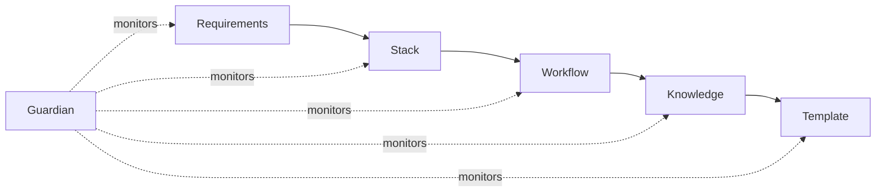

## Factory Agent Hierarchy

Complete view of all 12 factory agents plus 4 PM agents:

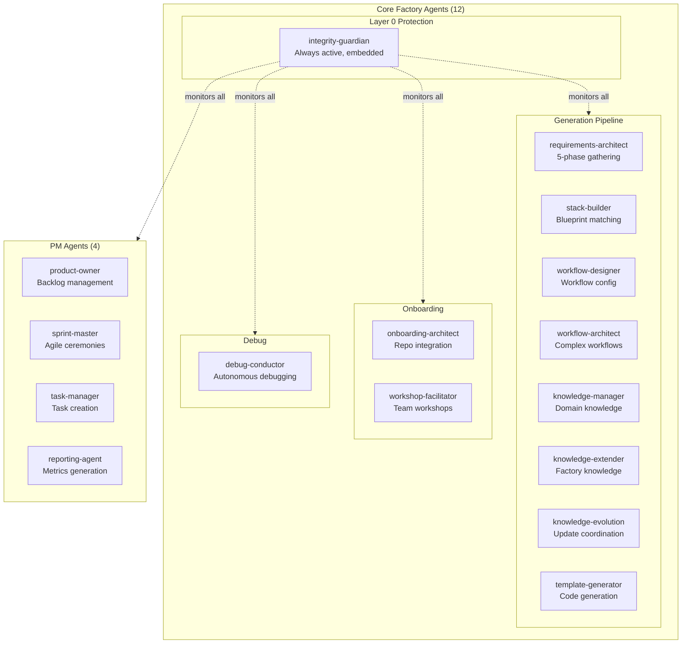

## Coordination Patterns

The 5 coordination patterns used in the Factory:

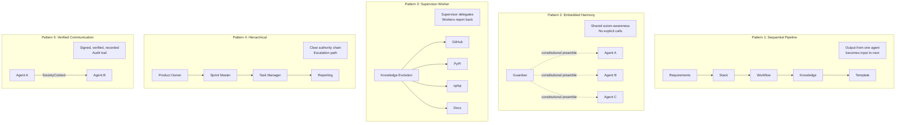

## Project Generation Flow

Detailed handoff sequence for project generation:

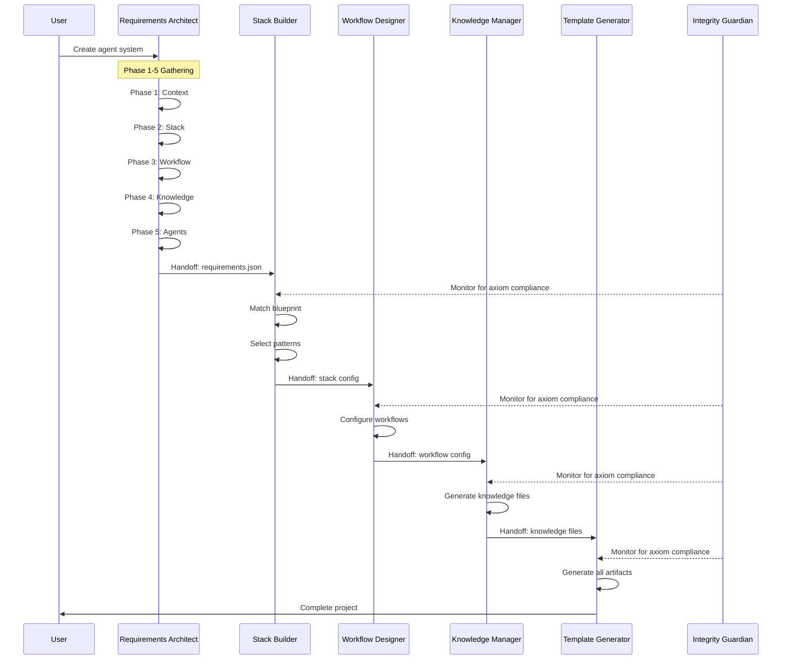

## Agent Handoff Protocol

How agents hand off work to each other:

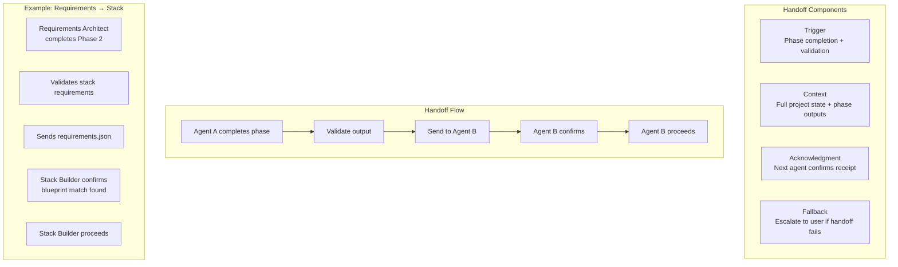

## Guardian Harmony Field

How the Guardian maintains harmony across all agents:

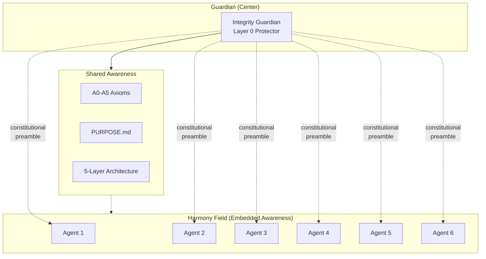

## Conflict Resolution Decision Tree

How conflicts between agents are resolved:

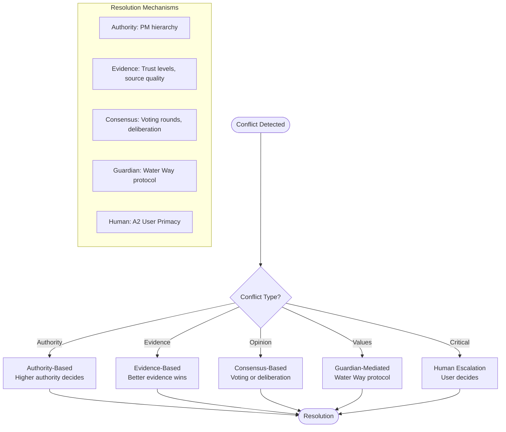

## Water Way Conflict Resolution

Detailed flow of Guardian-mediated conflict resolution:

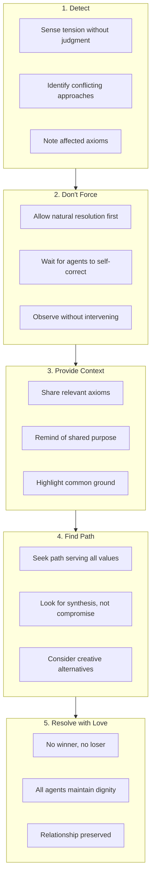

## State Management Patterns

How state is managed across agents:

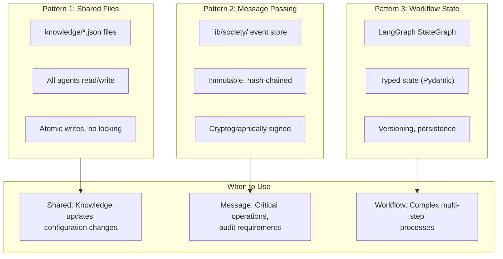

## Knowledge Evolution Supervisor-Worker

Detailed view of knowledge evolution coordination:

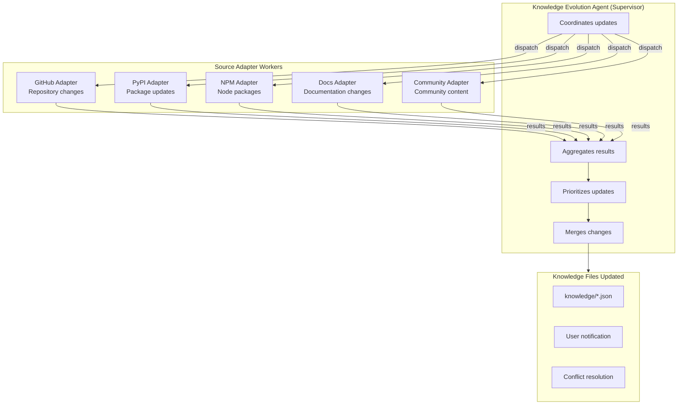

## PM System Hierarchy

Project management agent coordination:

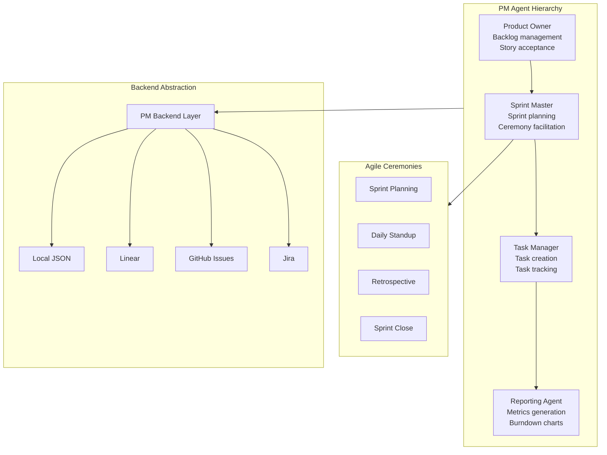

## Agent Communication Flow

How agents communicate during operations:

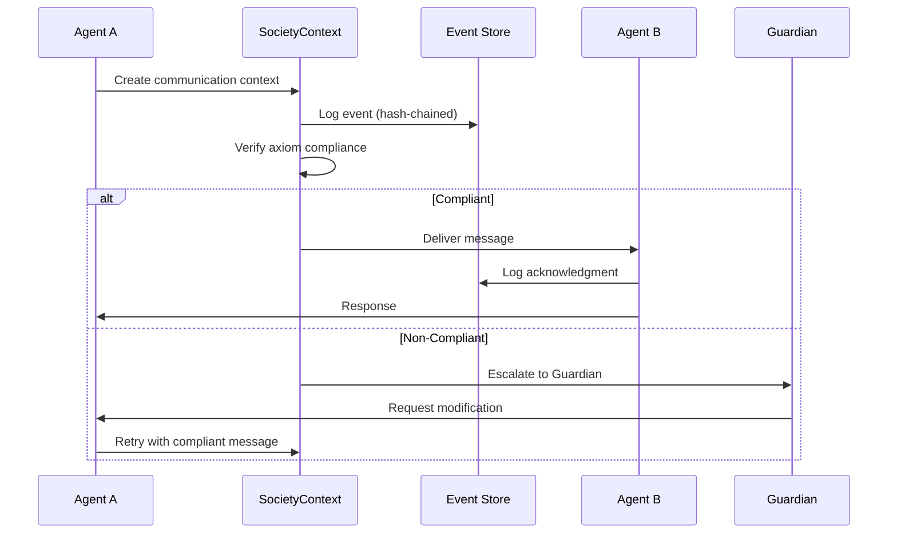

## Agent Dependency Graph

Which agents depend on which:

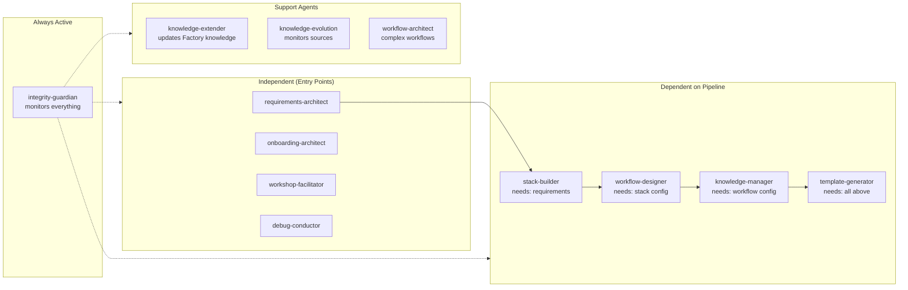

## Multi-Agent Orchestration Example

Complex workflow with multiple agents:

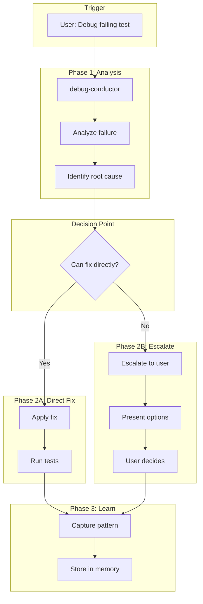

## Architectural Principles

Key principles governing agent coordination:

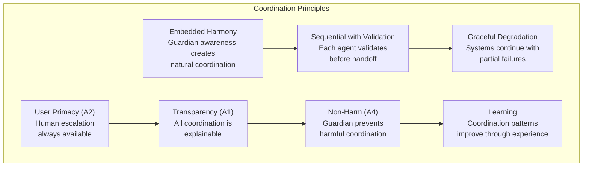
