# CLI Architecture

This document visualizes the command-line interface architecture, from command parsing to agent invocation and output generation.

## Quick Reference

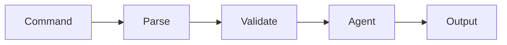

## CLI Command Flow

Complete command processing flow:

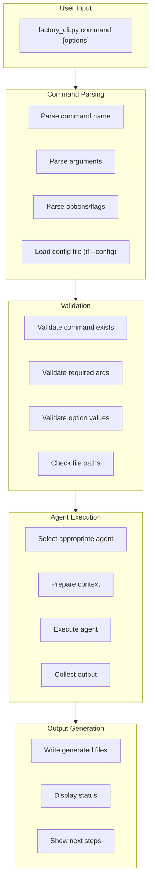

## Available Commands

CLI command structure:

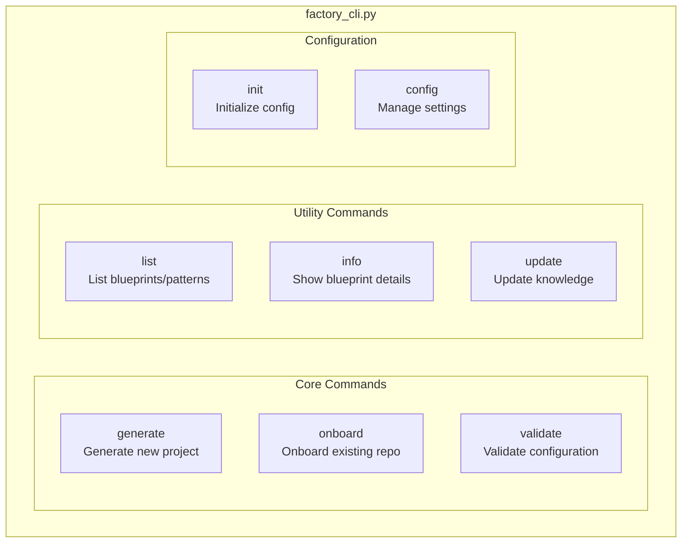

## Command Parsing Detail

How commands are parsed:

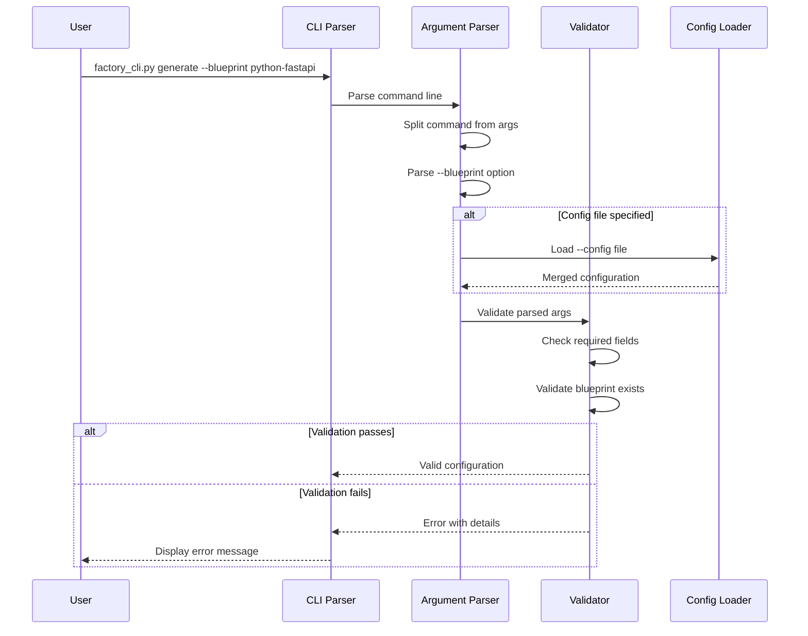

## Interactive vs Non-Interactive Mode

Mode selection and behavior:

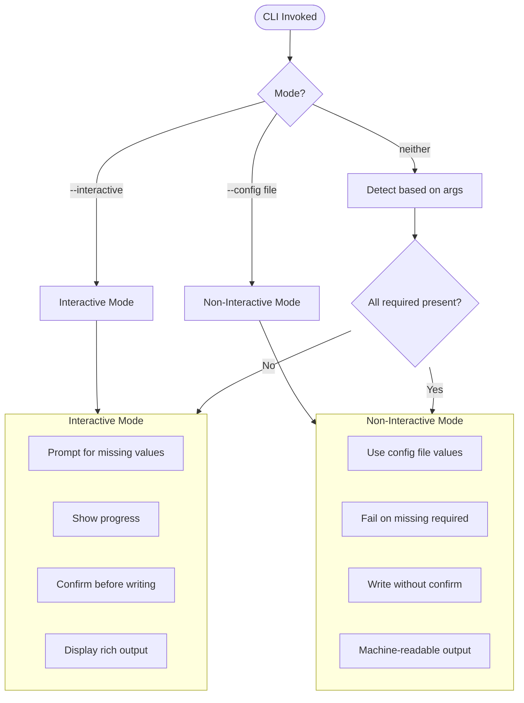

## Agent Invocation

How CLI invokes agents:

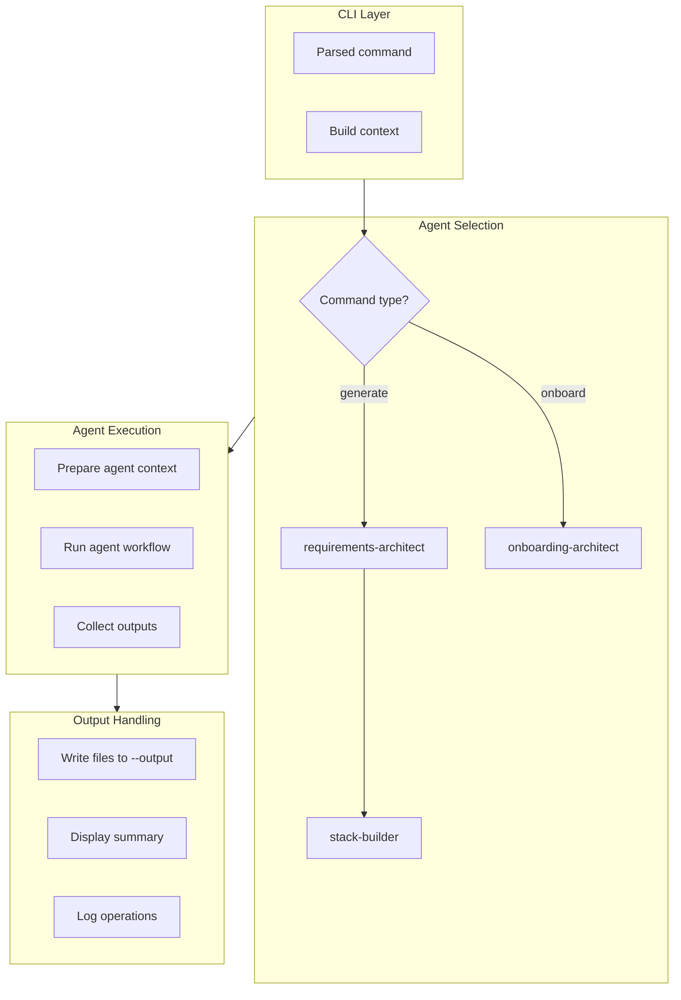

## Output Generation

How outputs are written:

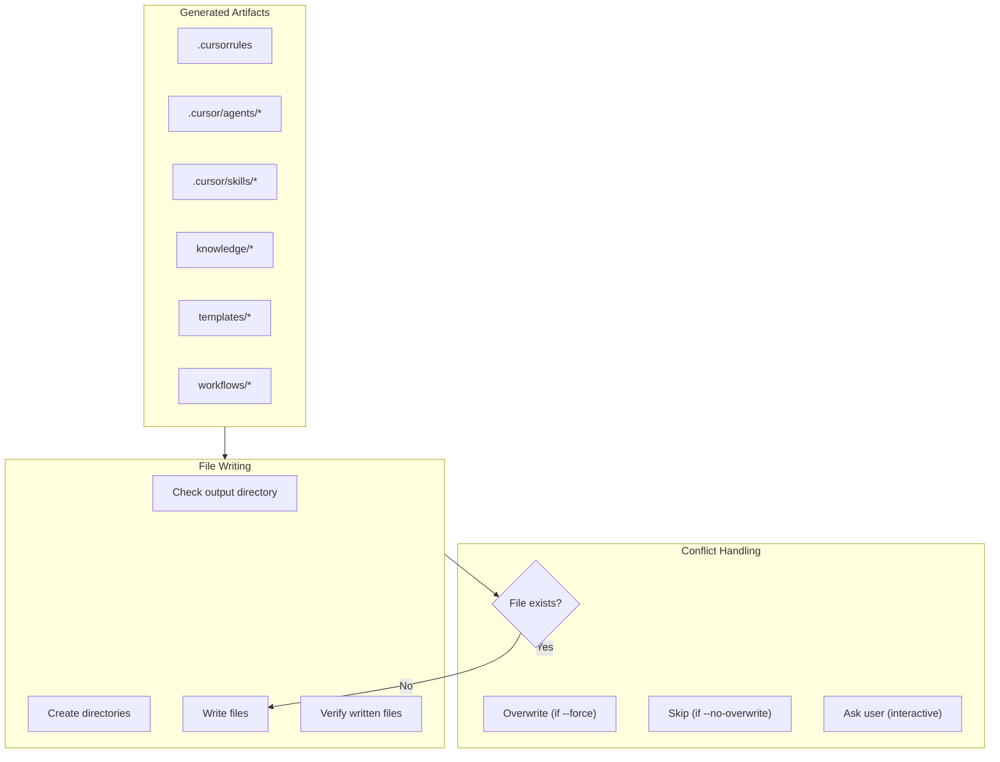

## Error Handling Flow

How errors are handled:

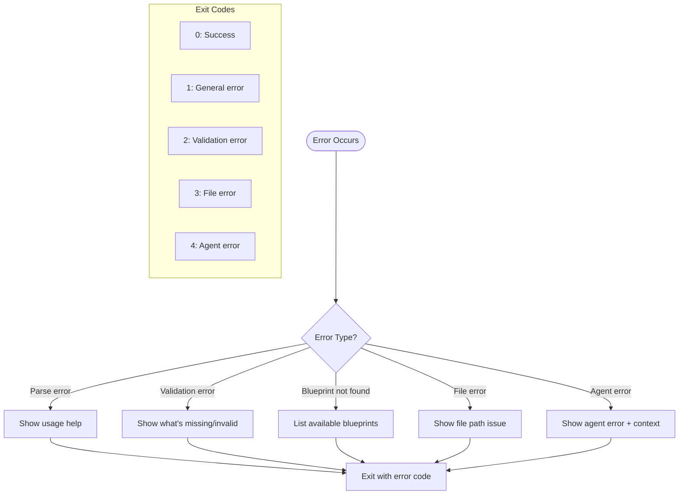

## Configuration File Format

Structure of config files:

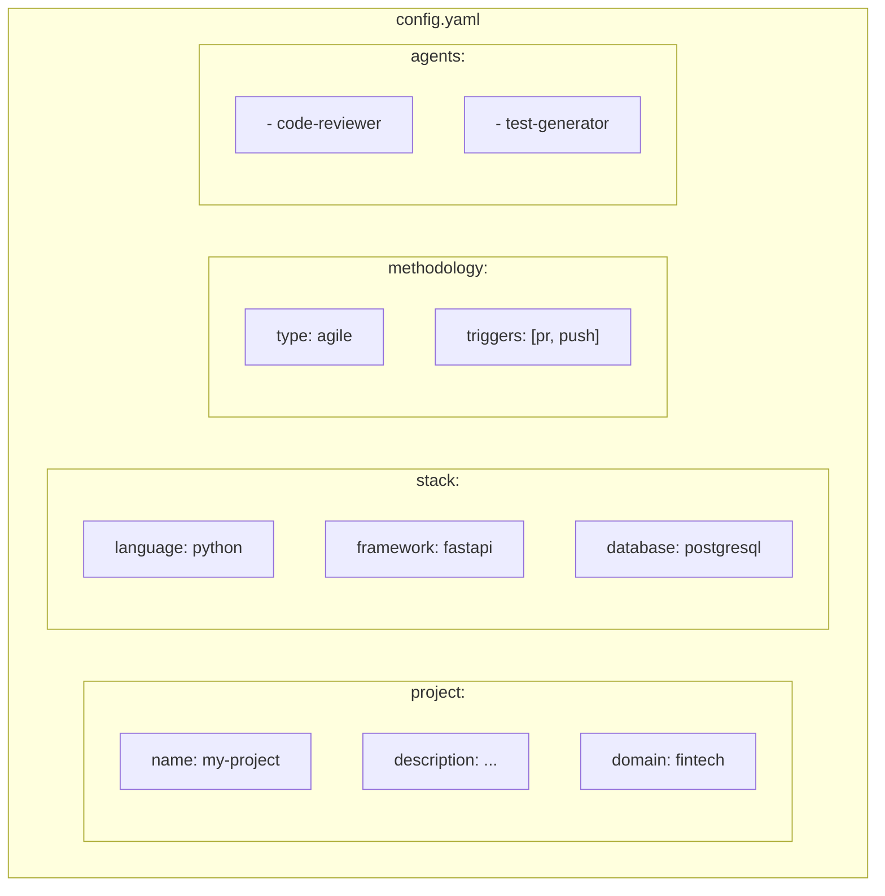

## CLI Options Reference

Available options and flags:

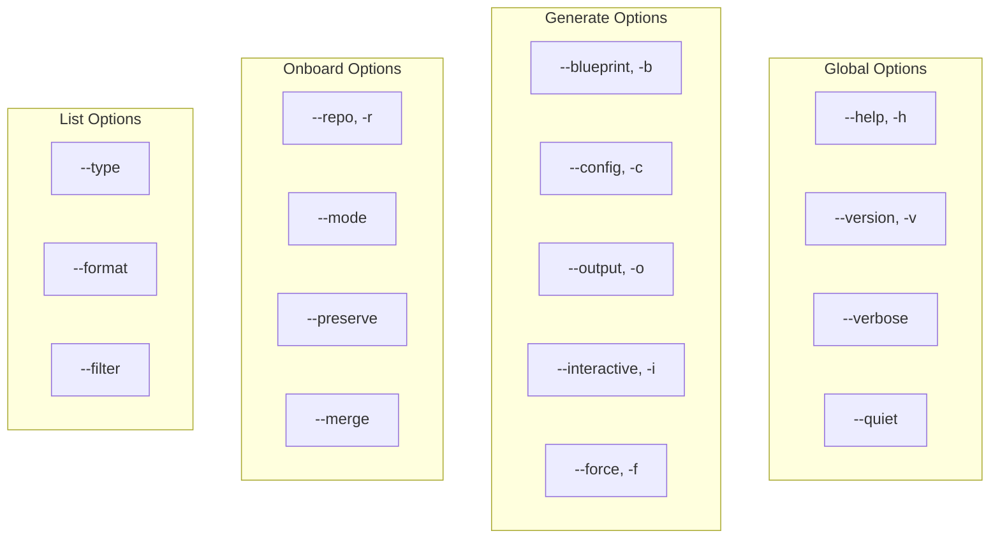

## Progress Display

How progress is shown to users:

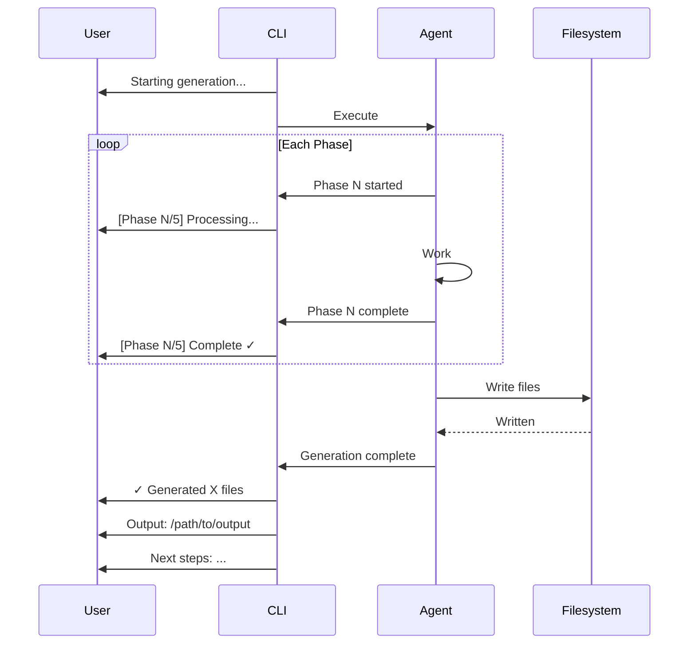

## Pipeline Integration

How CLI integrates with CI/CD:

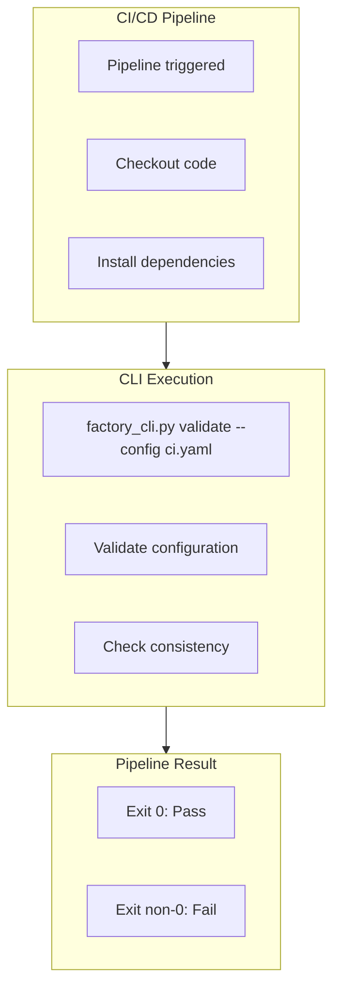

## Command Examples

Common usage patterns:

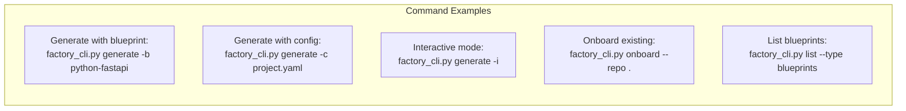
