# Configuration Resolution Architecture

This document visualizes how configuration is resolved from multiple sources with precedence rules and fallback chains.

## Quick Reference

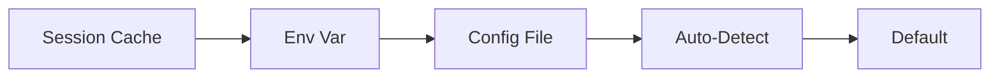

## Configuration Resolution Overview

Complete resolution hierarchy:

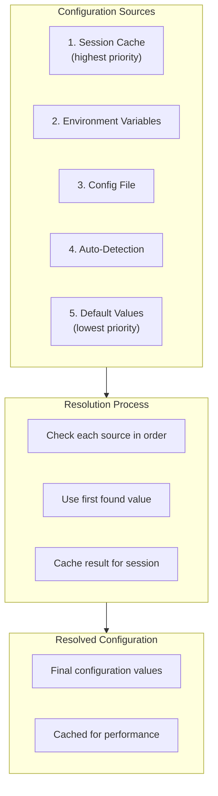

## Tool Path Resolution

How tool paths are resolved:

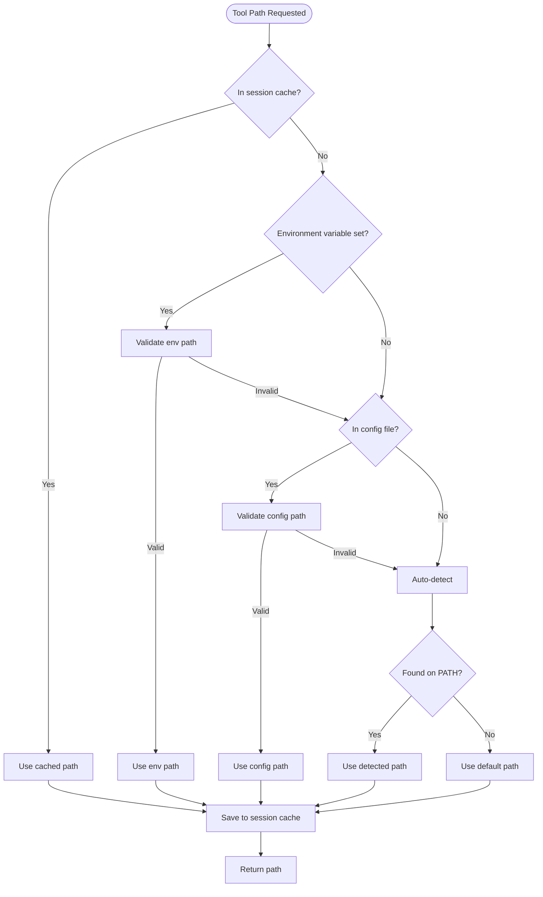

## Precedence Hierarchy Visualization

Visual representation of precedence:

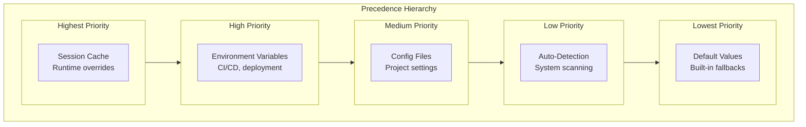

## Environment Variable Resolution

How environment variables are processed:

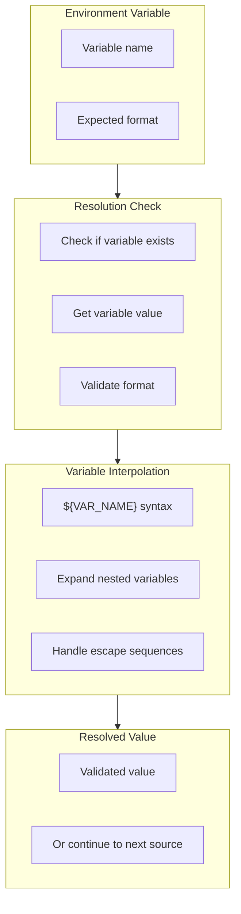

## Platform Detection

Platform-specific configuration:

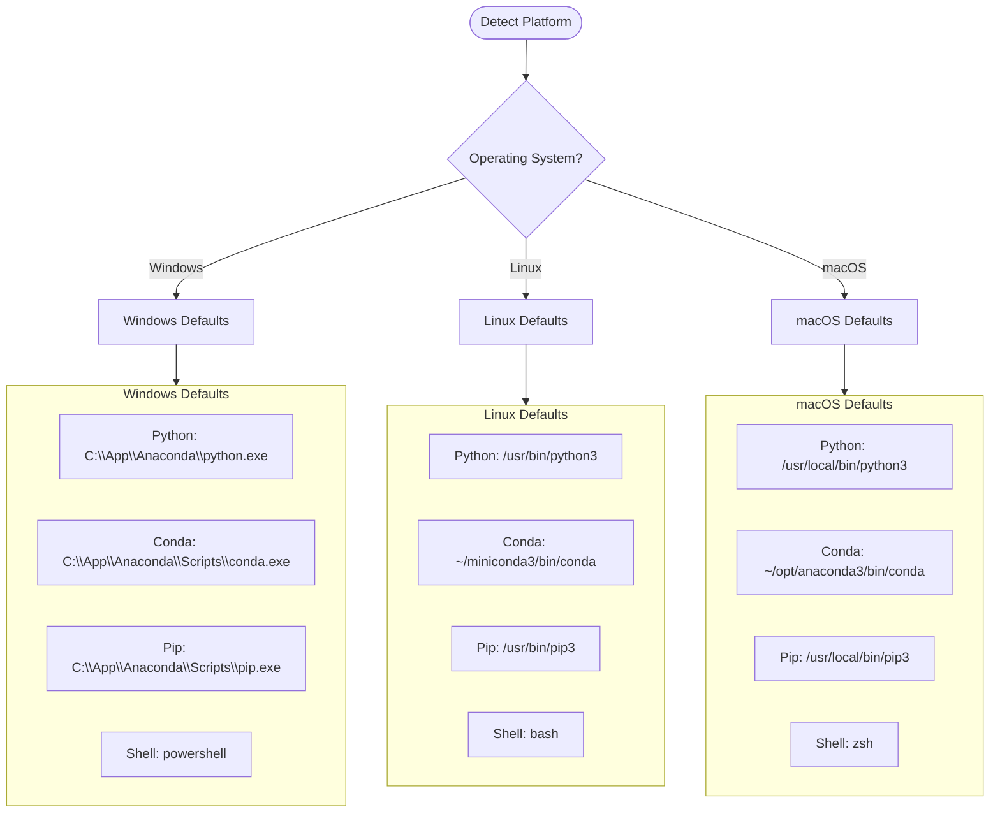

## Fallback Chain Visualization

Complete fallback chain for a tool:

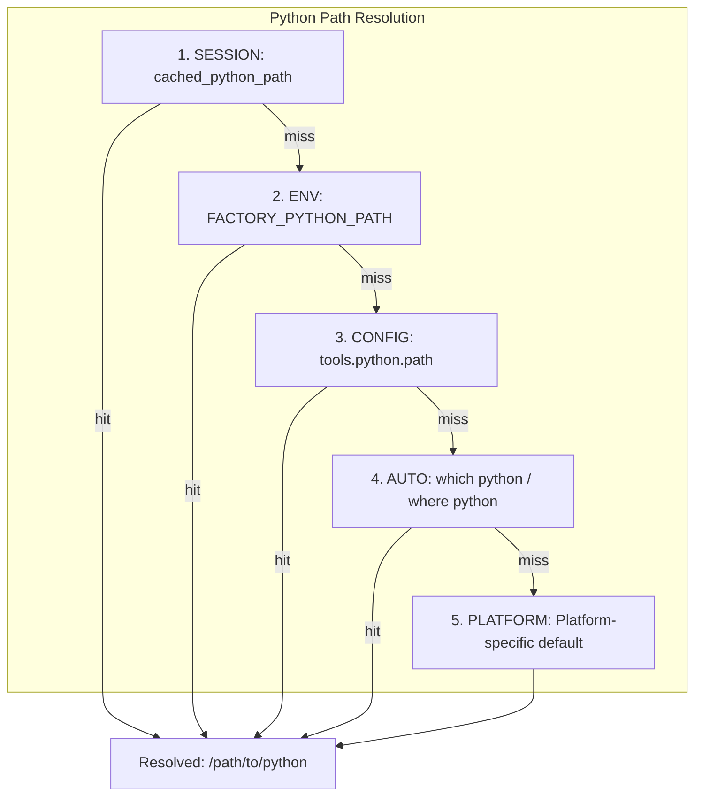

## Config File Structure

Structure of configuration files:

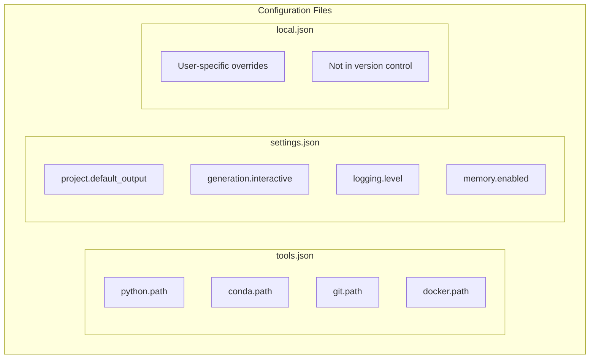

## Auto-Detection Process

How tools are automatically detected:

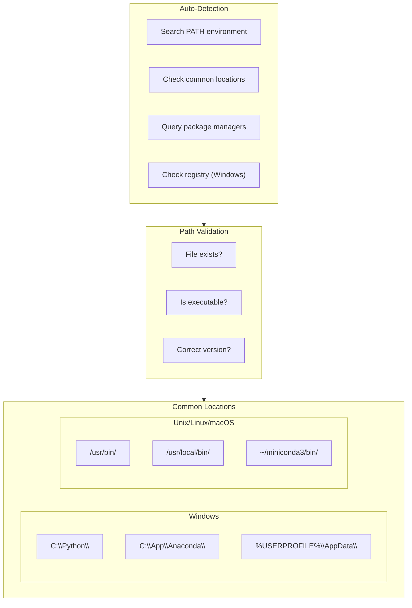

## Configuration Caching

How configuration is cached:

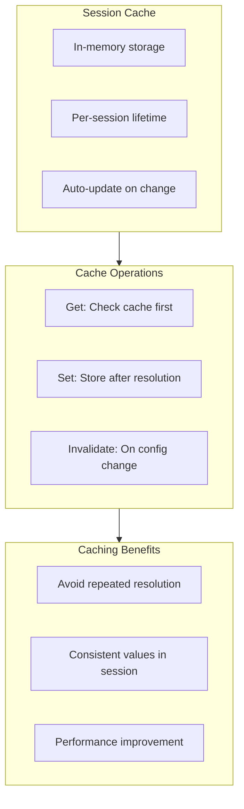

## Configuration Manager Flow

ConfigManager class behavior:

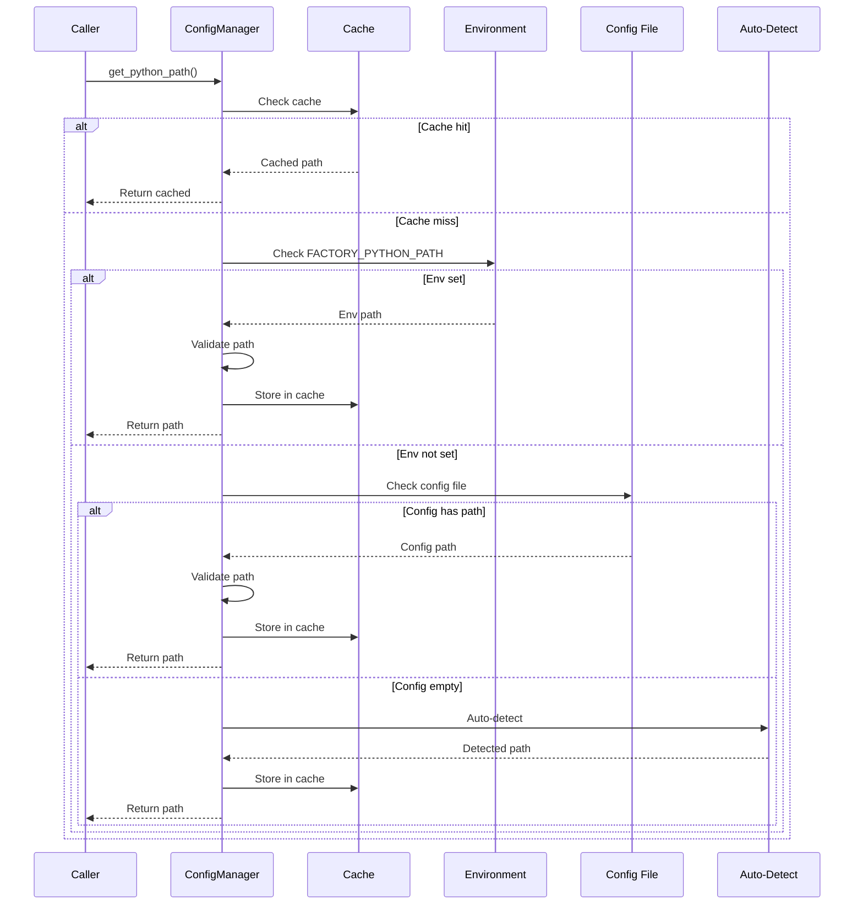

## Directory Resolution

How directories are resolved:

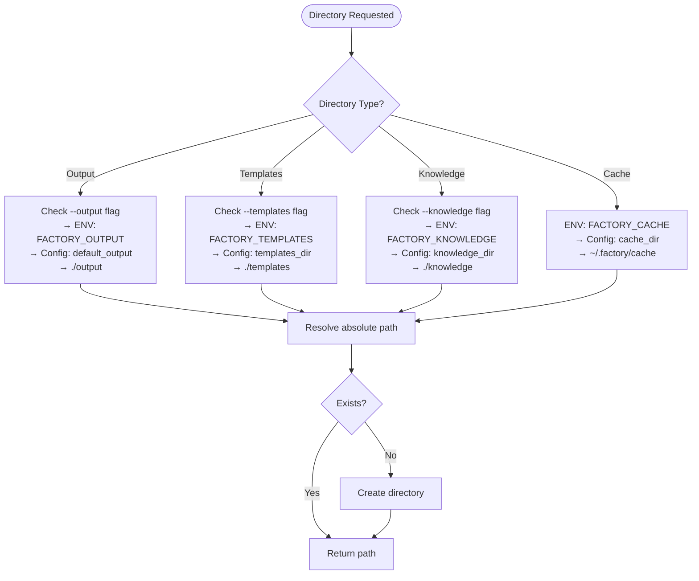

## Environment Variable Interpolation

How nested variables are expanded:

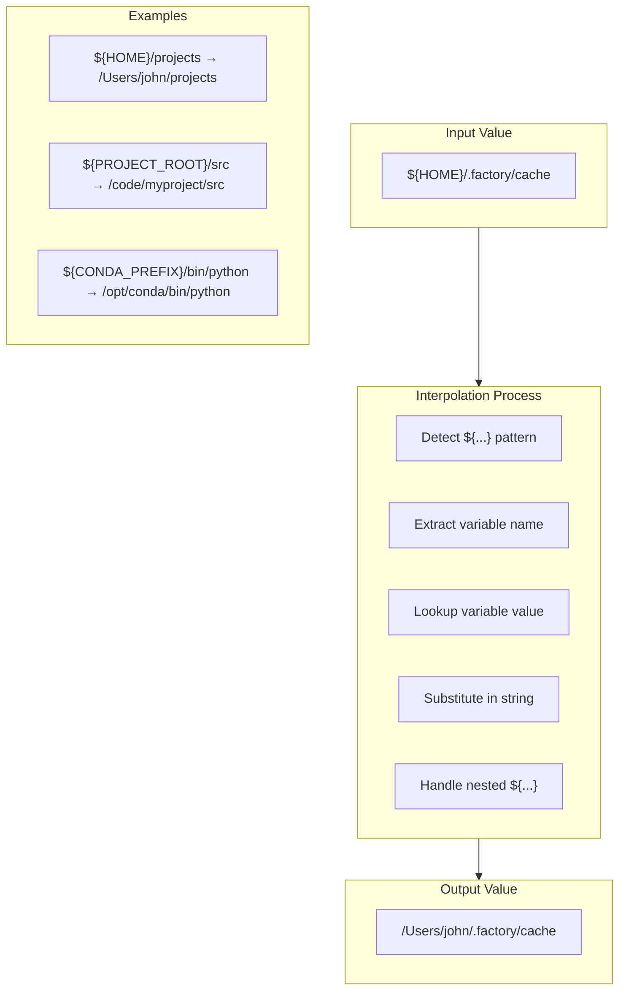

## Configuration Validation

How configuration values are validated:

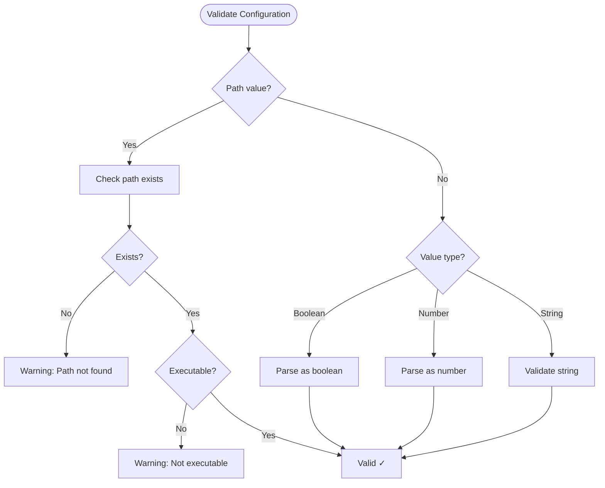

## Configuration Override Flow

How overrides are applied:

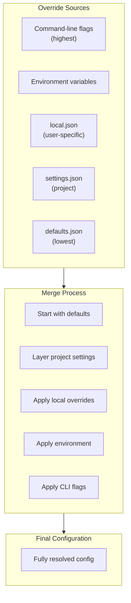
