# Formal Verification Architecture

This document visualizes the Lean 4 formal verification system that mathematically proves the Antigravity Agent Factory's axiom compliance.

## Quick Reference

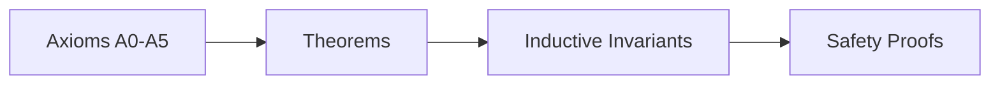

## Proof System Overview

The complete structure of the formal verification system in Lean 4:

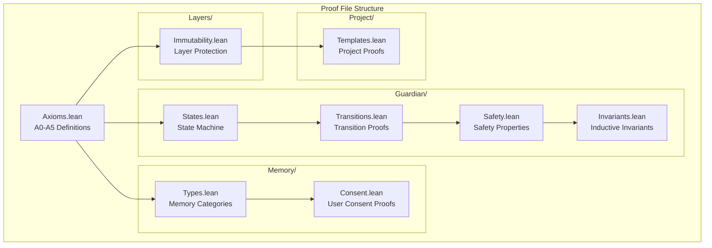

## Axiom Formalization (A0-A5)

The mathematical definition of all core axioms:

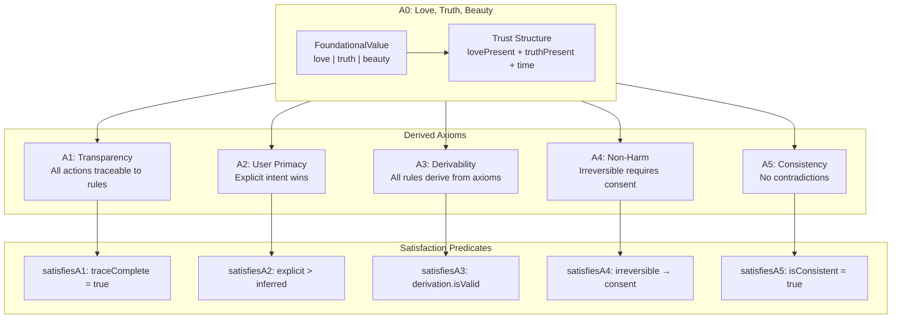

## 5-Layer Architecture Verification

Layer precedence and immutability boundaries with formal verification:

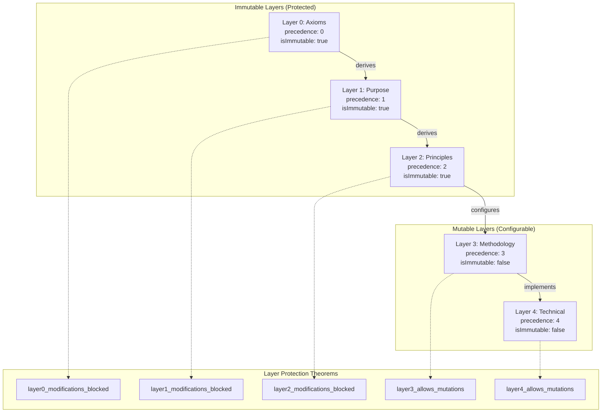

## Inductive Invariant Structure

How mathematical proofs guarantee properties hold forever:

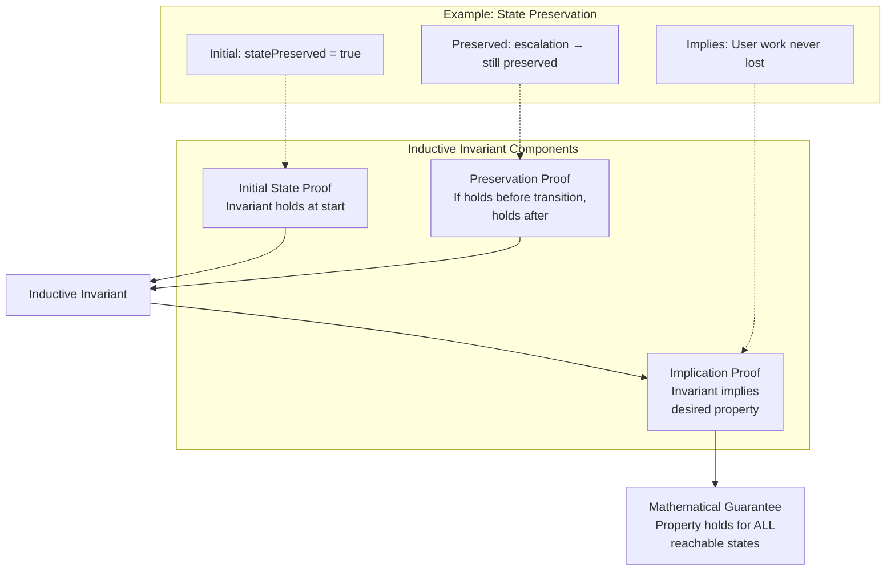

## Proof Dependency Graph

How theorems build on each other:

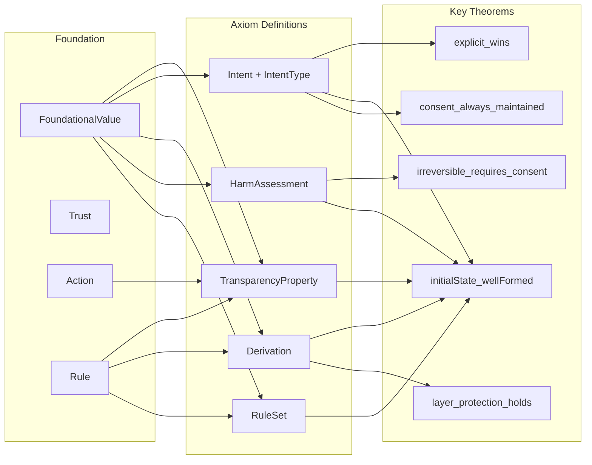

## Axiom Compliance Check

Complete verification structure combining all axioms:

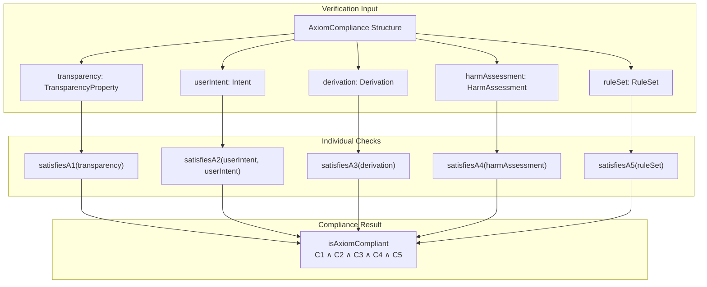

## Trust Chain Visualization

How verification flows from Factory to generated projects:

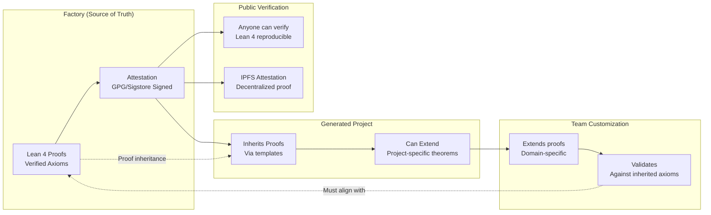

## Verification Status Summary

Current state of formal proofs in the system:

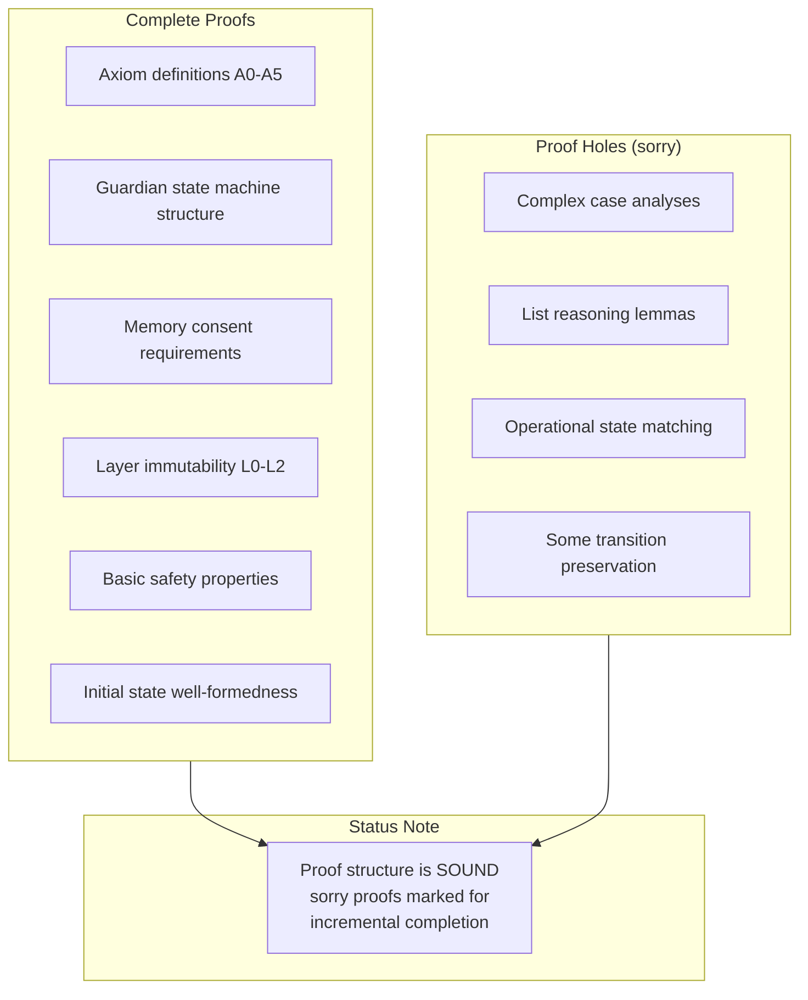

## CI/CD Integration

How formal verification integrates with the development workflow:

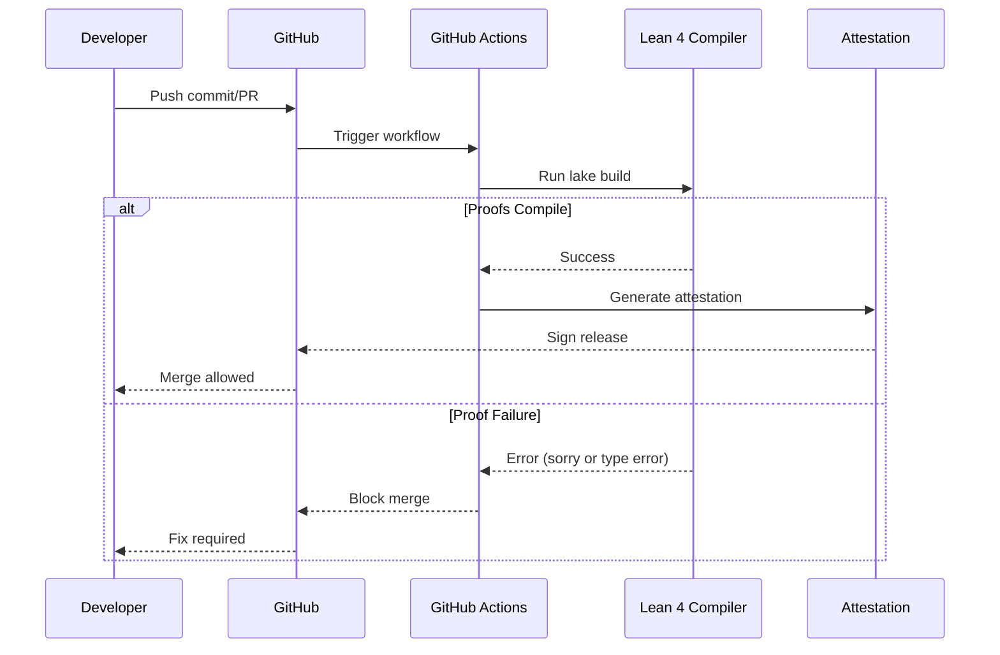

## Mathematical Foundations

Key mathematical concepts used in the verification system:

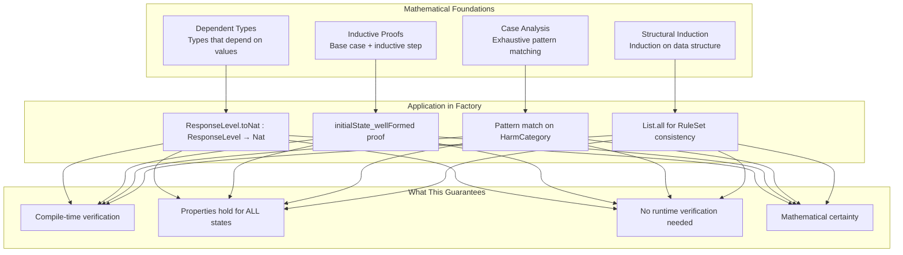
