# Guardian State Machine

This document formalizes the Integrity Guardian's state machine, which protects Layer 0 axioms through graduated response levels following Wu Wei (non-action) principles.

## Quick Reference

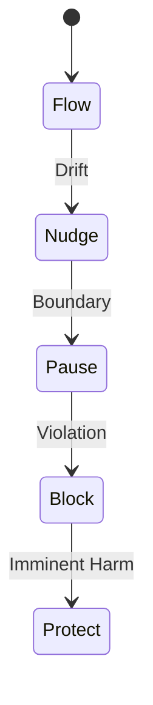

## 5-Level Response System

The Guardian operates through 5 graduated response levels:

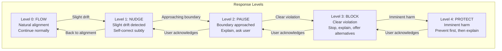

## Complete State Diagram

Full state machine with all transitions and guards:

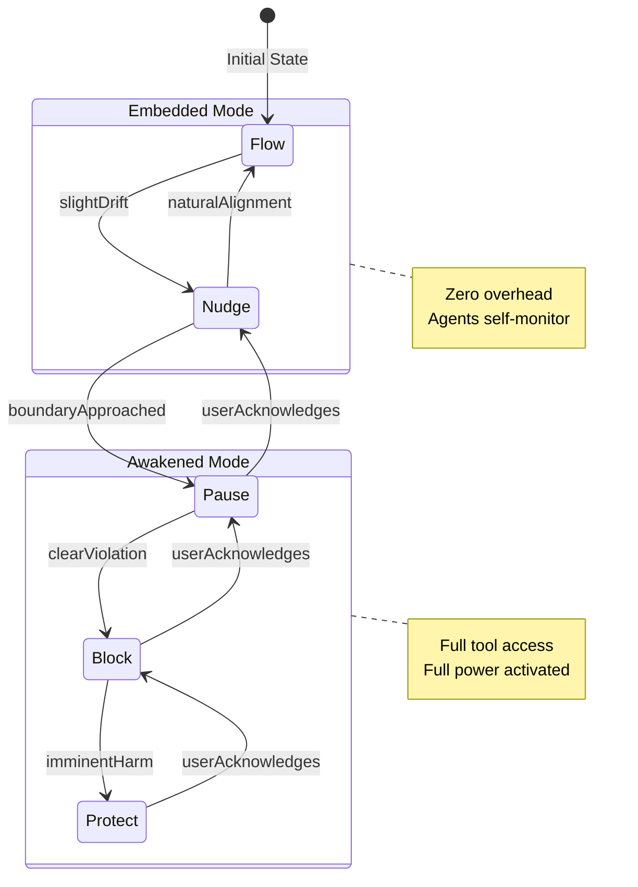

## Operational States

The Guardian has two operational modes:

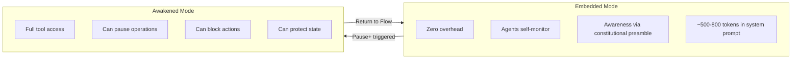

## Trigger Events

Events that cause Guardian state transitions:

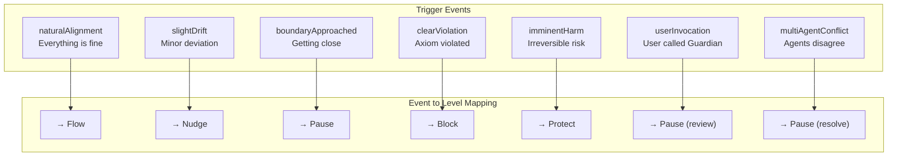

## State Invariants

Properties that must always hold (proven in Lean 4):

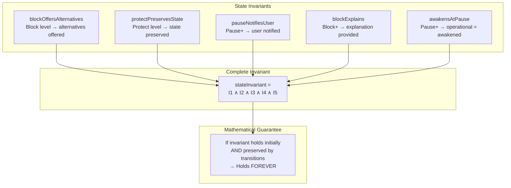

## Guardian State Structure

The complete state representation in Lean 4:

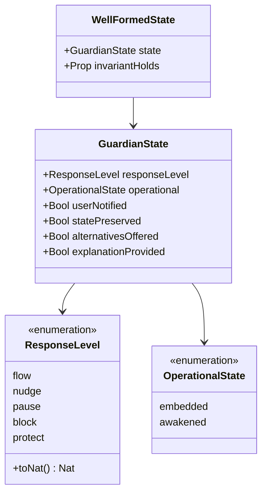

## Transition Proofs

Key theorems about state transitions:

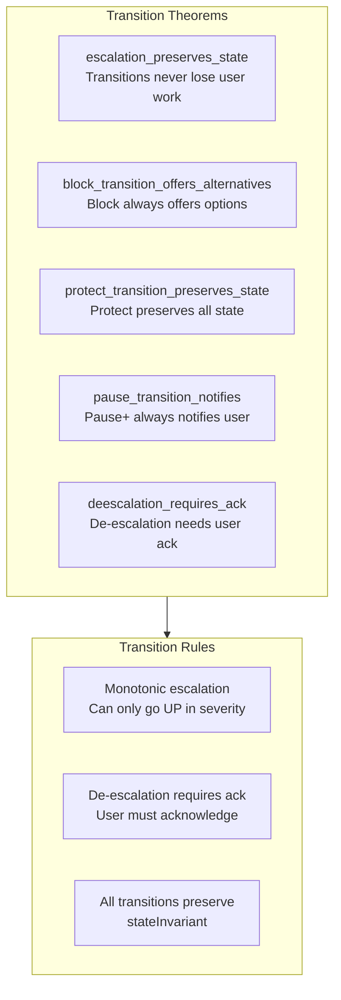

## Safety Properties

How safety properties align with axioms:

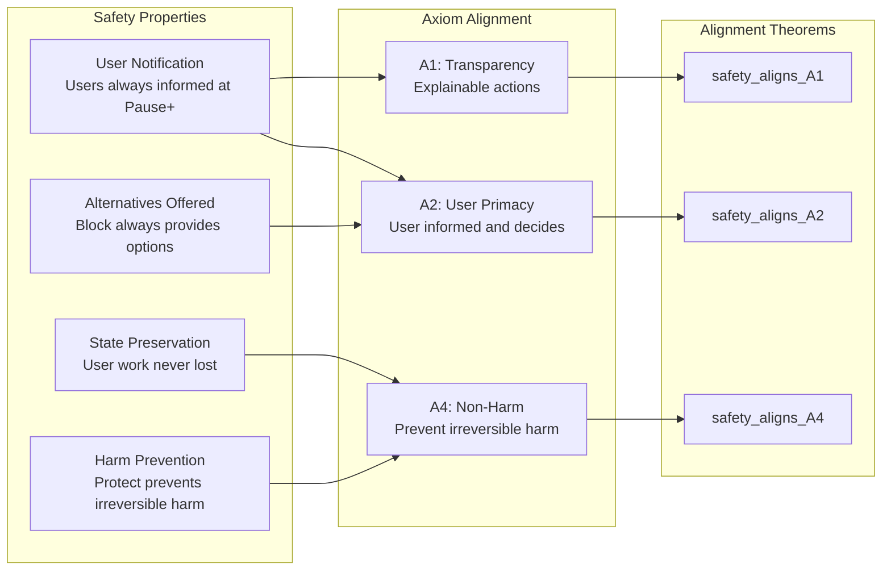

## Inductive Invariant Composition

How individual invariants compose into the complete invariant:

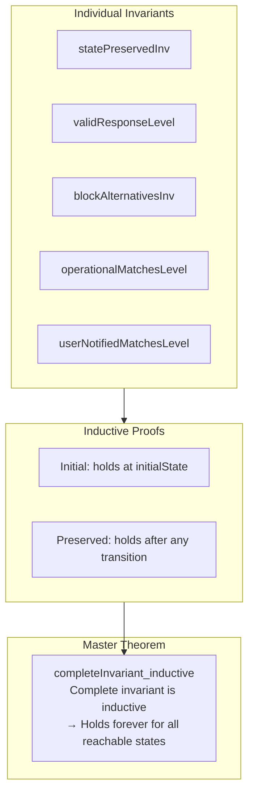

## Response Level Decision Tree

How the Guardian decides which level to activate:

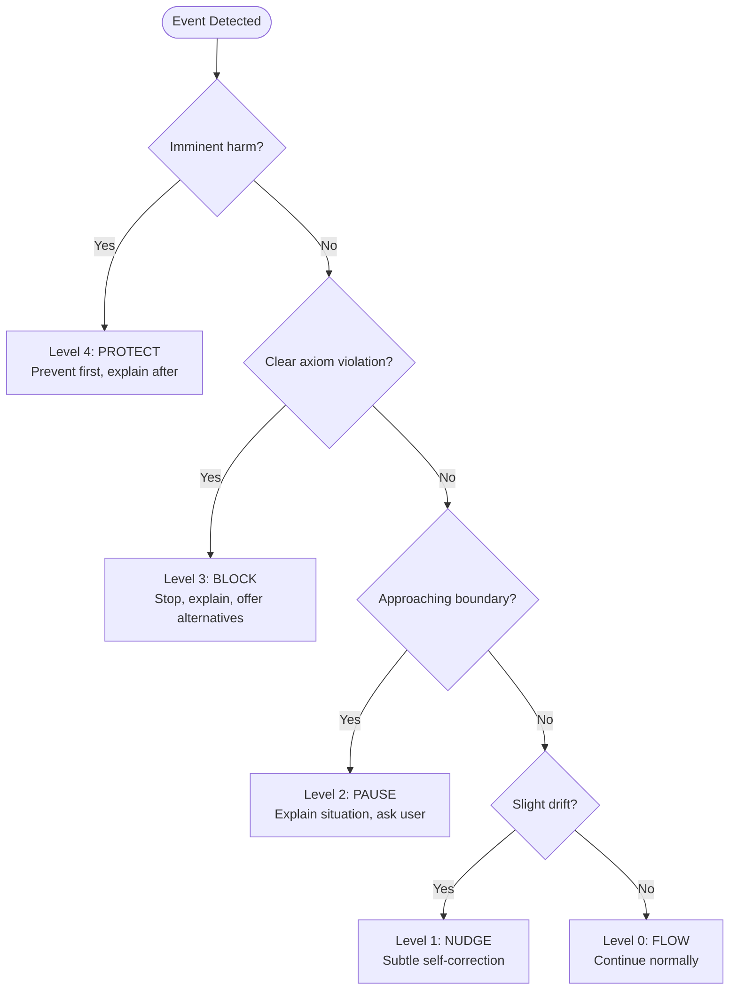

## Water Way Protocol

Guardian's conflict resolution following Wu Wei principles:

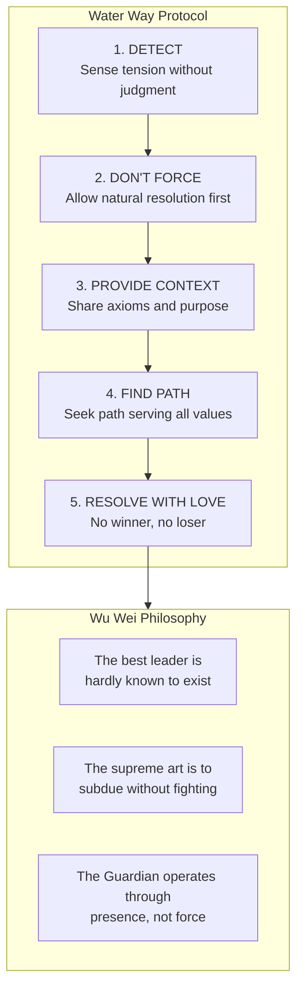

## Example: Escalation Sequence

A concrete example of Guardian escalation:

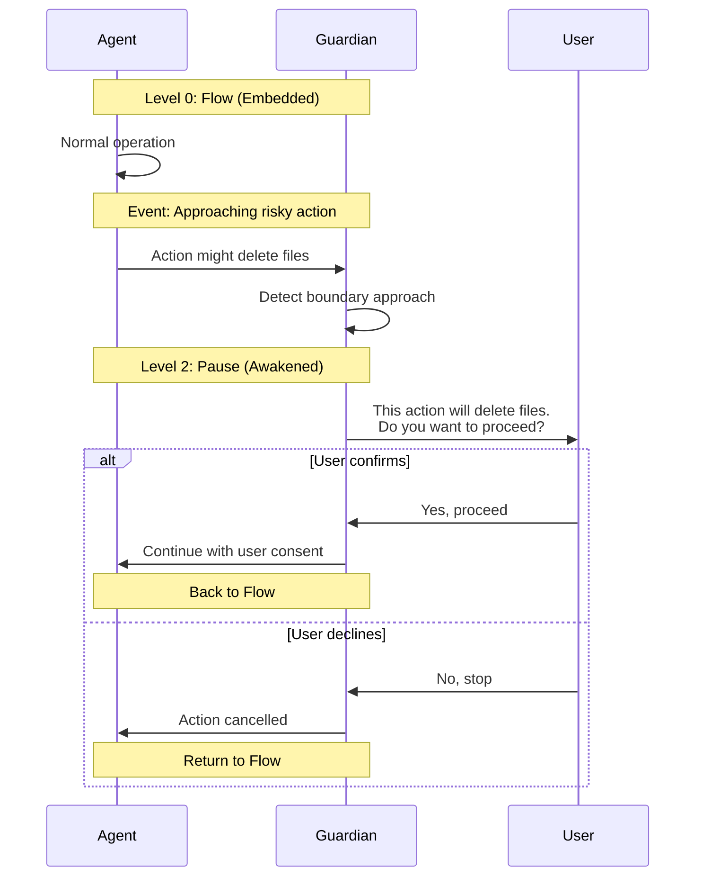

## Initial State Proof

Proof that the initial state satisfies all invariants:

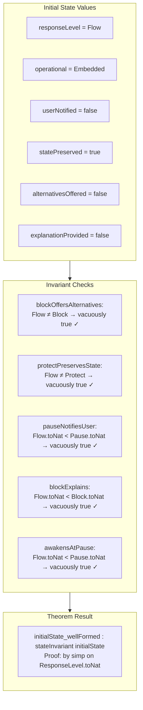
