# Integration Architecture

This document visualizes how the Factory integrates with external systems including MCP servers, PM backends, and development tools.

## Quick Reference

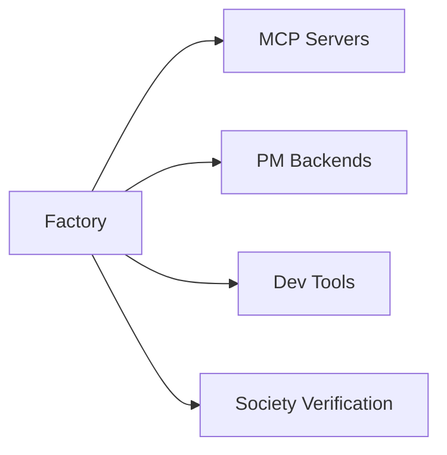

## Integration Overview

Complete integration landscape:

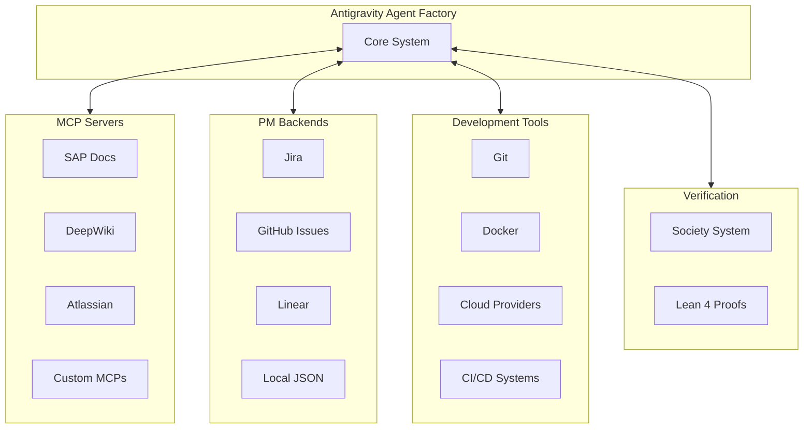

## MCP Server Integration

How MCP servers are discovered and used:

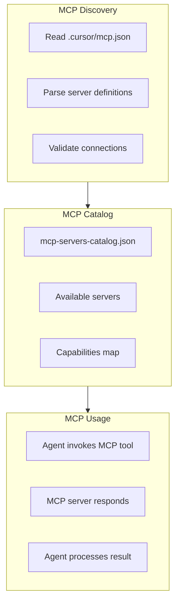

## MCP Server Configuration

Configuration structure:

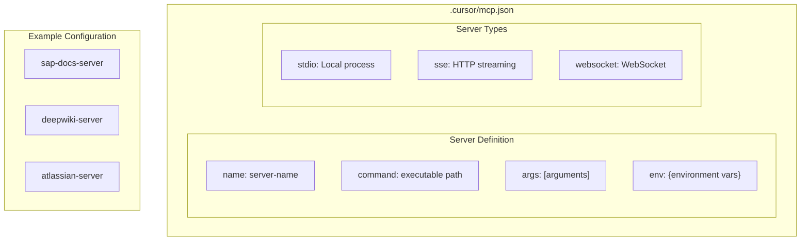

## PM Backend Abstraction

Project management backend architecture:

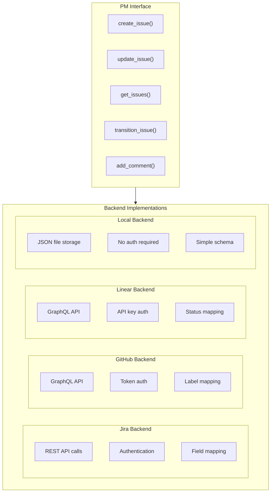

## PM Backend Selection

How the right backend is selected:

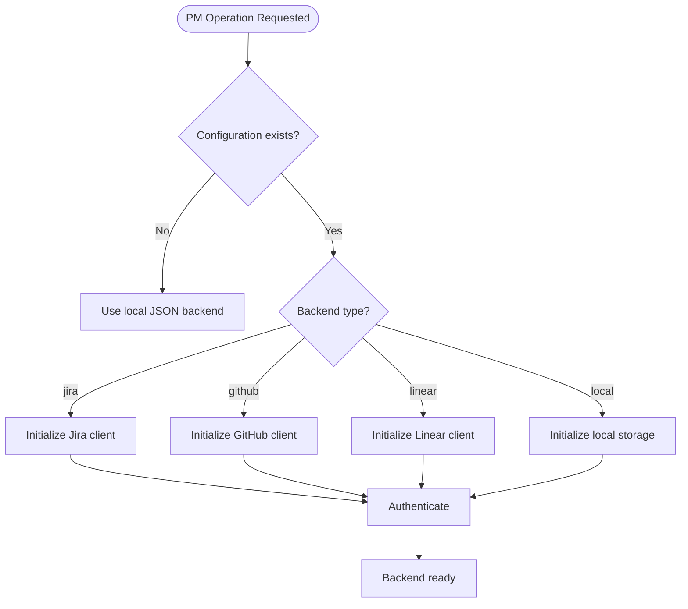

## Git Integration

Git operations and workflows:

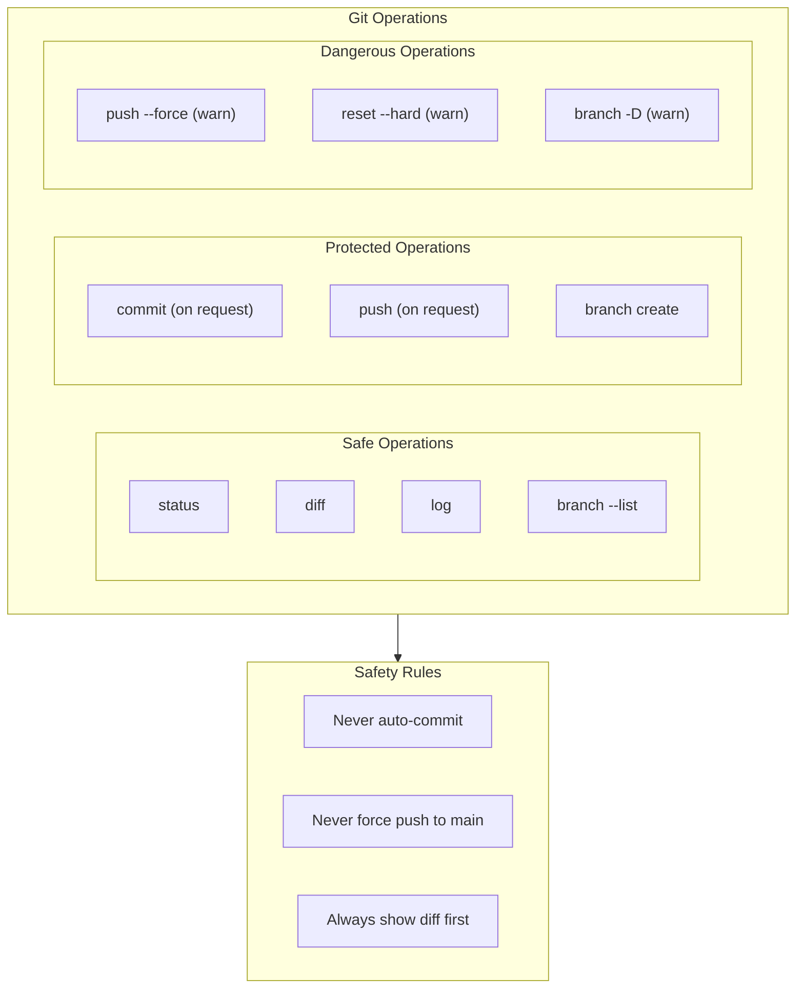

## Society Verification Integration

How lib/society integrates:

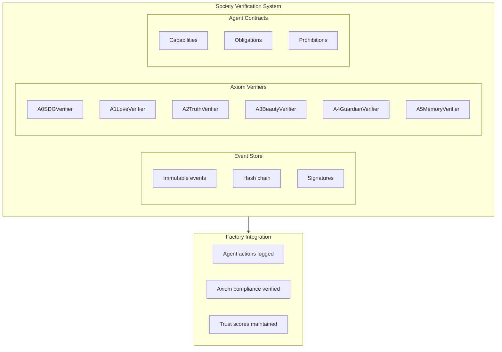

## External Tool Integration

Development tool integrations:

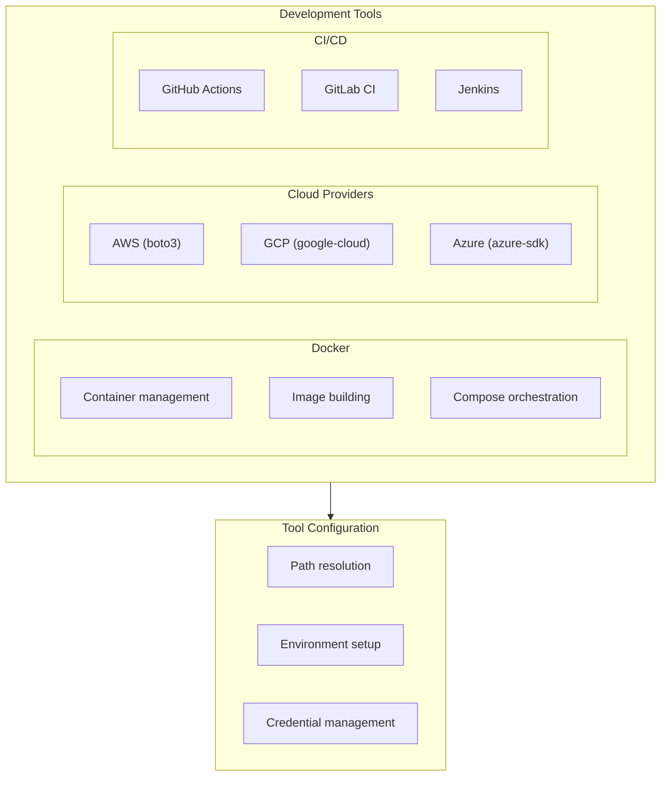

## Authentication Flow

How external services are authenticated:

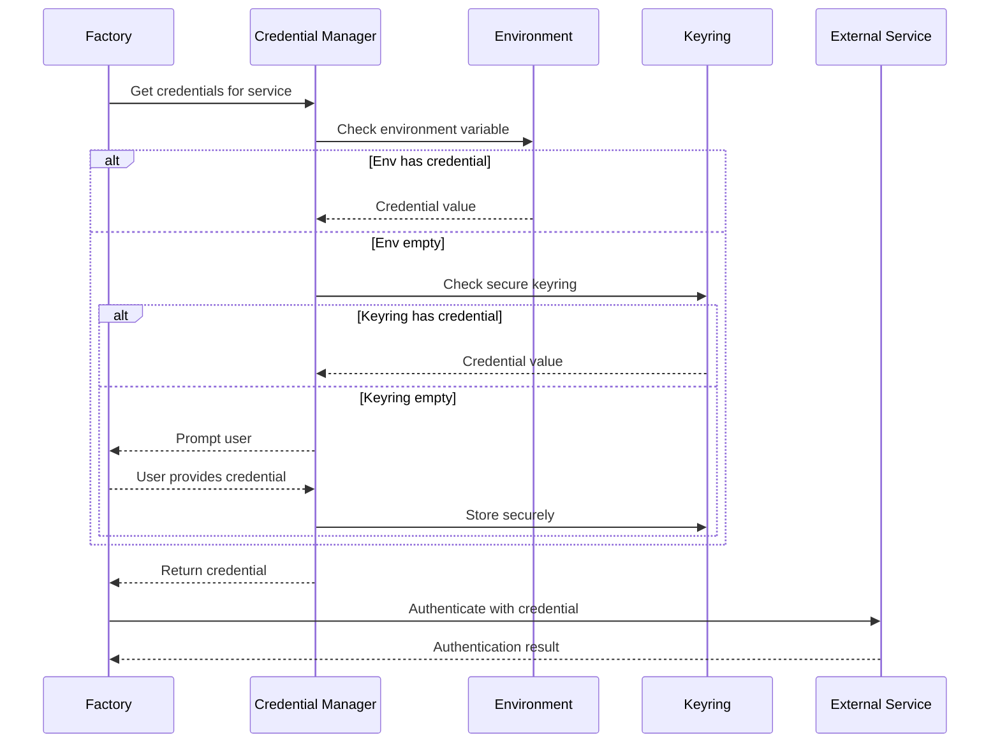

## MCP Tool Invocation

How MCP tools are called:

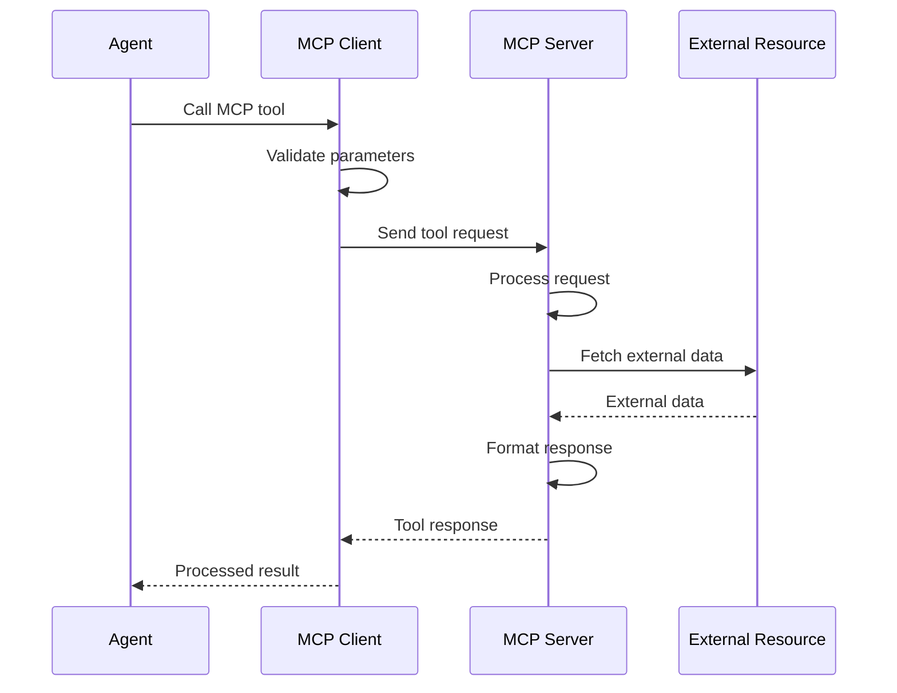

## Integration Error Handling

How integration errors are handled:

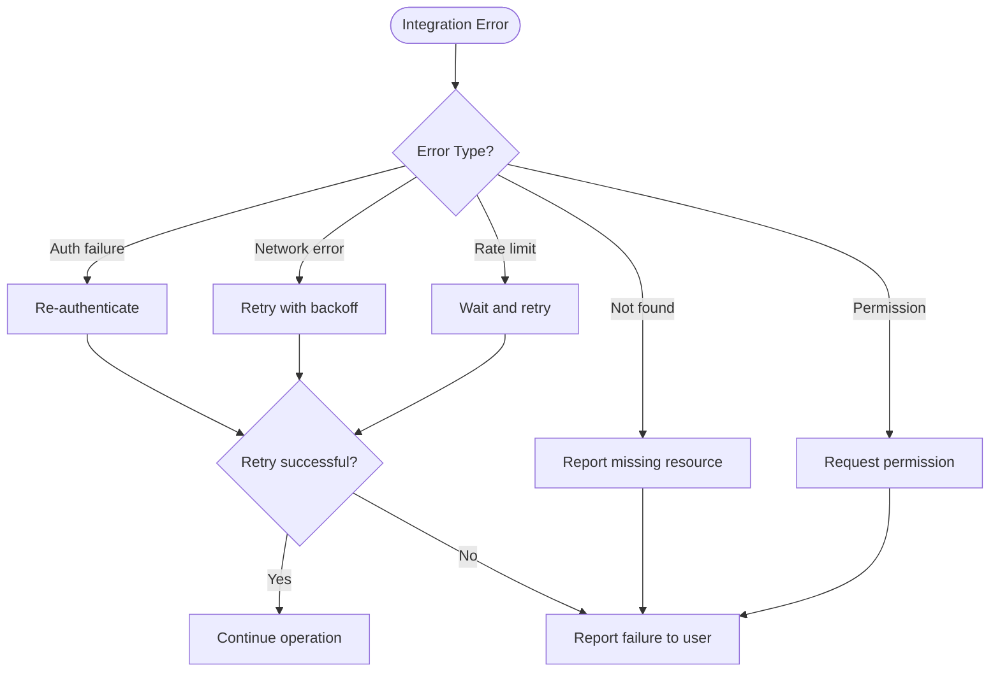

## Integration Configuration

Configuration for integrations:

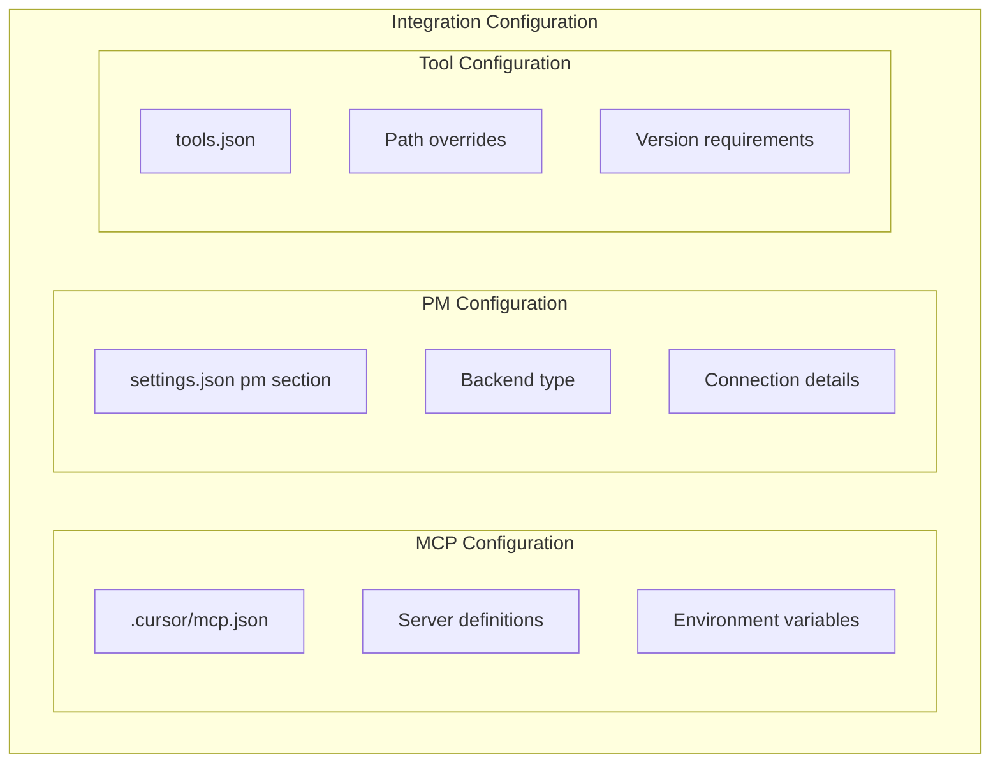

## Webhook Integration

Event-driven integrations:

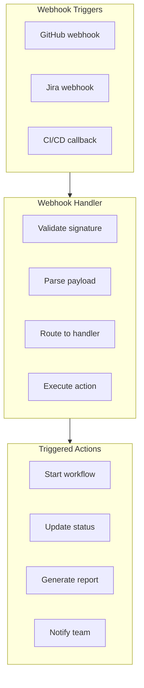

## Integration Health Monitoring

Monitoring integration health:

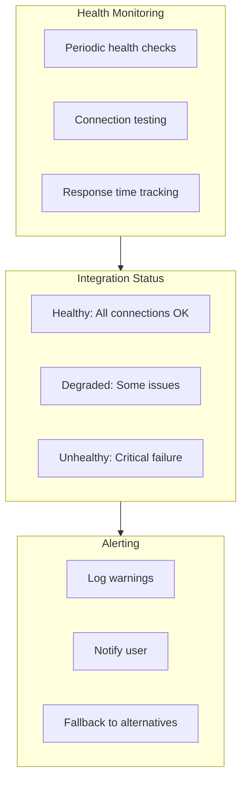
