# Knowledge Management Architecture

This document visualizes the knowledge file structure, evolution system, and query patterns that power the Factory's domain knowledge.

## Quick Reference

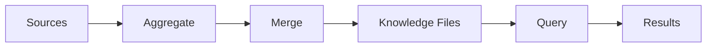

## Knowledge File Structure

Organization of the 89+ knowledge files:

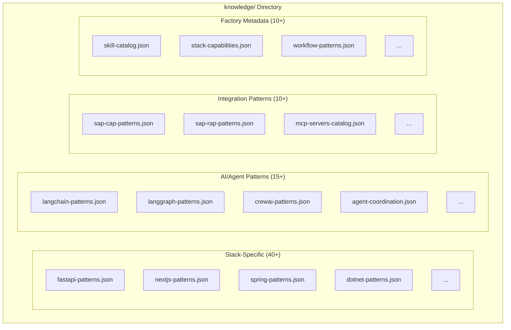

## Knowledge File Schema

Structure of individual knowledge files:

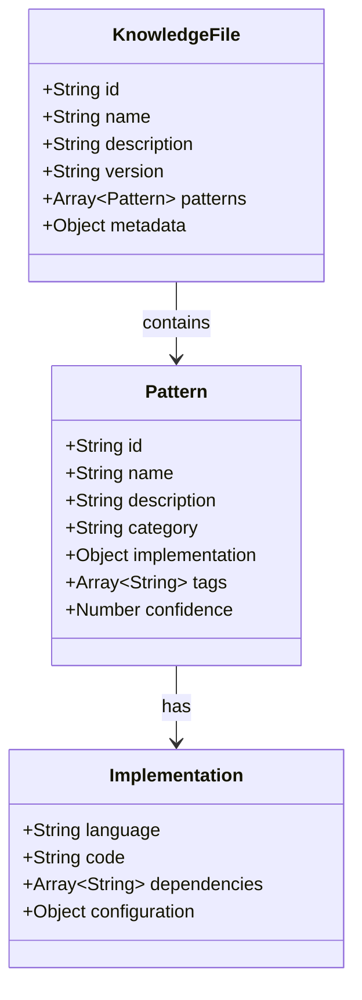

## Knowledge Evolution Architecture

How knowledge is automatically updated from sources:

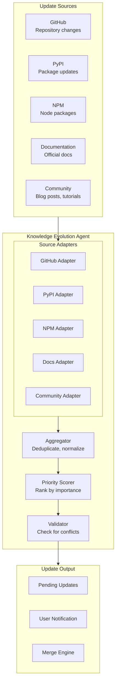

## Update Aggregation Flow

How updates from multiple sources are combined:

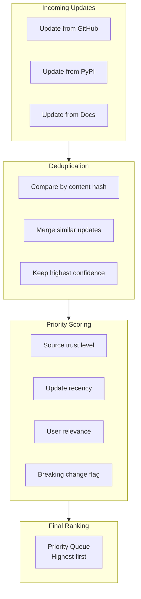

## Merge Strategies

How conflicting updates are resolved:

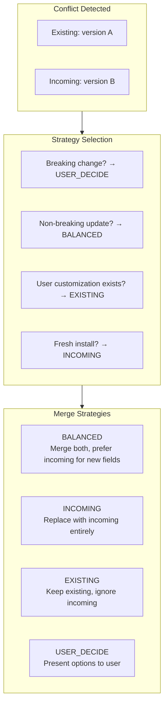

## Query Flow

How agents query knowledge files:

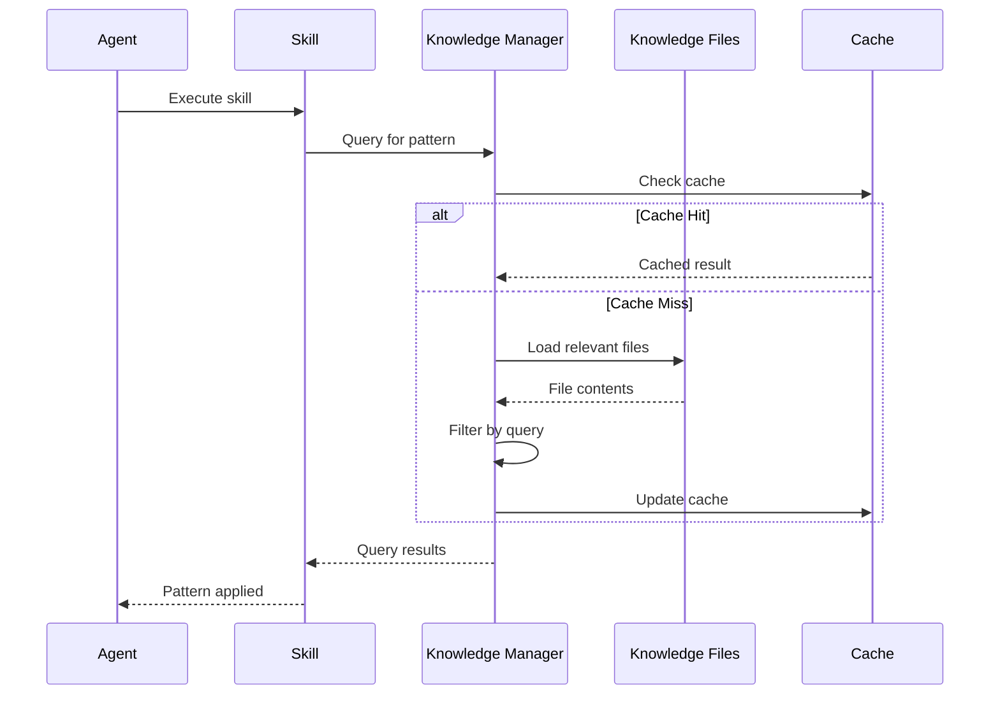

## Knowledge Query Patterns

Common query types and their resolution:

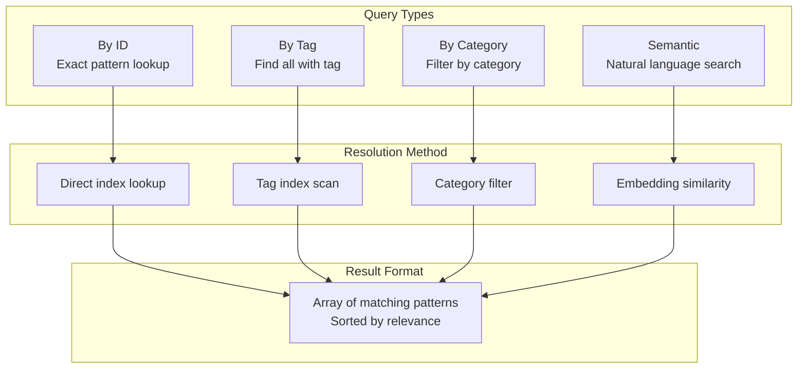

## Agent-Skill-Knowledge Relationship

How components interact with knowledge:

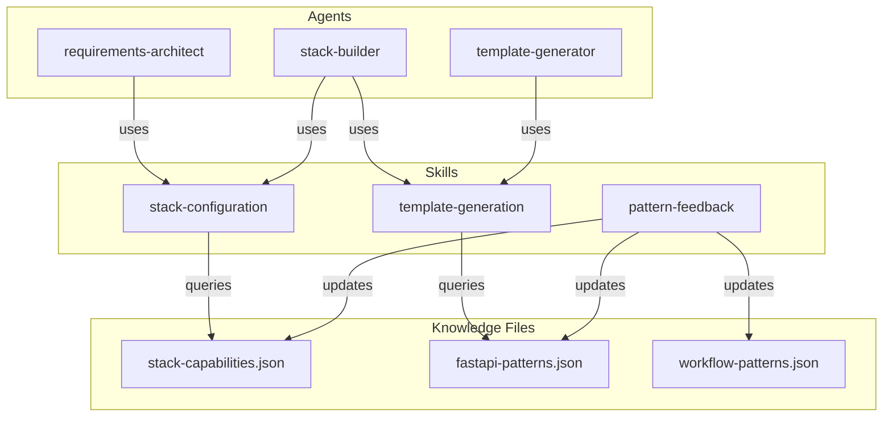

## Knowledge Versioning

How knowledge file versions are managed:

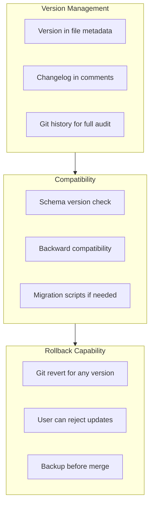

## Conflict Detection and Resolution

Detailed conflict handling:

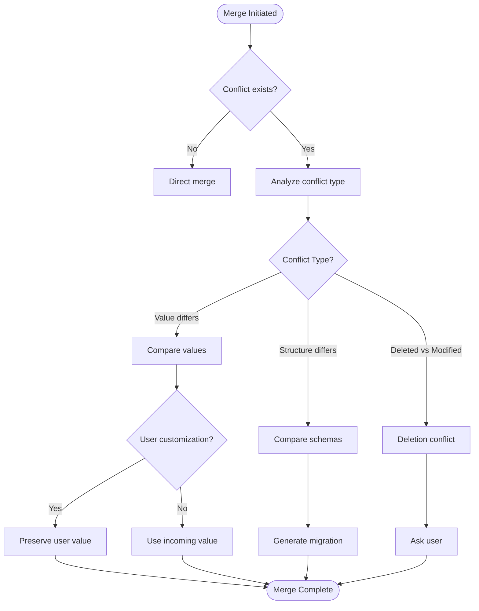

## Knowledge Evolution Supervisor-Worker

Detailed architecture of the evolution system:

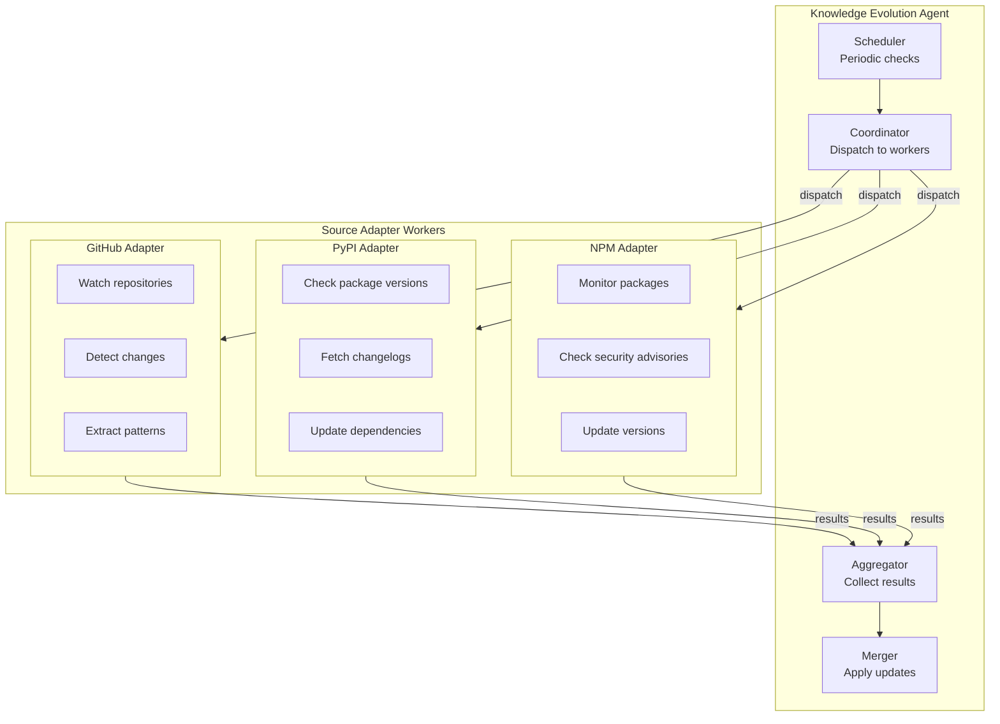

## Subscription-Based Filtering

How users can customize knowledge updates:

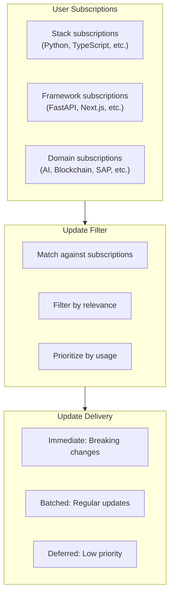

## Knowledge Cache Architecture

Caching for performance:

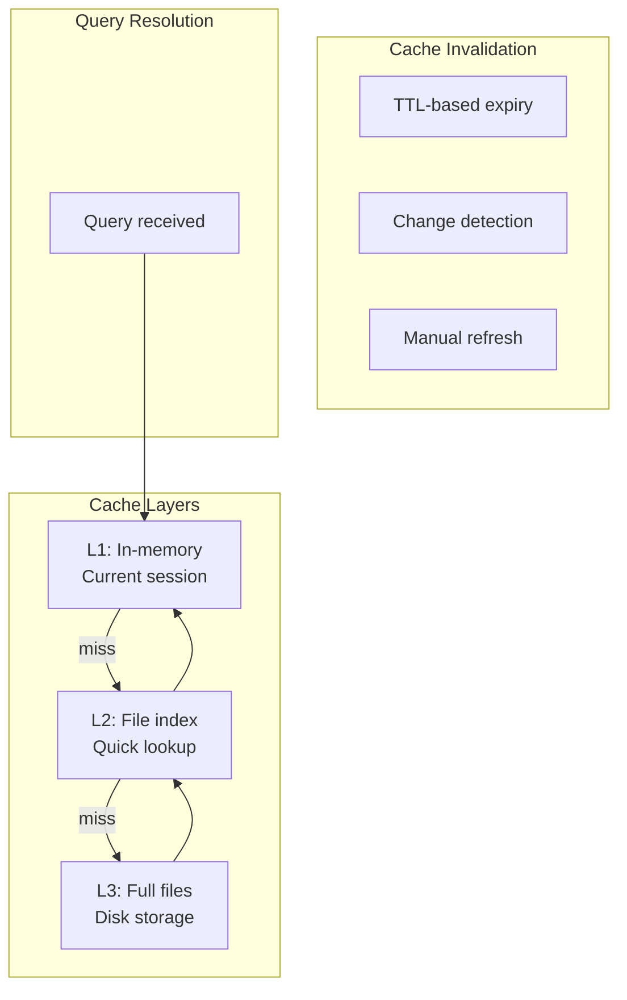

## Knowledge File Categories

Complete categorization:

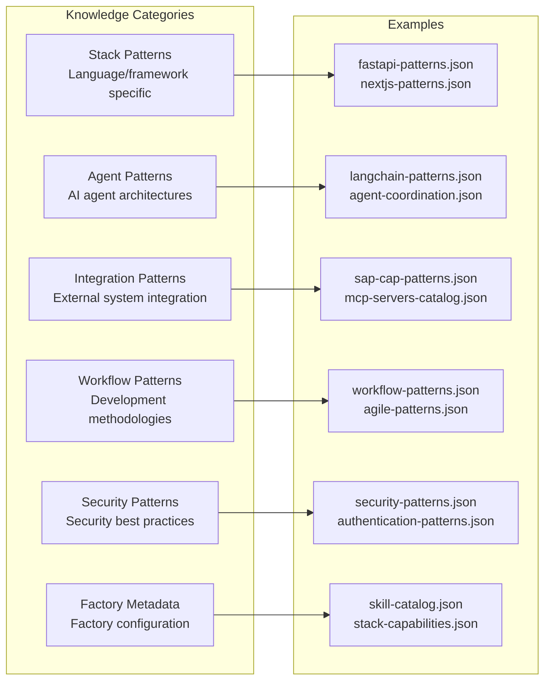

## Knowledge Quality Metrics

How knowledge quality is measured:

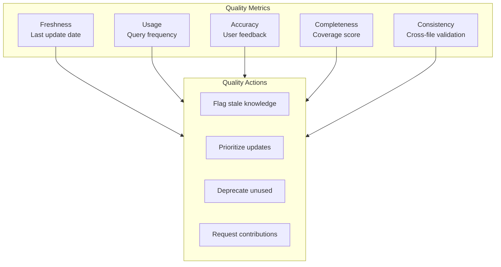
