# Learning Loops Architecture

This document visualizes the inductive learning system that enables the Factory to learn from experience and improve over time while respecting user consent.

## Quick Reference

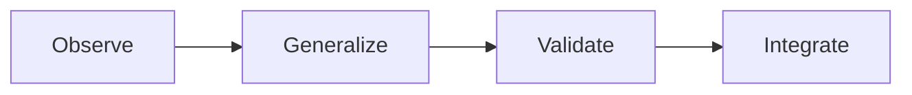

## Complete Learning Loop Architecture

End-to-end learning flow:

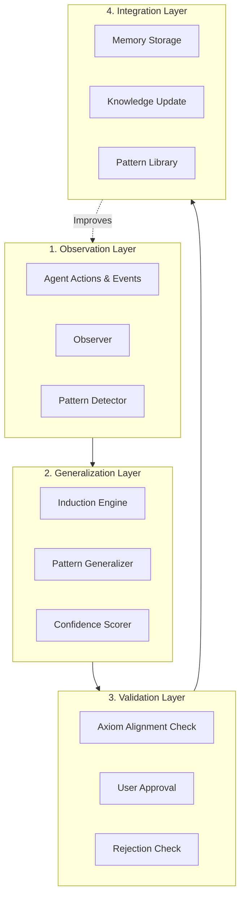

## Induction Engine Flow

How patterns are induced from observations:

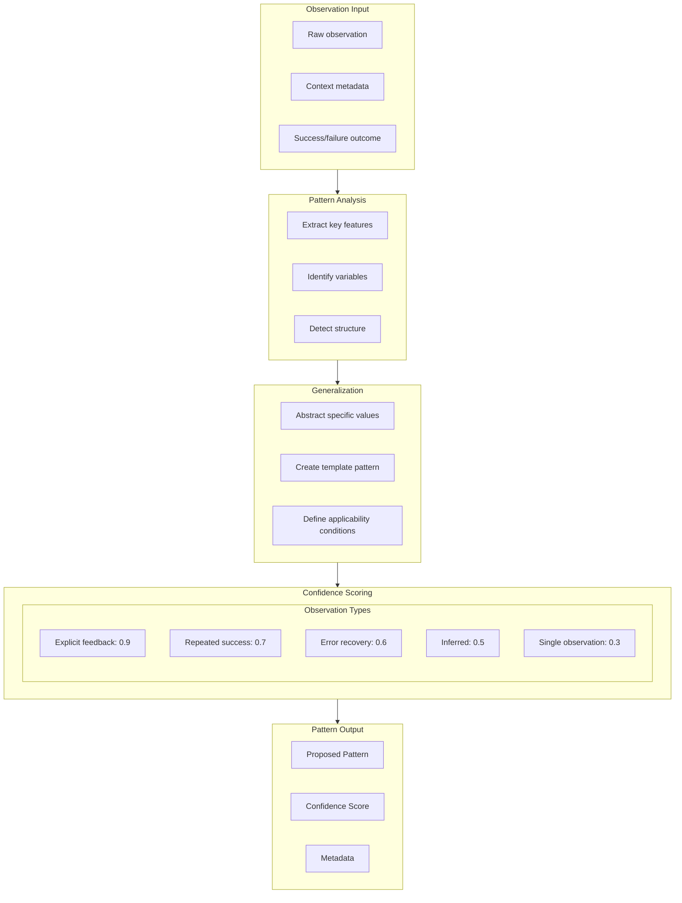

## Proposal Lifecycle

Complete lifecycle of a learning proposal:

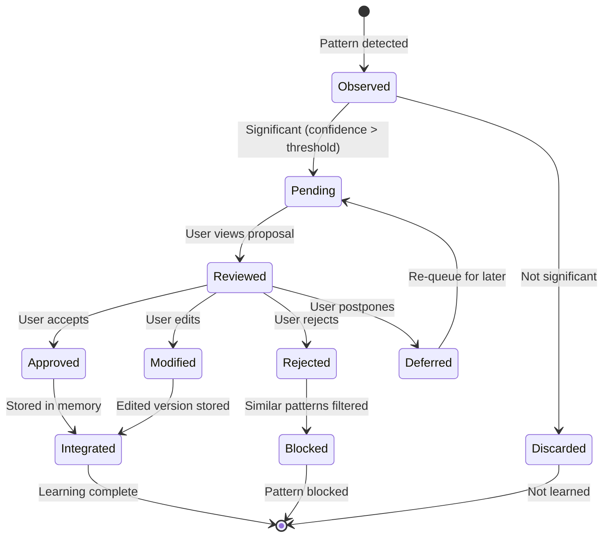

## Rejection Similarity Checking

Preventing re-proposal of rejected patterns:

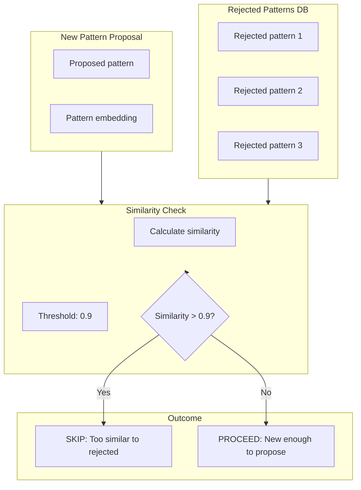

## Pattern Feedback Skill

How patterns feed back to improve the system:

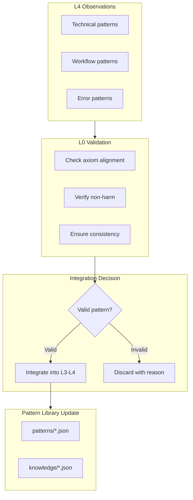

## Workflow Learning Hooks

Learning integrated into workflow execution:

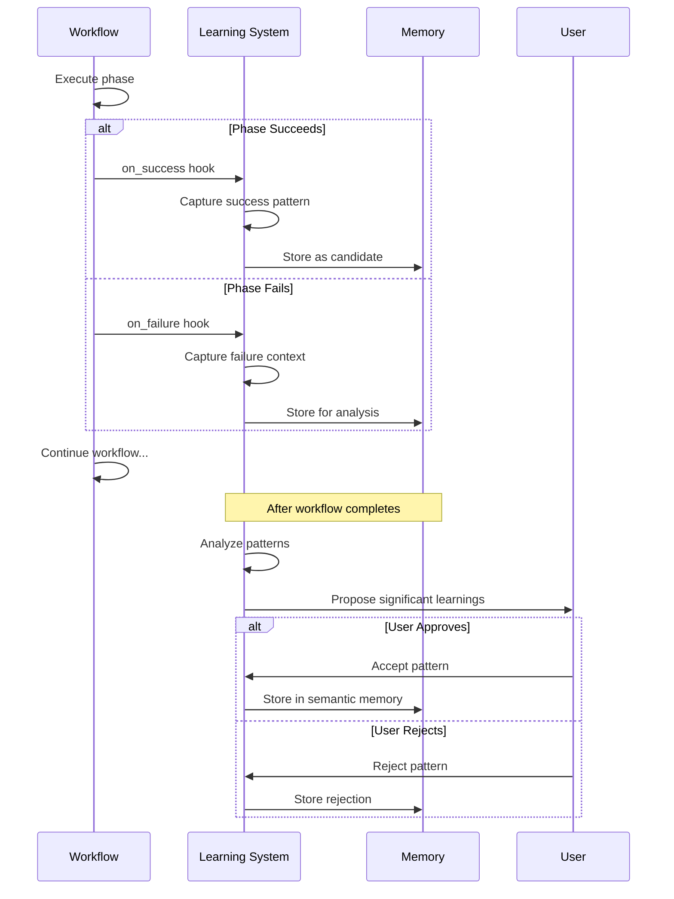

## Learning from Debug Sessions

How debugging improves the system:

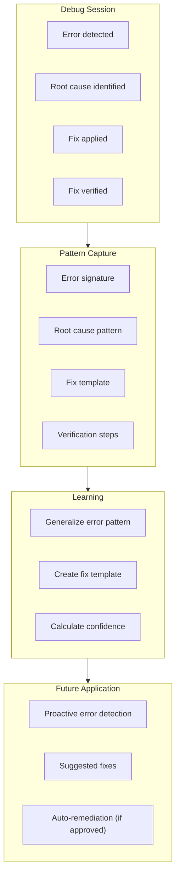

## Confidence Accumulation

How confidence grows over time:

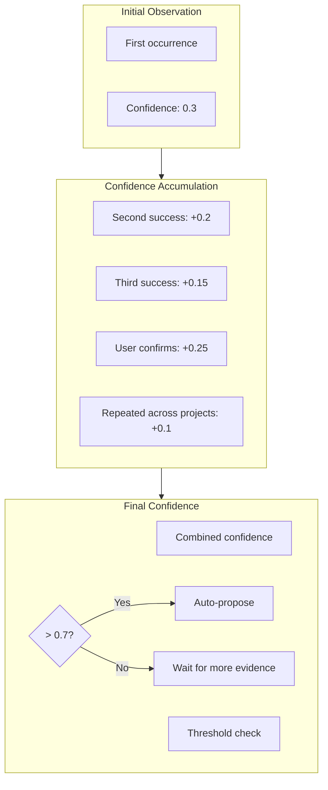

## Cross-Project Learning

Learning patterns across projects:

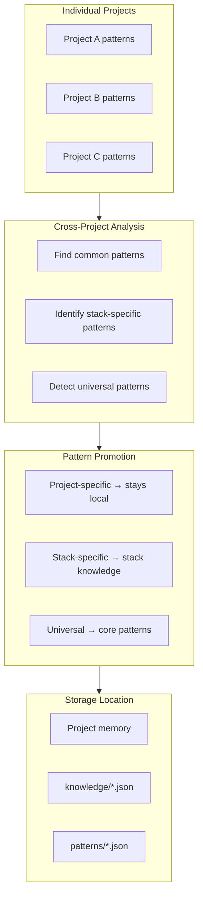

## Learning Types

Different types of learning in the system:

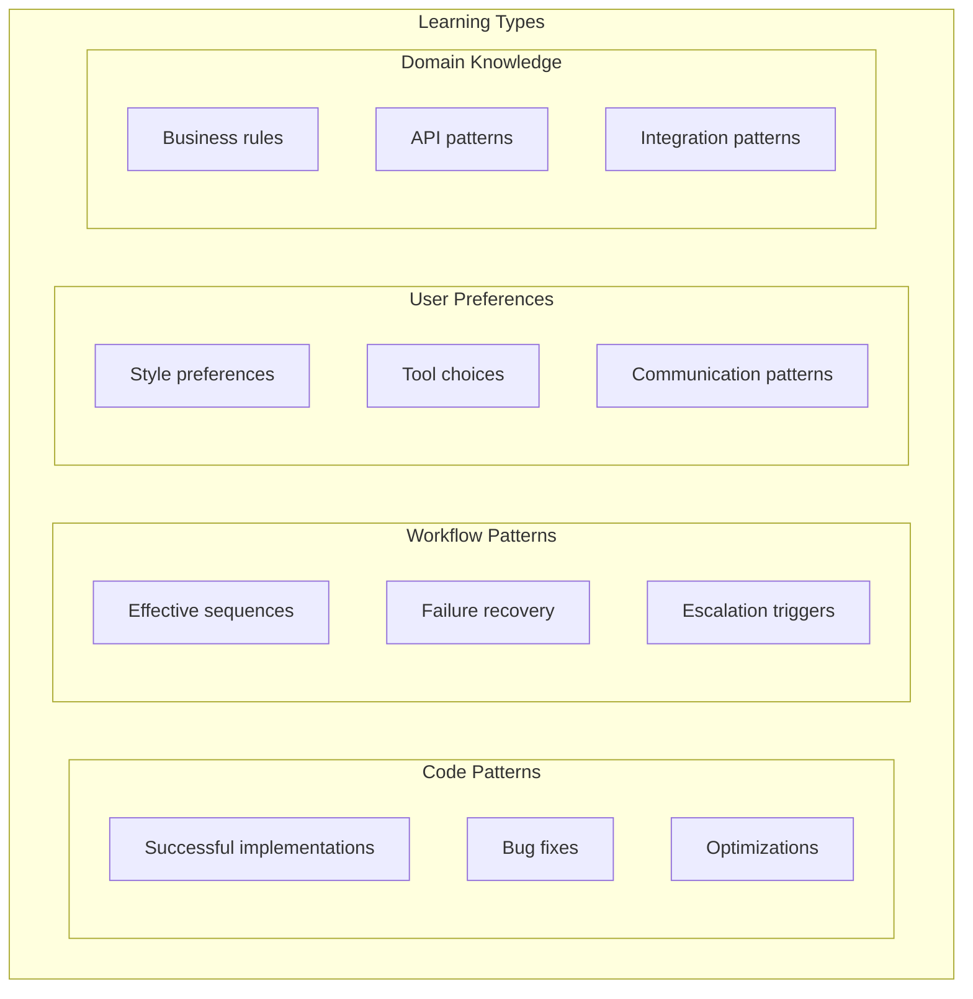

## Axiom Alignment Validation

Ensuring learned patterns align with axioms:

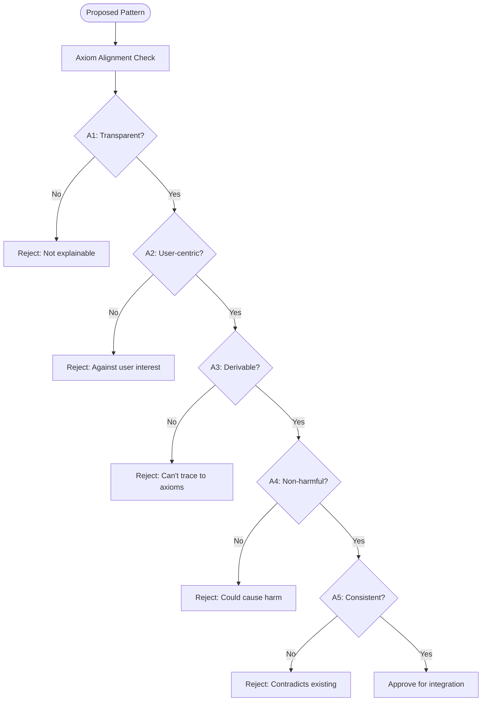

## Learning Metrics

Tracking learning effectiveness:

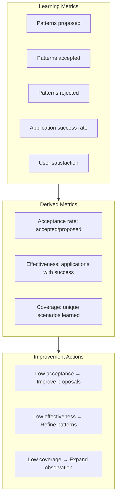

## Memory System Integration

How learning integrates with memory:

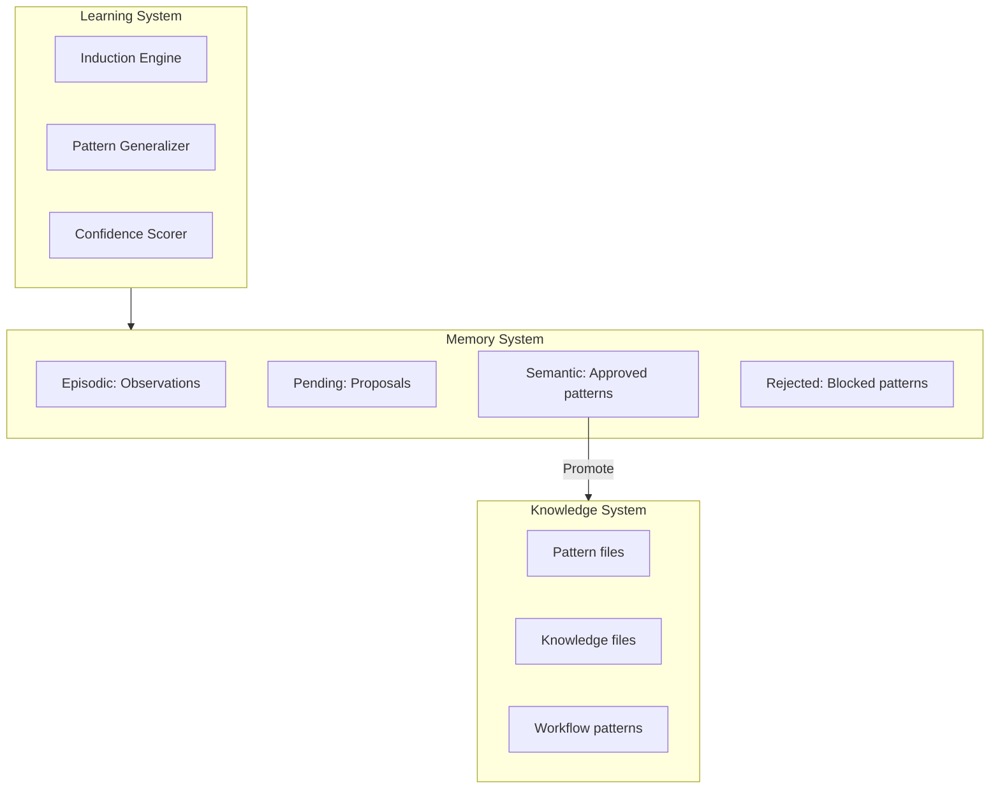

## Continuous Improvement Cycle

Ongoing system improvement:

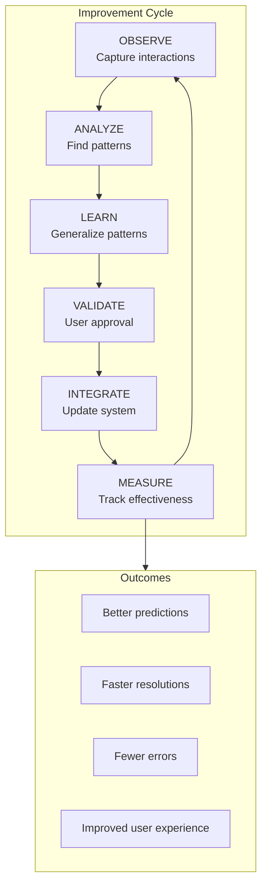
