# Memory System Architecture

This document visualizes the user-validated learning system that enables the Factory to learn from experience while respecting user consent and layer immutability.

## Quick Reference

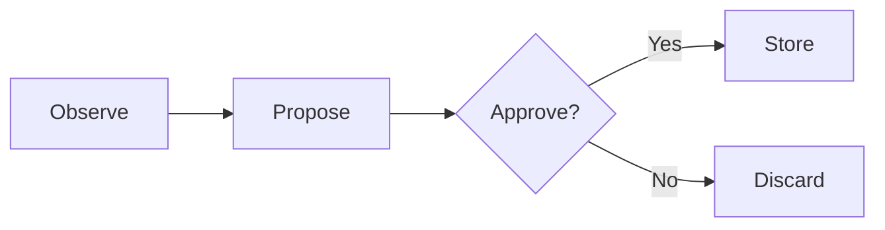

## Memory System Overview

Complete architecture of the memory system:

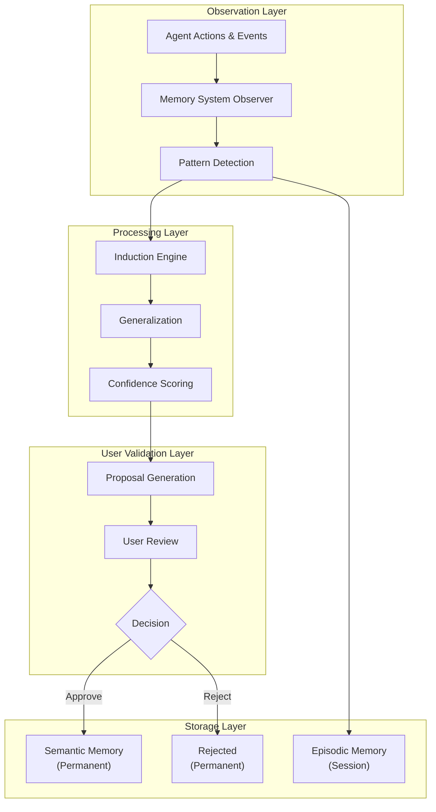

## Memory Observation Flow

How the system observes and captures patterns:

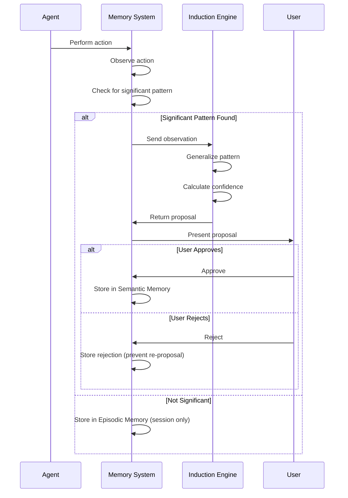

## User Validation Loop

The core consent mechanism:

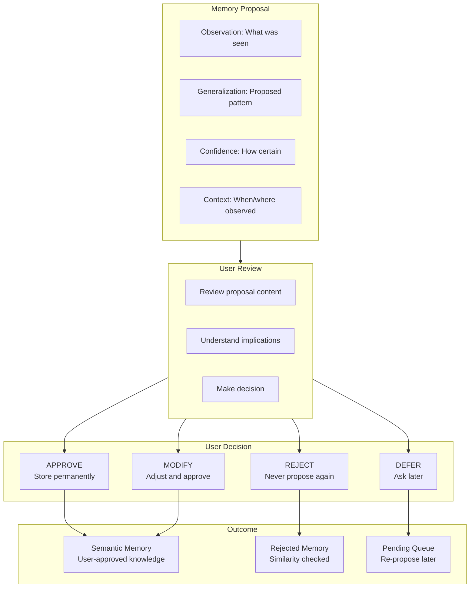

## Memory Types Relationship

How different memory types relate:

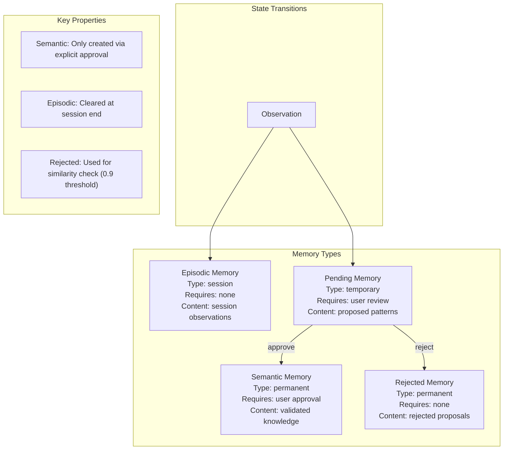

## Layer Protection Boundaries

Memory system respects 5-layer immutability:

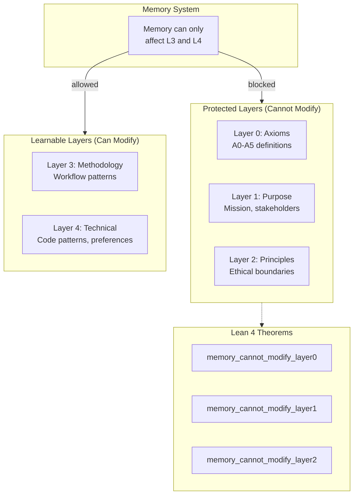

## Memory Collection Architecture

ChromaDB storage structure:

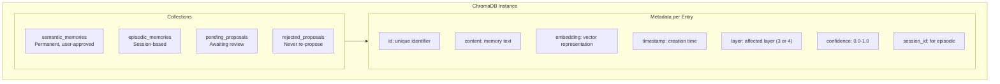

## Consent Proofs Visualization

Lean 4 theorems guaranteeing user consent:

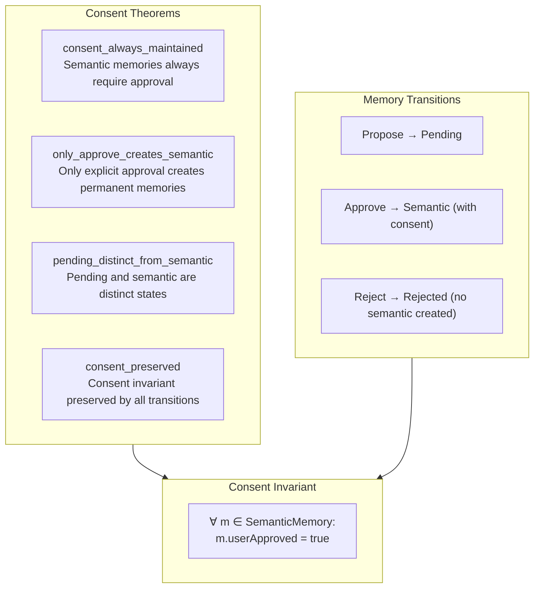

## Induction Engine Flow

How patterns are generalized:

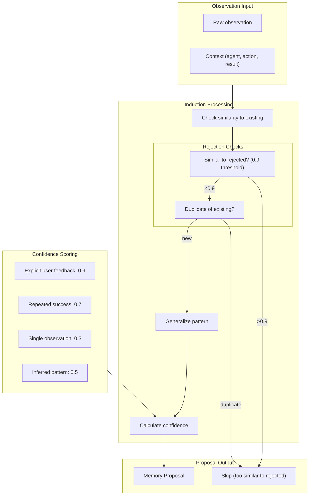

## Memory Integration with Agents

How agents interact with memory:

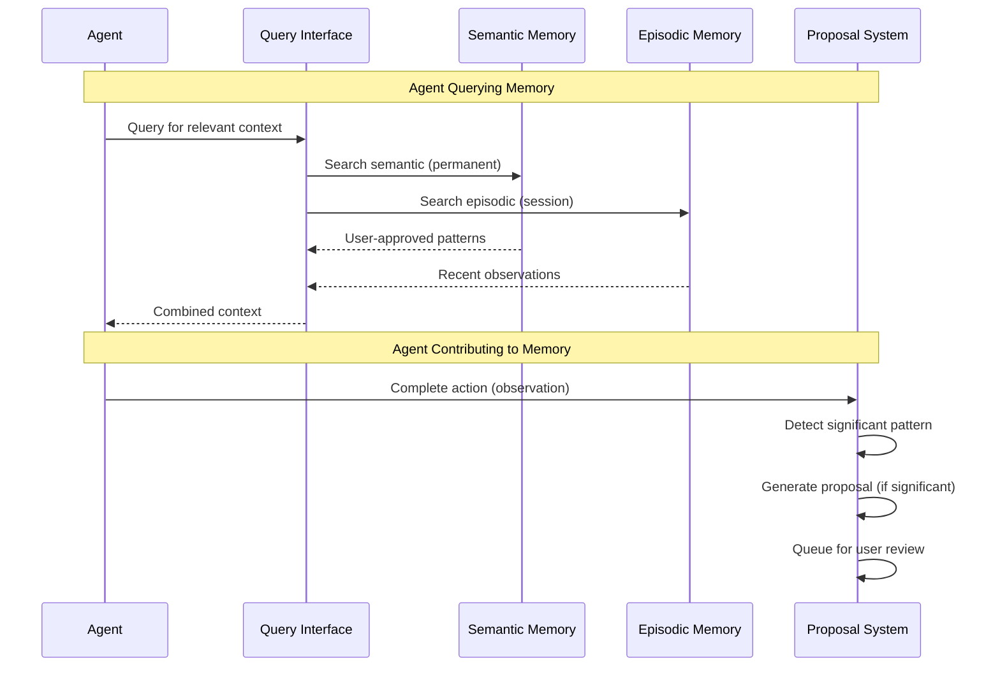

## Session Lifecycle

Memory behavior across sessions:

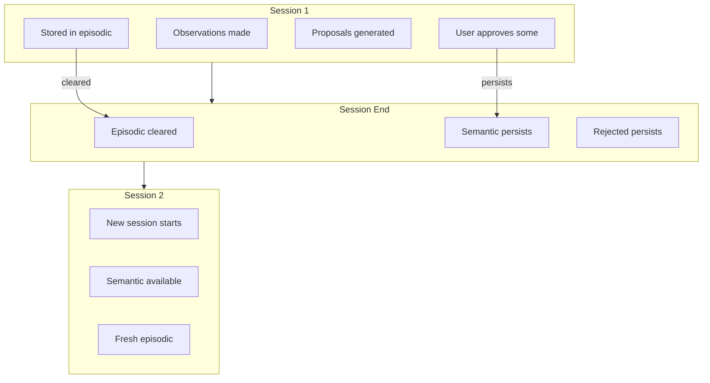

## Memory Query Flow

How agents query memory for context:

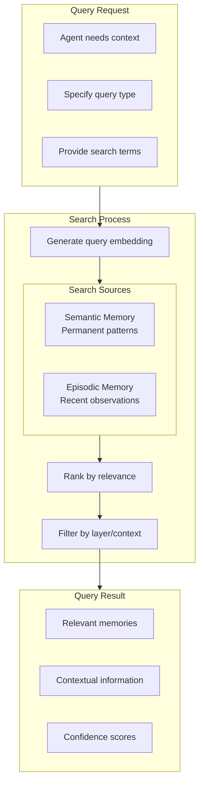

## Memory System State Diagram

Complete state machine for memory entries:

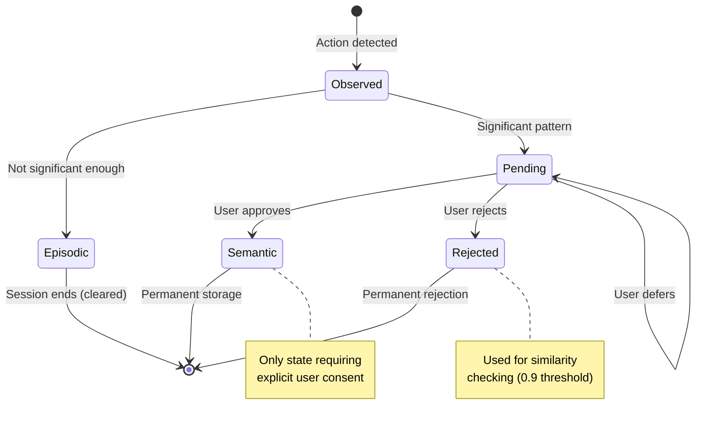

## Observation Categories

Types of observations and their default confidence:

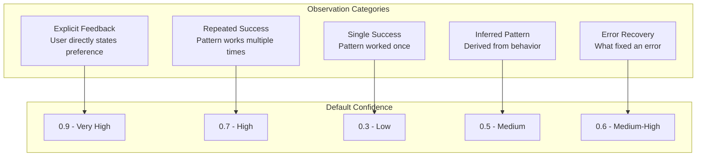

## Memory System Axiom Alignment

How memory system aligns with core axioms:

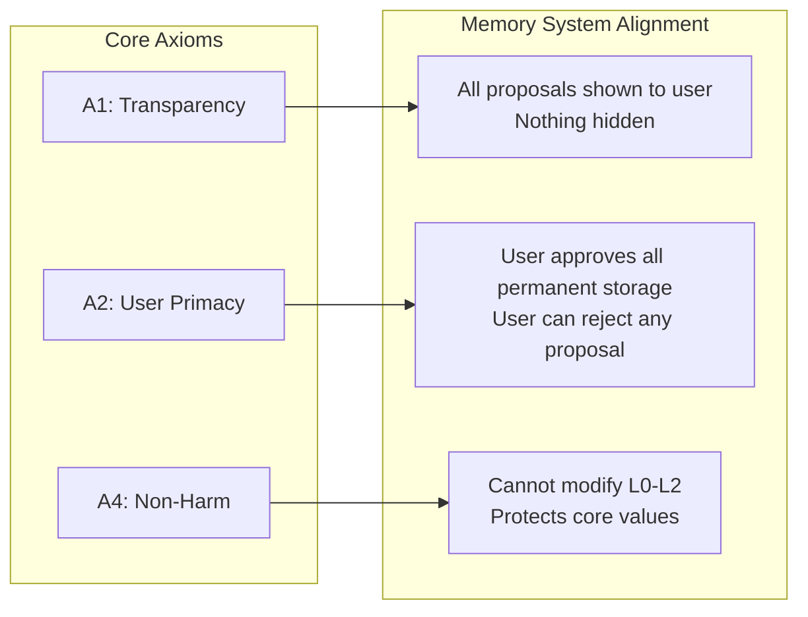
