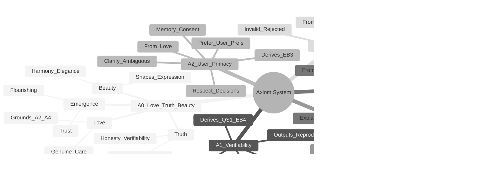

# Antigravity Agent Factory Mindmaps

> Hierarchical visual navigation for all major concepts in the system.

This document contains 12 mindmaps providing conceptual overviews of the Antigravity Agent Factory. Use these for quick navigation and understanding relationships between components.

---

## Navigation

- [1. System Overview](#1-system-overview)
- [2. 5-Layer Architecture](#2-5-layer-architecture)
- [3. Axiom Derivation](#3-axiom-derivation)
- [4. Agent Ecosystem](#4-agent-ecosystem)
- [5. Skills Taxonomy](#5-skills-taxonomy)
- [6. Knowledge Files](#6-knowledge-files)
- [7. Blueprints](#7-blueprints)
- [8. Guardian System](#8-guardian-system)
- [9. Memory System](#9-memory-system)
- [10. Workflow System](#10-workflow-system)
- [11. Onboarding Paths](#11-onboarding-paths)
- [12. Verification Ecosystem](#12-verification-ecosystem)

---

## 1. System Overview

A high-level view of all major components in the Antigravity Agent Factory.

**Related Documentation**: [README.md](../README.md), **docs/COMPLETE_GUIDE.md**

---

## 2. 5-Layer Architecture

The hierarchical layer system from foundational axioms to technical implementation.

**Related Documentation**: **docs/LAYERED_ARCHITECTURE.md**, [diagrams/formal-verification.md](formal-verification.md)

---

## 3. Axiom Derivation

How the foundational axioms derive into principles and behaviors.

**Related Documentation**: [proofs/Axioms.lean](../proofs/Axioms.lean), **docs/research/AXIOM_BASED_AGENT_ARCHITECTURE.md**

---

## 4. Agent Ecosystem

All 16 agents organized by role and their coordination patterns.

**Related Documentation**: **docs/reference/FACTORY_COMPONENTS.md**, [diagrams/agent-coordination.md](agent-coordination.md)

---

## 5. Skills Taxonomy

All 40+ skills organized by category.

**Related Documentation**: **.cursor/skills/**, **docs/reference/FACTORY_COMPONENTS.md**

---

## 6. Knowledge Files

89 knowledge files organized by category.

**Related Documentation**: **docs/reference/KNOWLEDGE_FILES.md**, [knowledge/](../knowledge/)

---

## 7. Blueprints

27 blueprints organized by category.

**Related Documentation**: [docs/reference/BLUEPRINTS.md](../docs/reference/BLUEPRINTS.md), [blueprints/](../docs/reference/BLUEPRINTS.md)

---

## 8. Guardian System

The Layer 0 protector with its response levels and operational states.

**Related Documentation**: [.cursor/agents/integrity-guardian.md](../.agent/agents/integrity-guardian.md), [diagrams/guardian-state-machine.md](guardian-state-machine.md)

---

## 9. Memory System

User-validated learning with consent loop and layer protection.

**Related Documentation**: **docs/MEMORY_SYSTEM.md**, [diagrams/memory-system.md](memory-system.md)

---

## 10. Workflow System

Declarative workflow definitions with triggers, phases, and learning hooks.

**Related Documentation**: **docs/research/WORKFLOW_SYSTEM.md**, [diagrams/learning-loops.md](learning-loops.md)

---

## 11. Onboarding Paths

Three onboarding options for individuals and teams.

**Related Documentation**: [docs/guides/getting-started.md](../docs/guides/getting-started.md), **docs/TEAM_WORKSHOP_GUIDE.md**

---

## 12. Verification Ecosystem

Static proofs (Lean 4) and runtime verification (Society).

**Related Documentation**: **docs/VERIFICATION.md**, **docs/SOCIETY_USAGE.md**, [diagrams/formal-verification.md](formal-verification.md)

---

## Cross-Reference Guide

| Mindmap | Primary Docs | Related Diagrams |
|---------|--------------|------------------|
| System Overview | README, COMPLETE_GUIDE | All diagrams |
| 5-Layer Architecture | LAYERED_ARCHITECTURE | formal-verification.md |
| Axiom Derivation | proofs/Axioms.lean | formal-verification.md |
| Agent Ecosystem | FACTORY_COMPONENTS | agent-coordination.md |
| Skills Taxonomy | FACTORY_COMPONENTS | - |
| Knowledge Files | KNOWLEDGE_FILES | knowledge-management.md |
| Blueprints | BLUEPRINTS | - |
| Guardian System | GUARDIAN_COORDINATION | guardian-state-machine.md |
| Memory System | MEMORY_SYSTEM | memory-system.md |
| Workflow System | WORKFLOW_SYSTEM | learning-loops.md |
| Onboarding Paths | GETTING_STARTED | onboarding-flows.md |
| Verification | VERIFICATION, SOCIETY_USAGE | formal-verification.md |

---

*Generated by the Antigravity Agent Factory. Last updated: 2026-02-05*
