# Onboarding Flow Architecture

This document visualizes the three onboarding modes and non-destructive integration flow for bringing existing repositories into the Antigravity Agent Factory ecosystem.

## Quick Reference

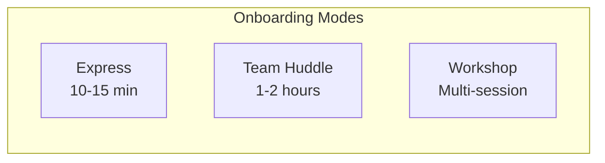

## Three Onboarding Modes Comparison

Overview of all onboarding approaches:

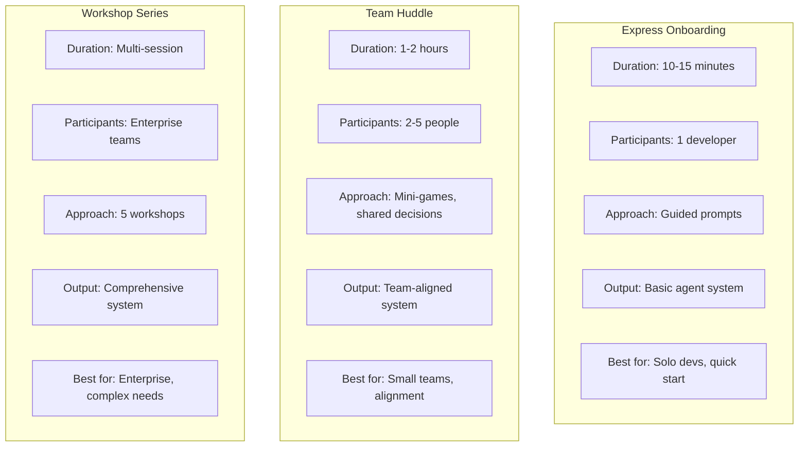

## Express Onboarding Flow

Quick 10-15 minute onboarding:

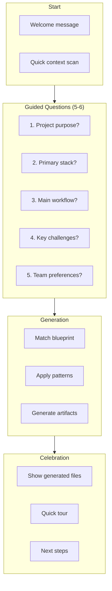

## Team Huddle Flow

1-2 hour collaborative session:

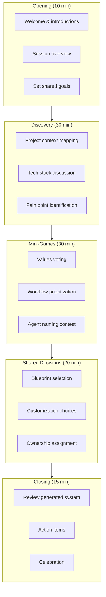

## Workshop Series Flow

Enterprise multi-session approach:

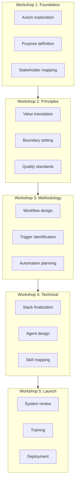

## Non-Destructive Integration Flow

How existing files are preserved:

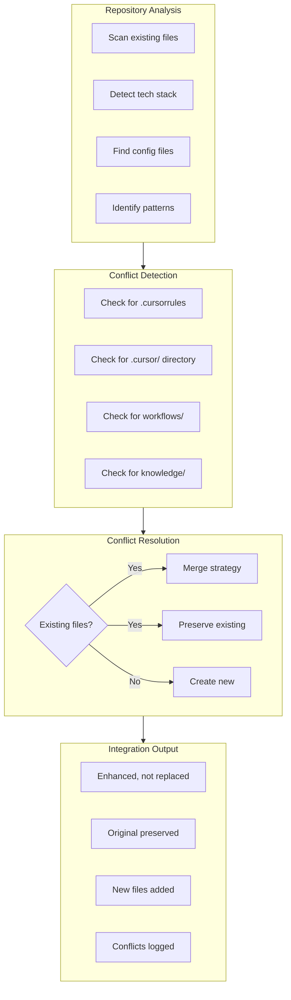

## Pre-existing File Preservation

How different file types are handled:

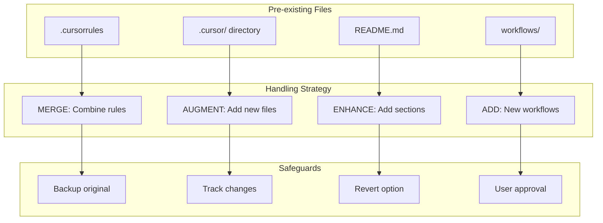

## Repository Analysis Flow

How existing repositories are analyzed:

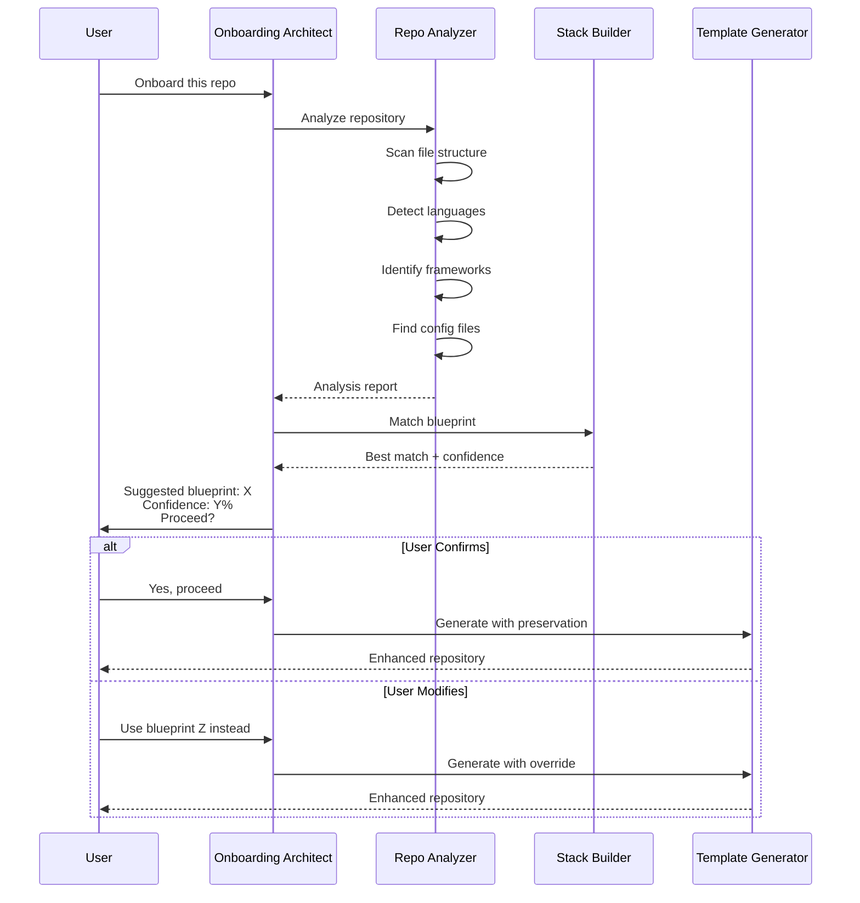

## Blueprint Matching Algorithm

How the right blueprint is selected:

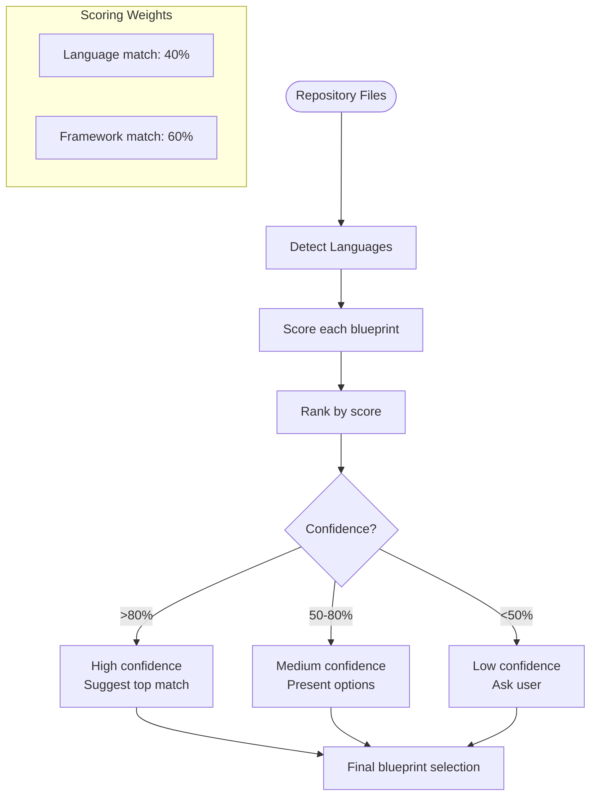

## Conflict Detection Matrix

What conflicts are detected and how:

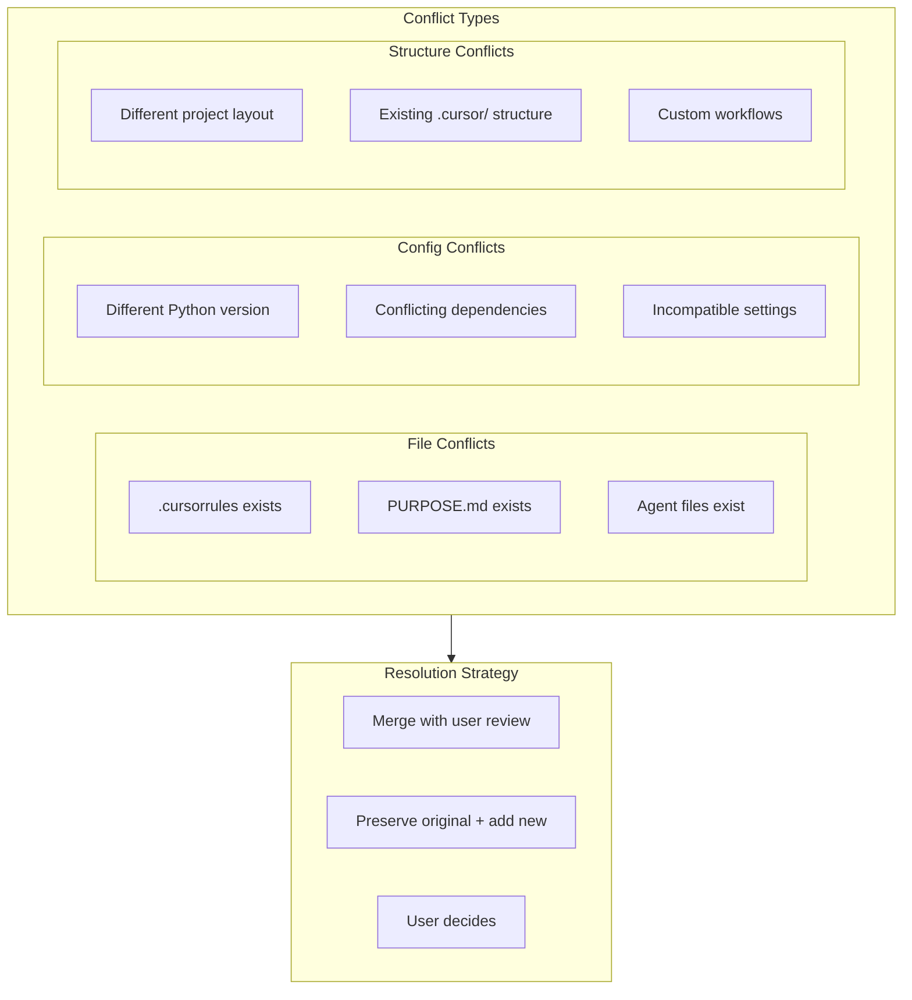

## Integration Outcome

What gets created during onboarding:

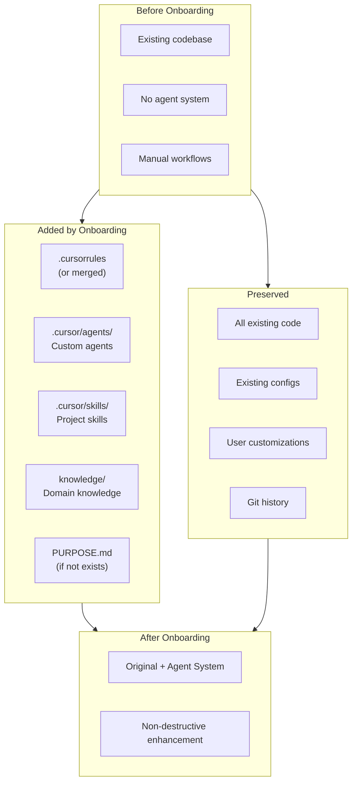

## Mode Selection Decision Tree

Helping users choose the right mode:

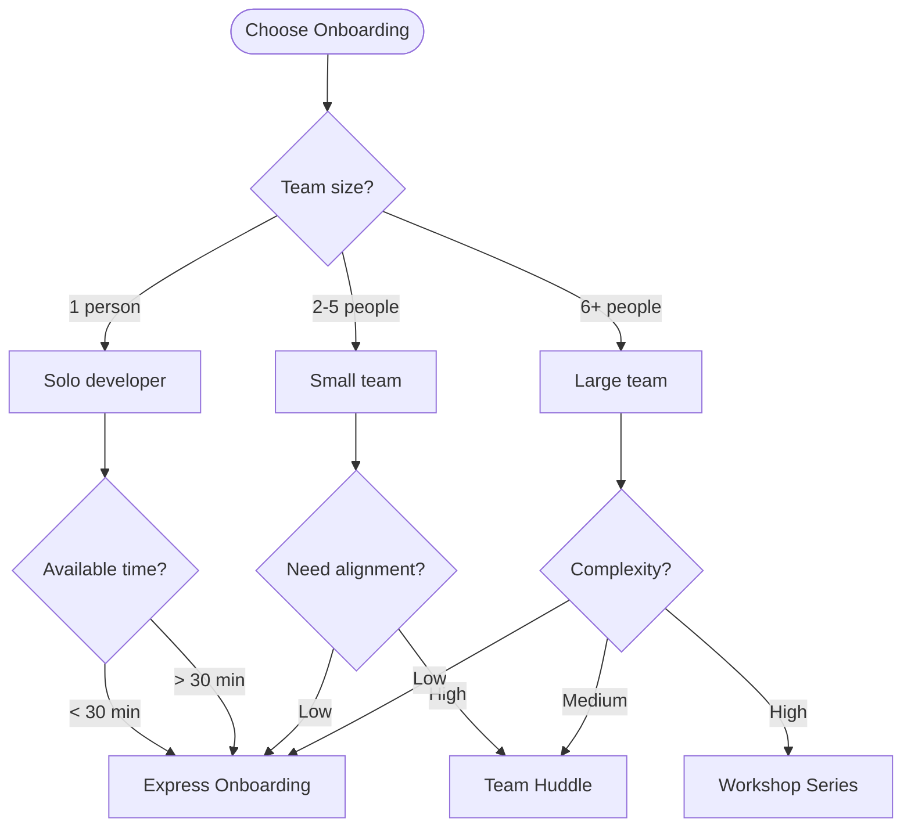

## Onboarding Metrics

Success indicators for onboarding:

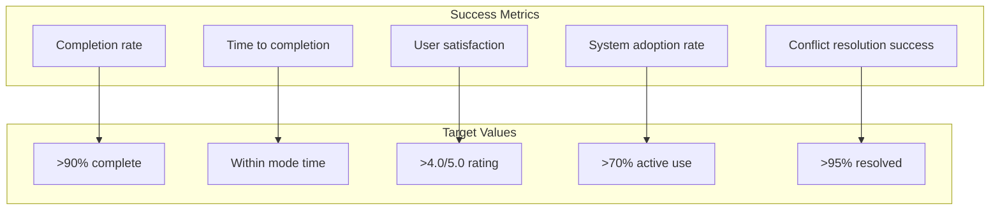

## Post-Onboarding Flow

What happens after onboarding:

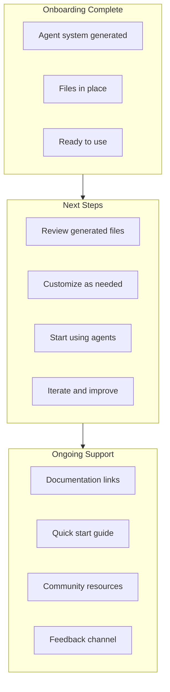
