# Pattern Library Architecture

This document visualizes the pattern organization, inheritance, selection algorithms, and how patterns are used to generate artifacts.

## Quick Reference

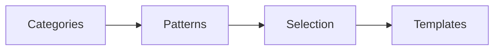

## Pattern Library Overview

Complete pattern organization:

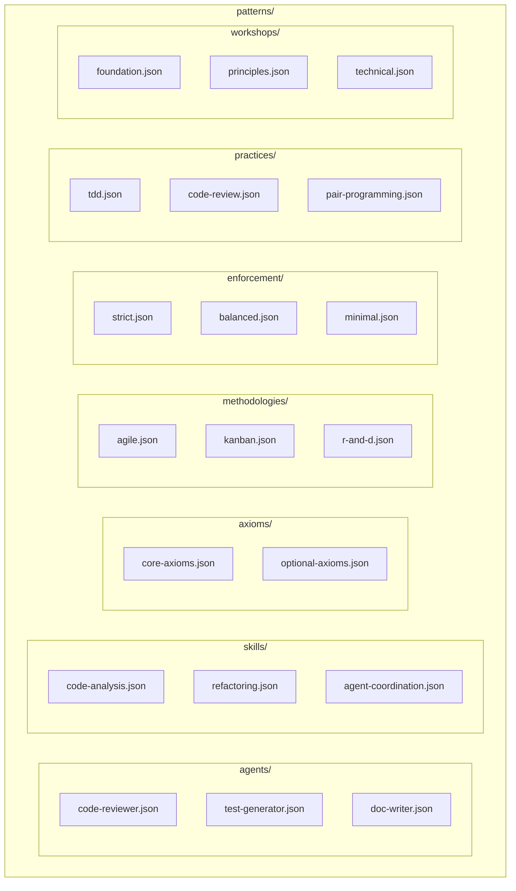

## Pattern Categories

Detailed category breakdown:

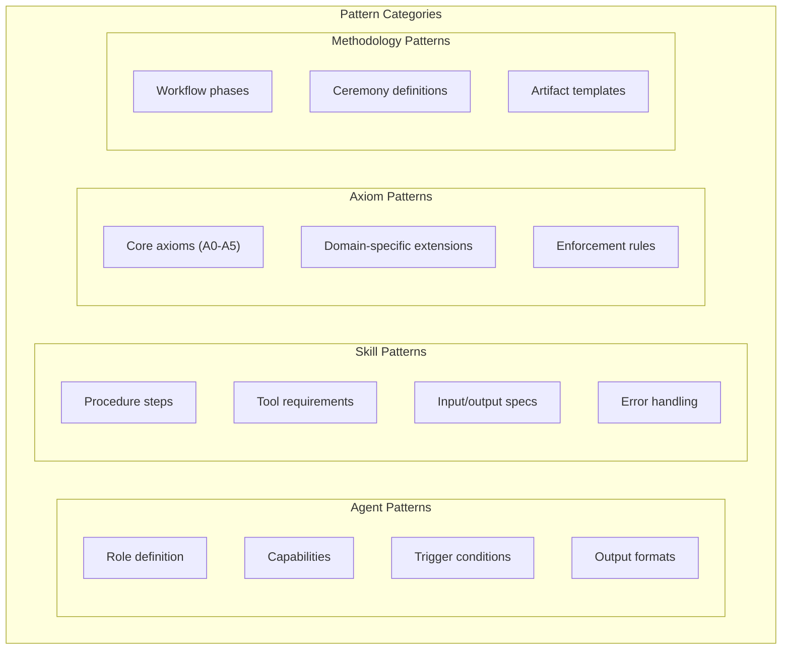

## Pattern JSON Schema

Structure of pattern files:

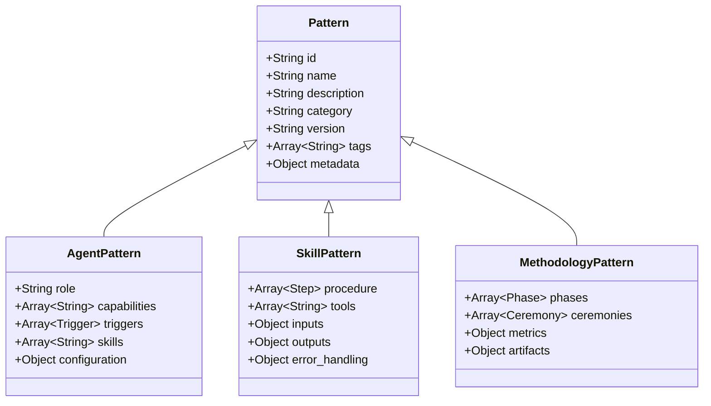

## Pattern Inheritance

How patterns extend each other:

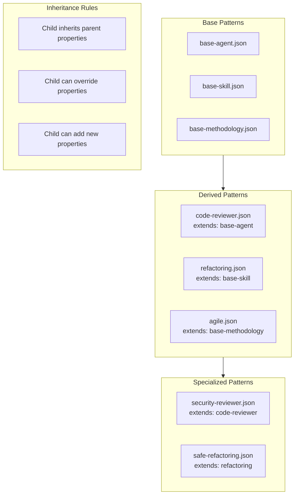

## Pattern to Template Relationship

How patterns drive template generation:

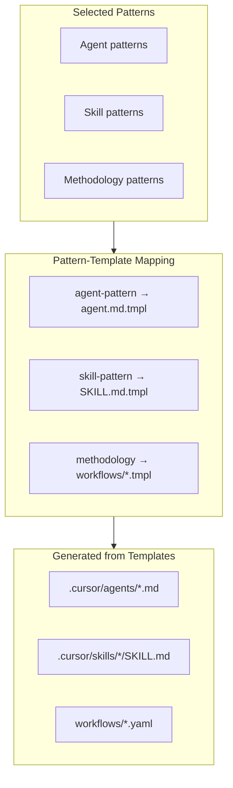

## Blueprint Selection Algorithm

How patterns are selected based on requirements:

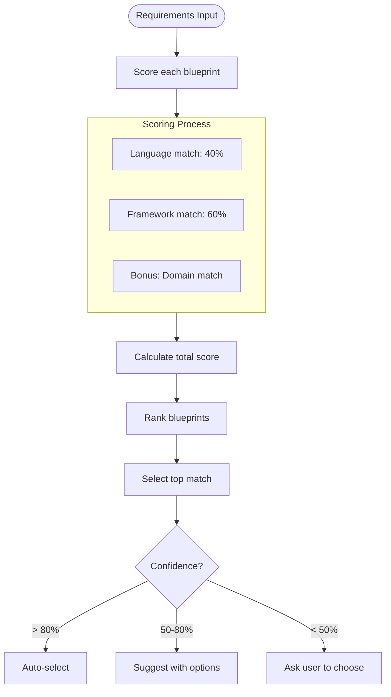

## Pattern Selection Criteria

What factors influence pattern selection:

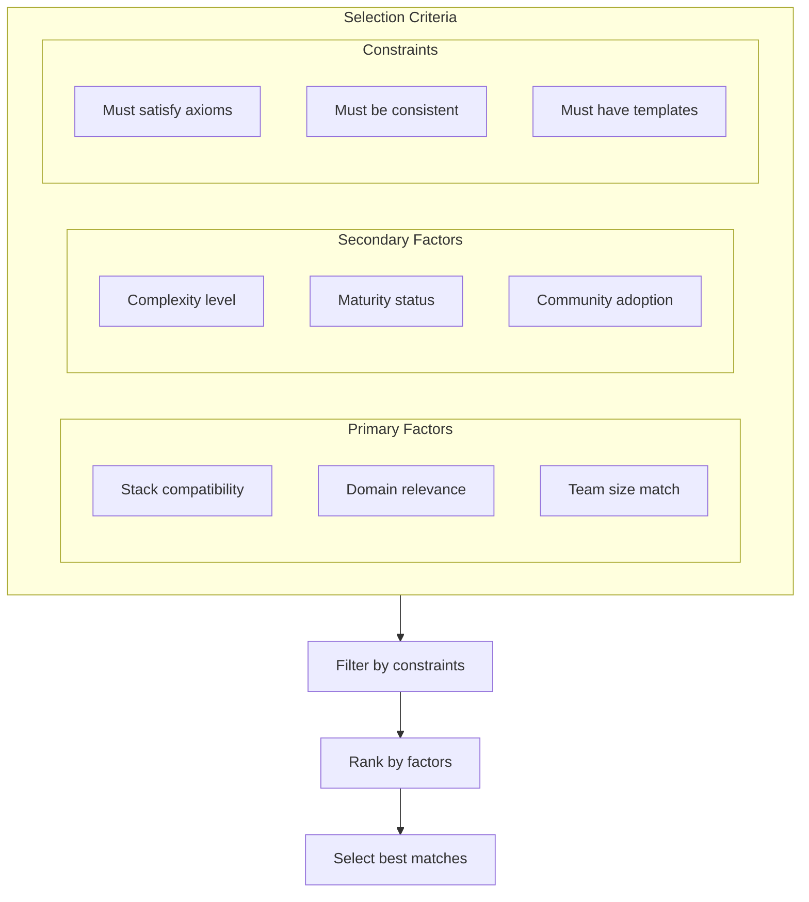

## Pattern Composition

How multiple patterns combine:

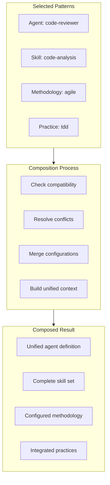

## Pattern File Structure

Detailed JSON structure:

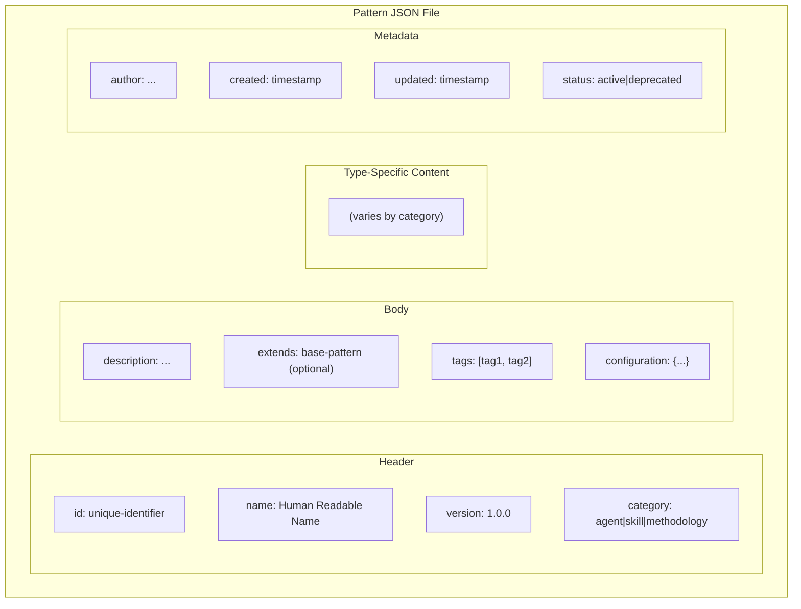

## Pattern Matching Flow

How patterns are matched to requirements:

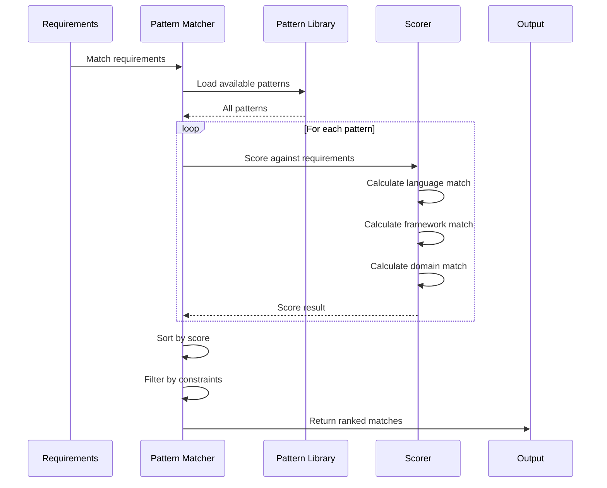

## Pattern Versioning

How pattern versions are managed:

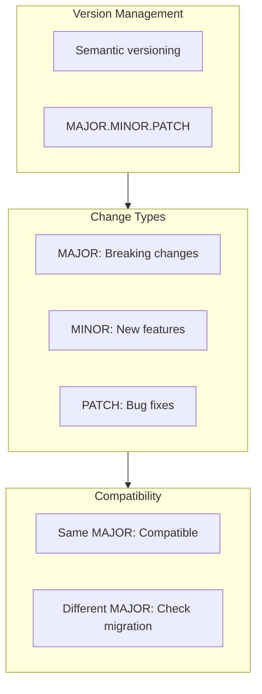

## Pattern Validation

How patterns are validated:

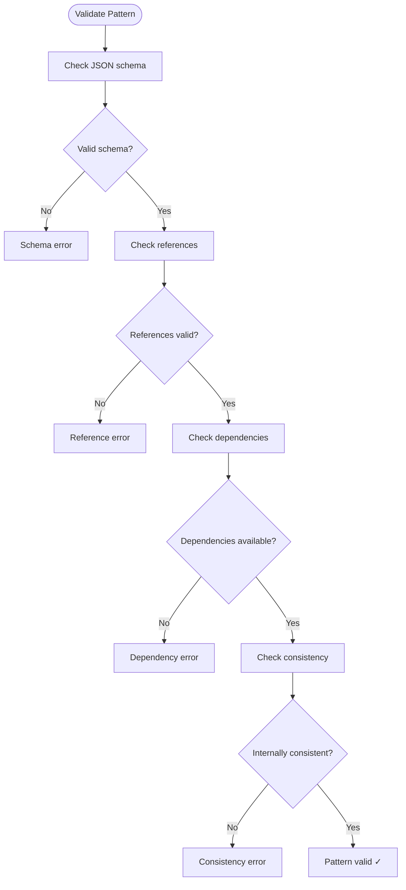

## Pattern Discovery

How patterns are discovered and loaded:

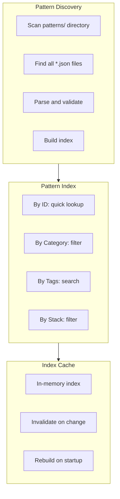

## Pattern Usage Statistics

Tracking pattern usage:

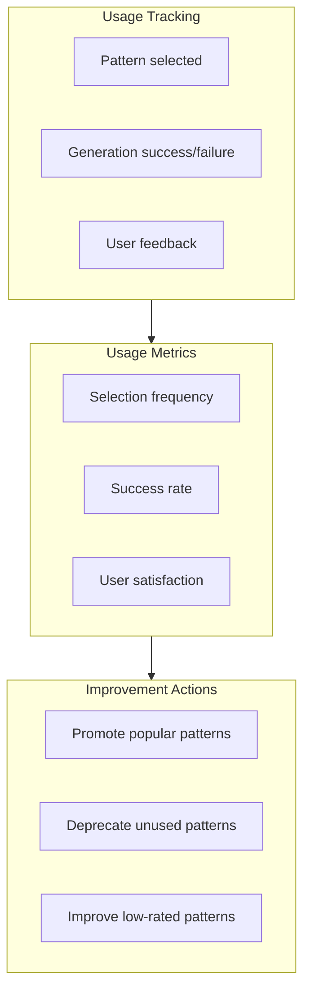
