# Quality Gates Architecture

This document visualizes the 5-phase quality validation pipeline that ensures code quality, security, and adherence to standards.

## Quick Reference

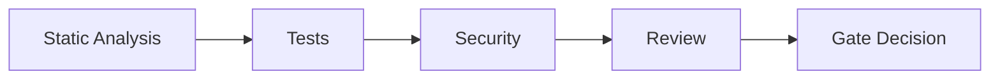

## 5-Phase Quality Pipeline

Complete quality validation flow:

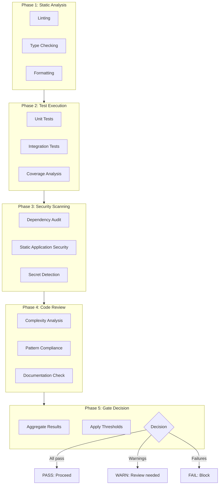

## Phase 1: Static Analysis

Detailed static analysis checks:

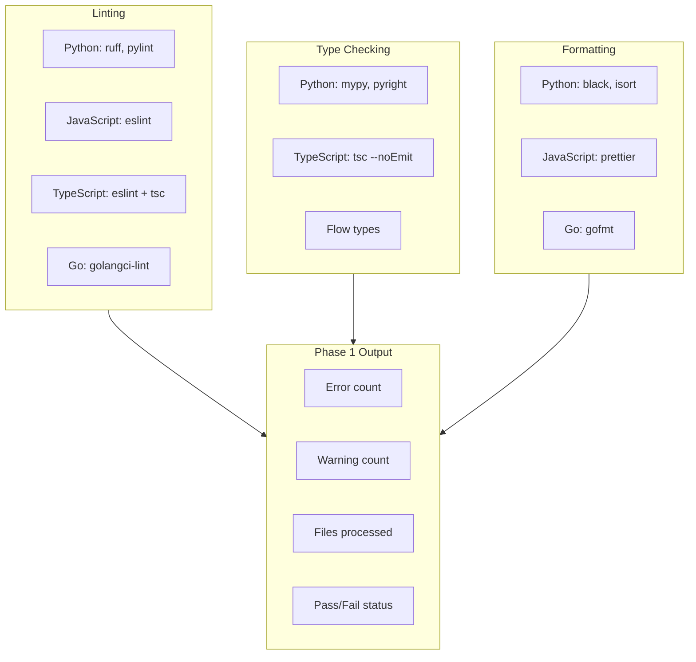

## Phase 2: Test Execution

Test execution and coverage:

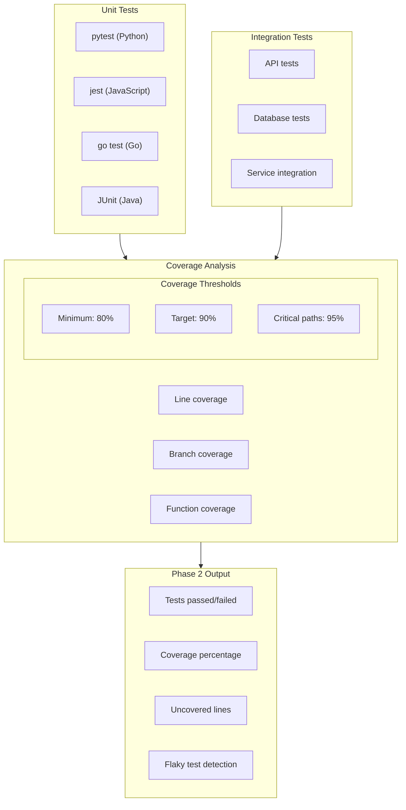

## Phase 3: Security Scanning

Security validation checks:

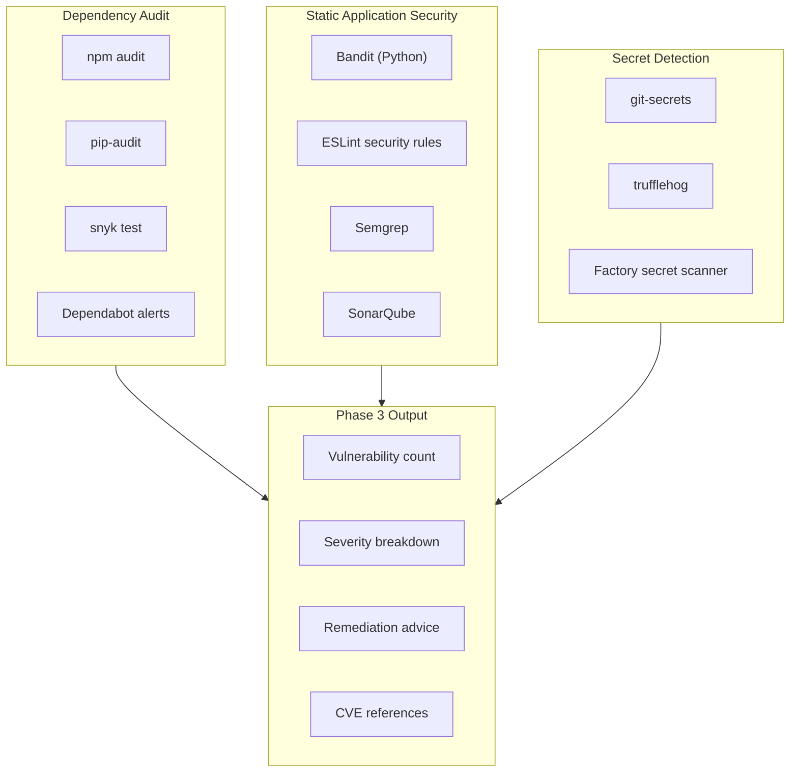

## Phase 4: Code Review

Automated code review checks:

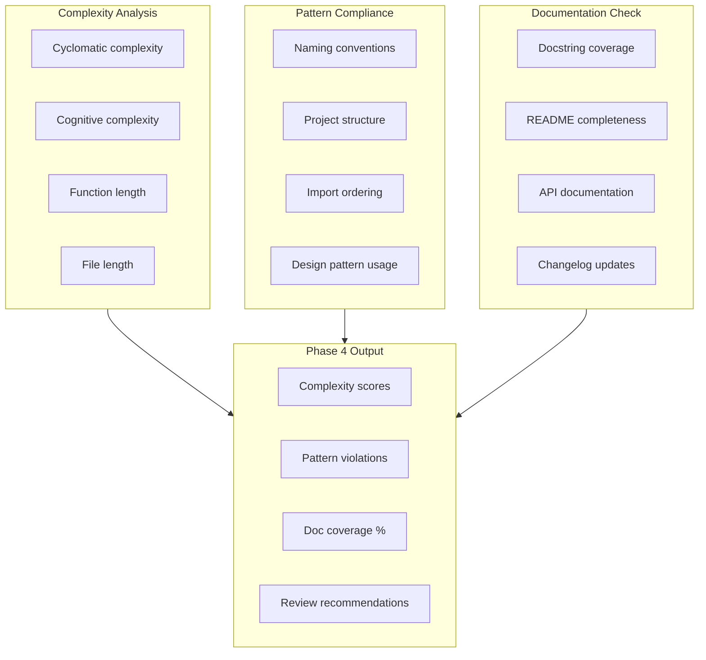

## Phase 5: Gate Decision

Aggregation and final decision:

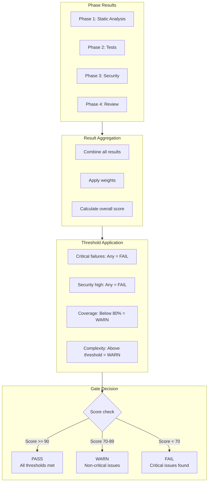

## Decision Matrix

Gate decision based on check results:

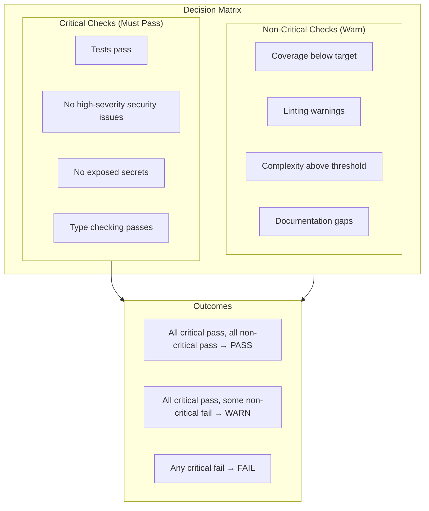

## Learning Hook Integration

How quality feedback feeds into learning:

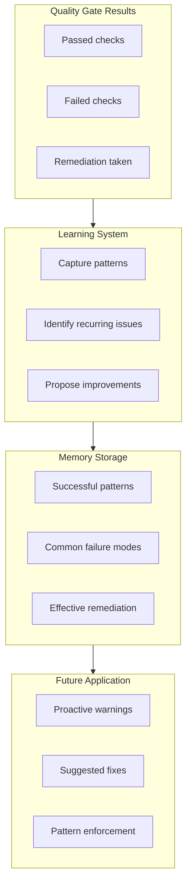

## Escalation Paths

Different failure types and their resolution:

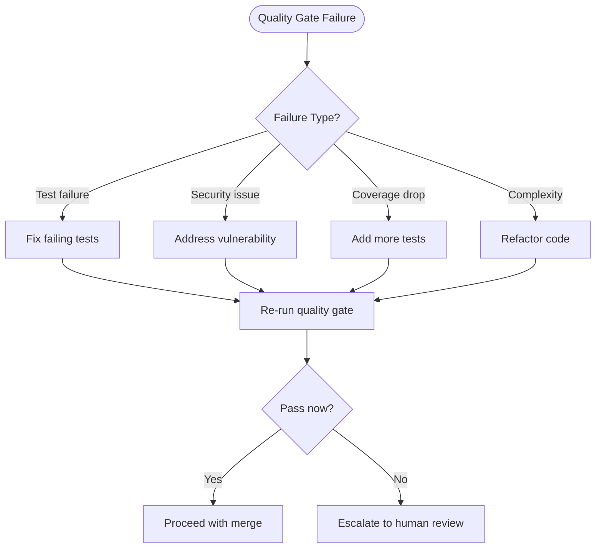

## Quality Metrics Dashboard

Key metrics tracked:

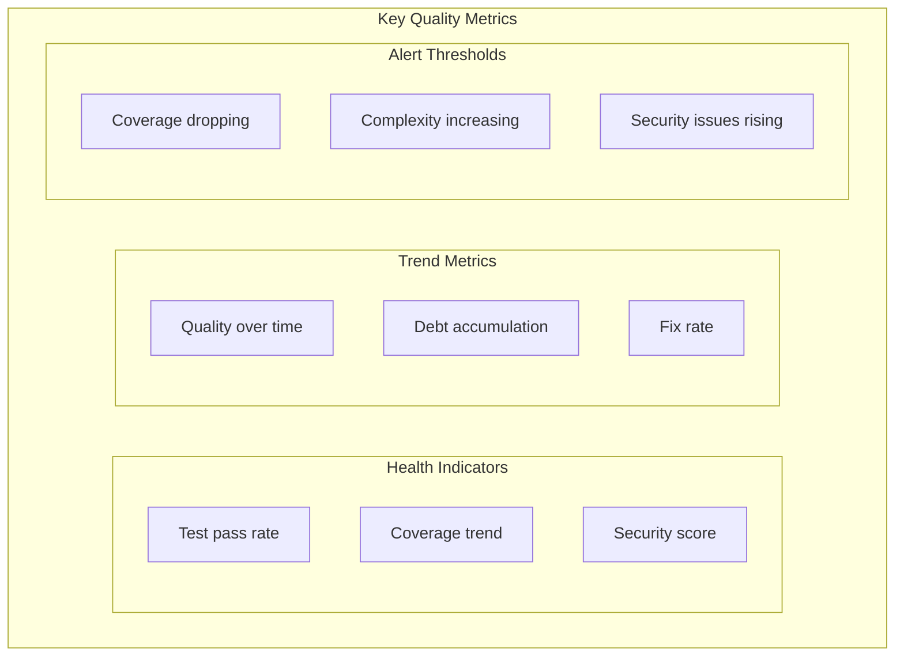

## Quality Gate Configuration

Configurable thresholds:

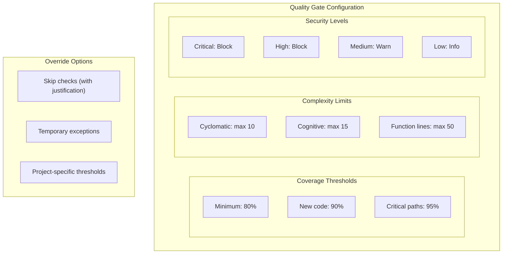

## CI/CD Integration

Quality gates in CI/CD pipeline:

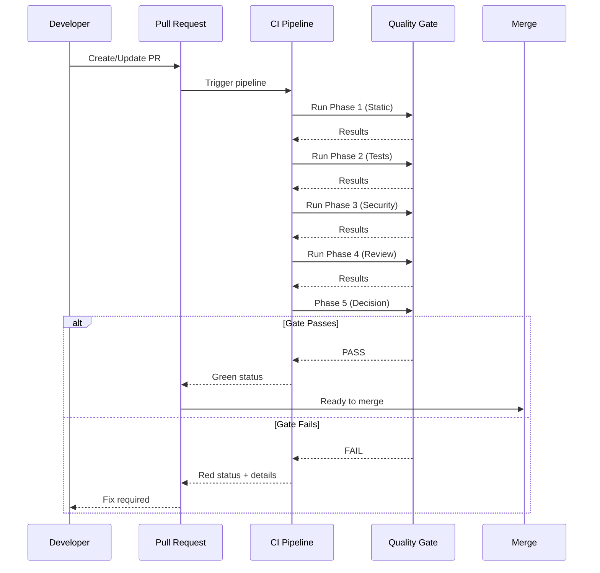

## Workflow Pattern Integration

Quality gate workflow definition:

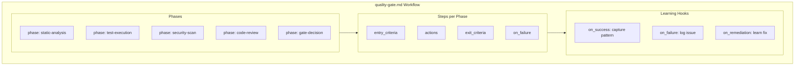
