# Security Pipeline Architecture

This document visualizes the multi-layer security validation system that protects users, their data, and system integrity.

## Quick Reference

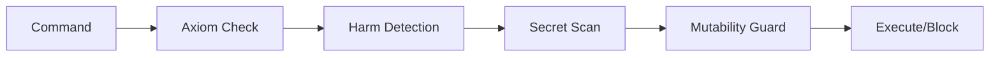

## Multi-Layer Validation Pipeline

Complete security check flow:

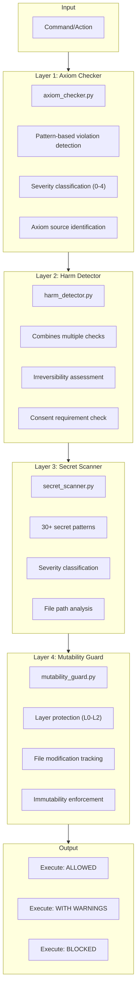

## Axiom Checker Detail

Pattern-based axiom violation detection:

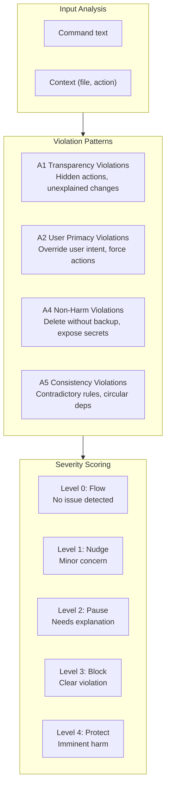

## Harm Detection System

Comprehensive harm assessment:

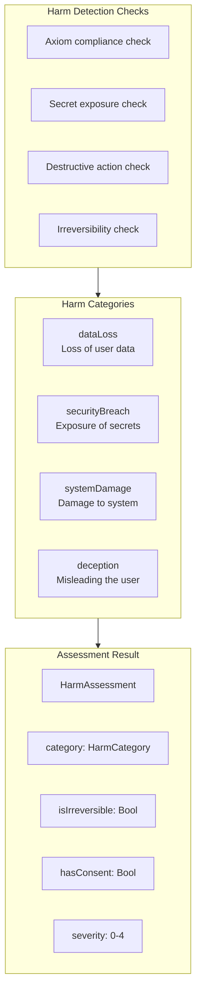

## Secret Scanner Patterns

30+ patterns for detecting exposed secrets:

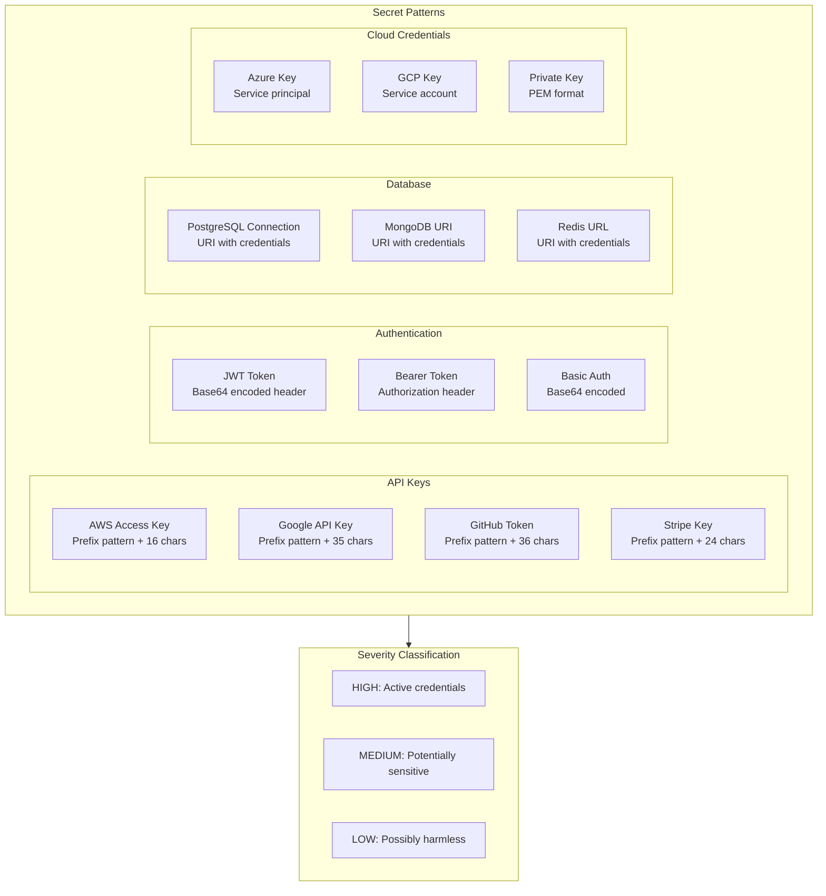

## Mutability Guard

Layer protection enforcement:

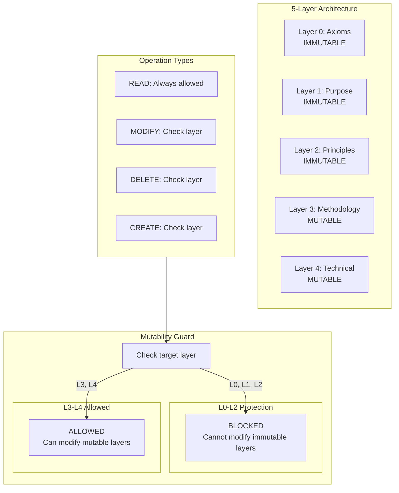

## Security Check Sequence

Complete security validation sequence:

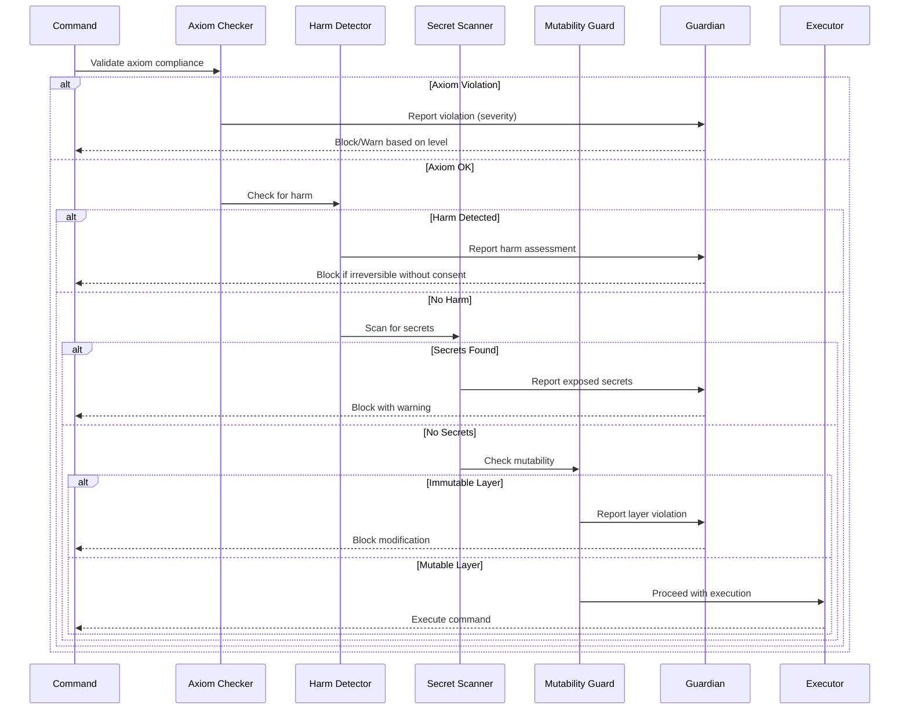

## Guardian Response Integration

How security checks integrate with Guardian response levels:

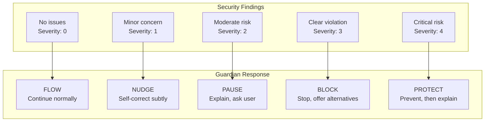

## Severity Level Classification

How severity levels are determined:

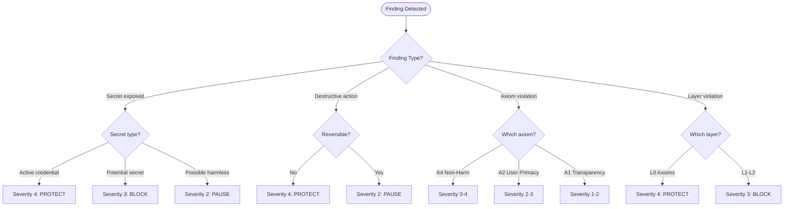

## Destructive Command Detection

Patterns for detecting dangerous commands:

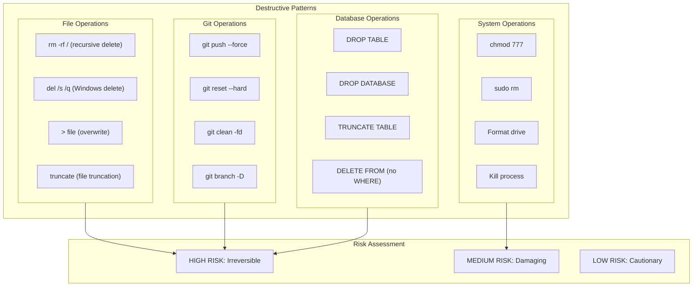

## File Path Analysis

Security considerations for file paths:

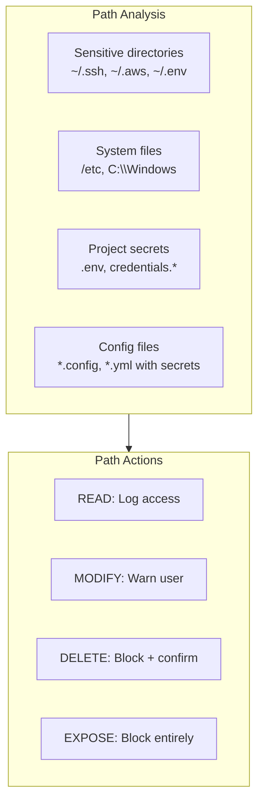

## Security Event Logging

How security events are recorded:

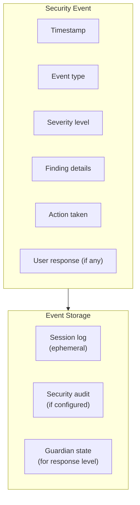

## Consent Flow for Risky Actions

How user consent is obtained:

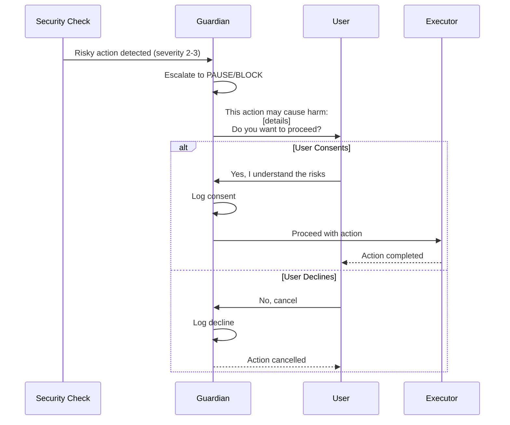

## Security Pipeline Configuration

How security checks can be configured:

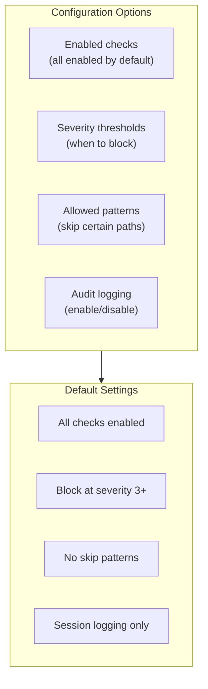
