# Template Generation Pipeline

This document visualizes the template discovery, context building, and rendering process that generates project artifacts.

## Quick Reference

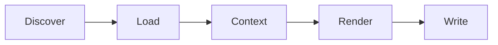

## Template Pipeline Overview

Complete template generation flow:

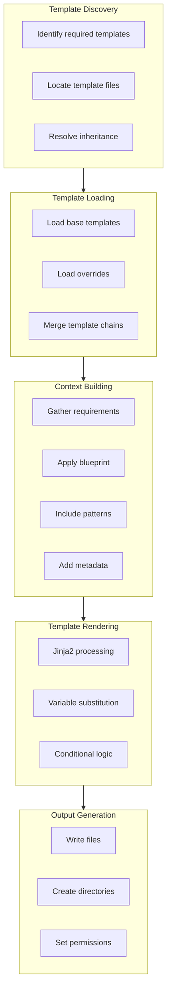

## Template Discovery Flow

How templates are located:

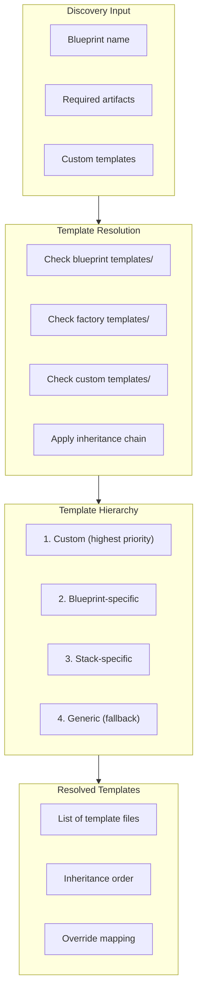

## Template Directory Structure

Organization of templates:

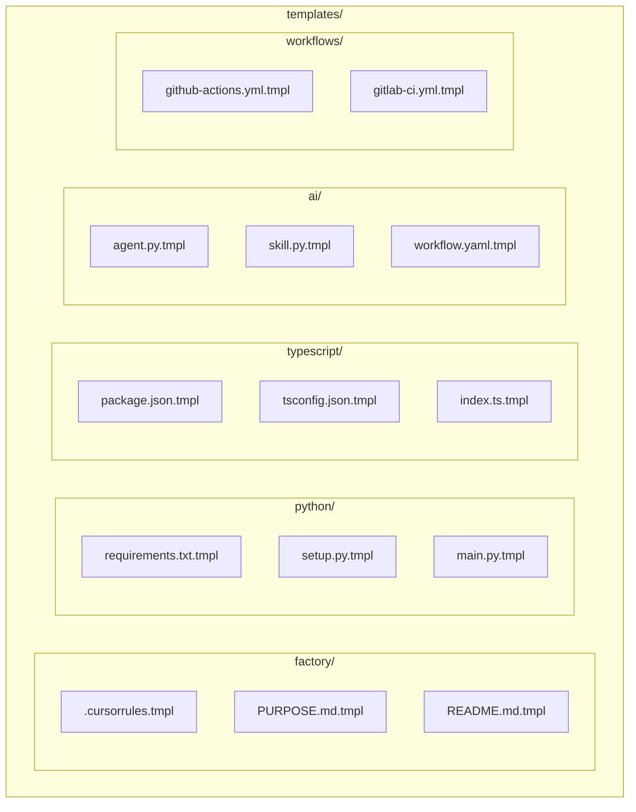

## Context Building Process

How rendering context is assembled:

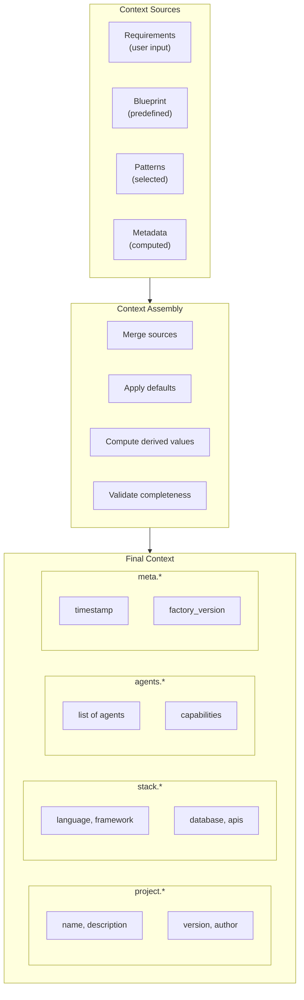

## Jinja Rendering Process

Template processing details:

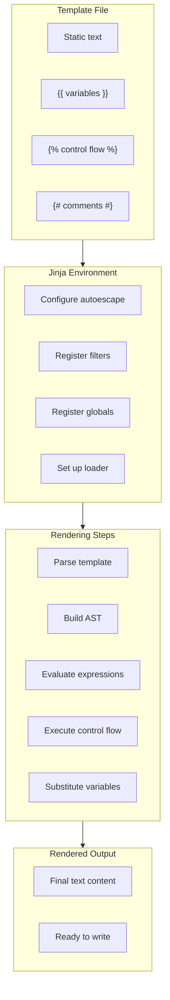

## Variable Resolution Chain

Where variables come from:

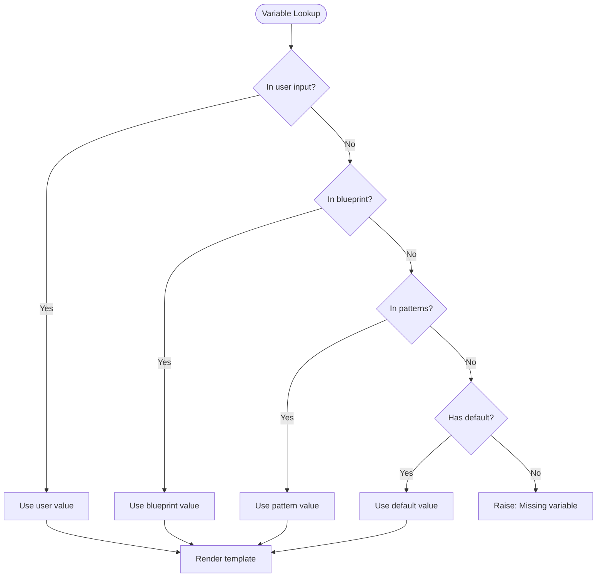

## Multi-Template Orchestration

How multiple templates are coordinated:

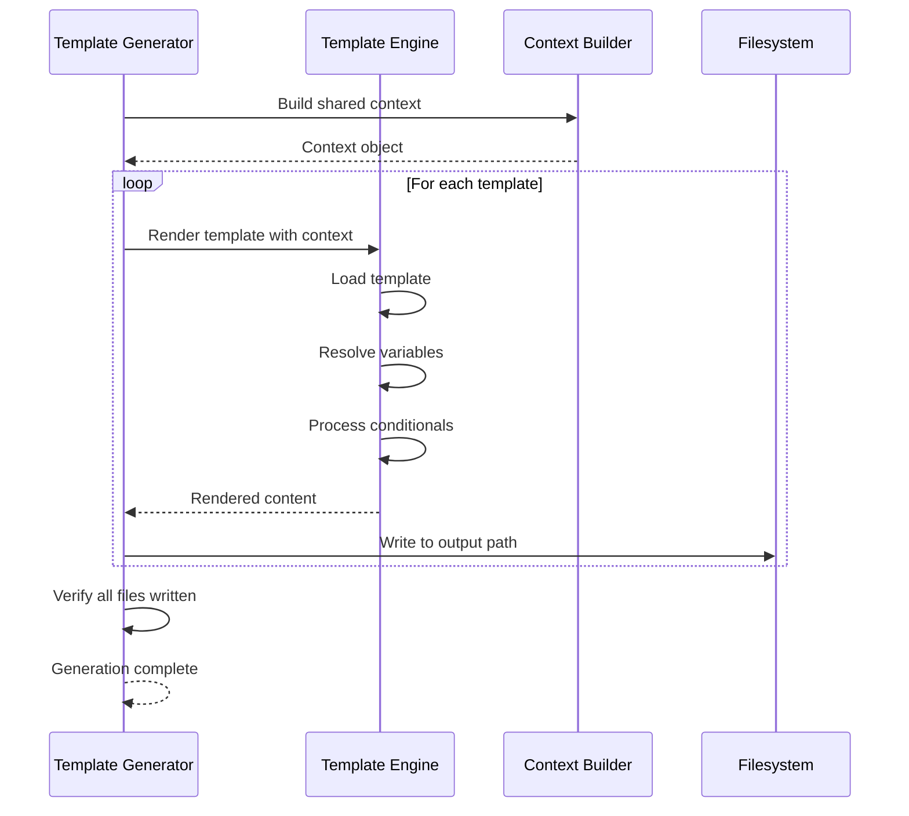

## Template Inheritance

How templates extend each other:

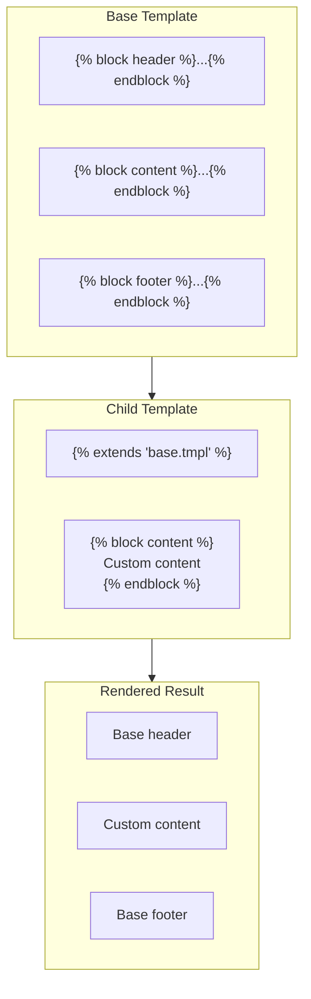

## Conditional Template Logic

How conditionals work in templates:

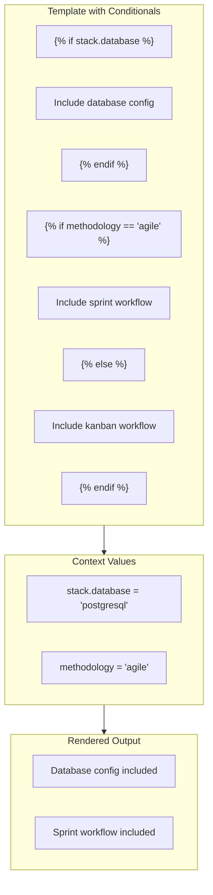

## Custom Jinja Filters

Available custom filters:

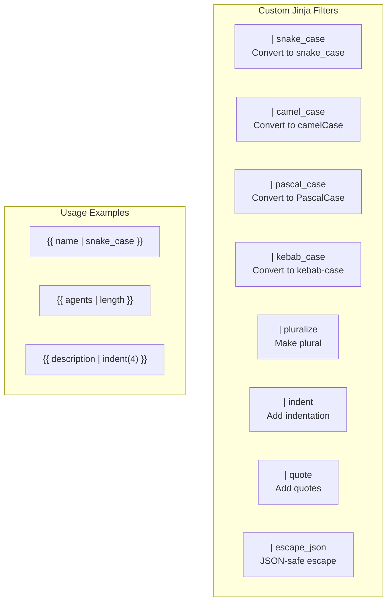

## Template Engine Configuration

How the template engine is configured:

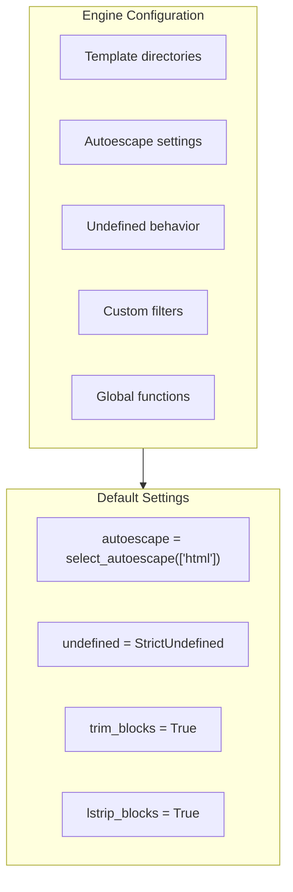

## File Writing Process

How rendered content is written:

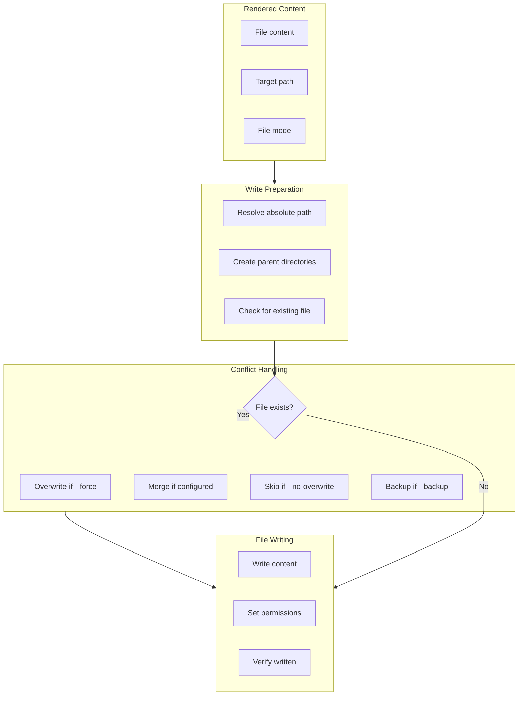

## Template Batch Processing

Processing multiple templates efficiently:

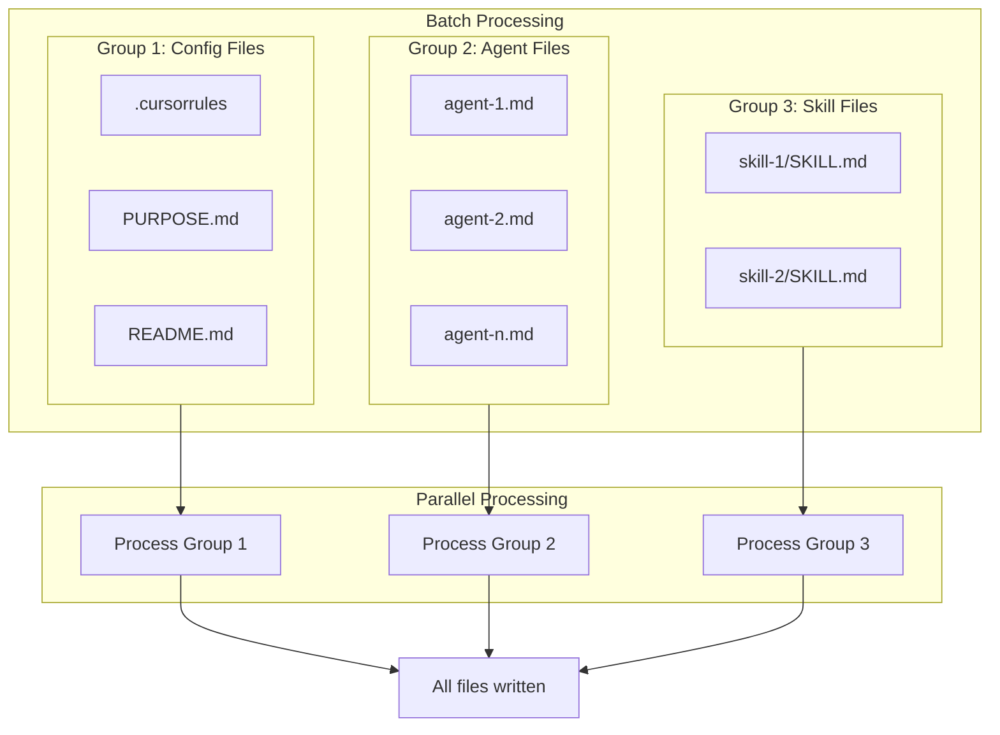

## Template Validation

Pre-render validation:

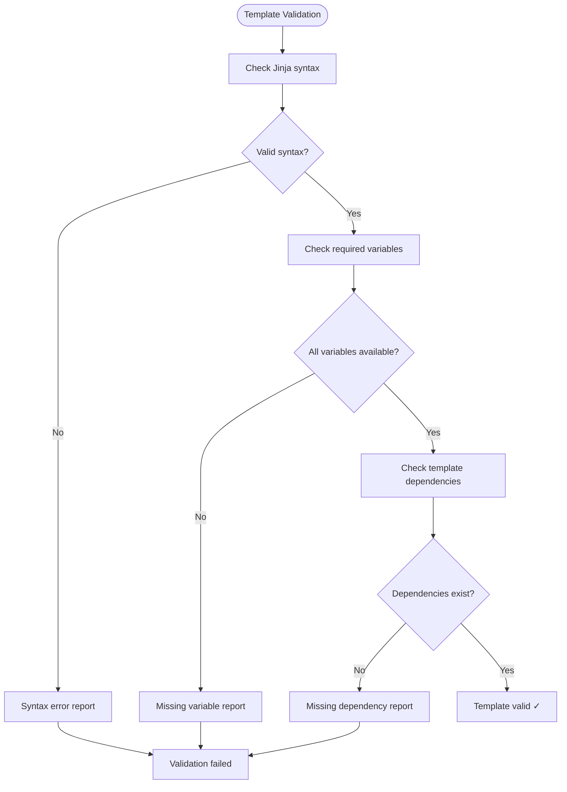
