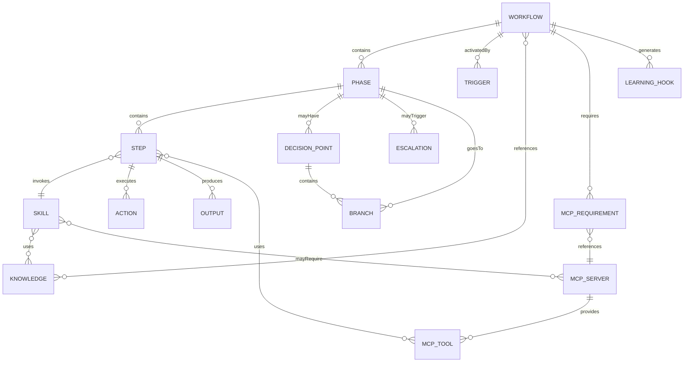
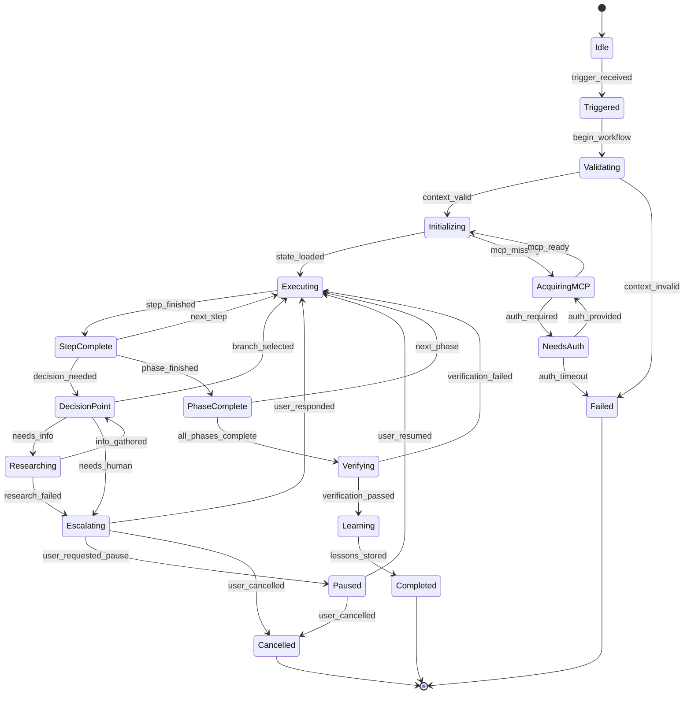
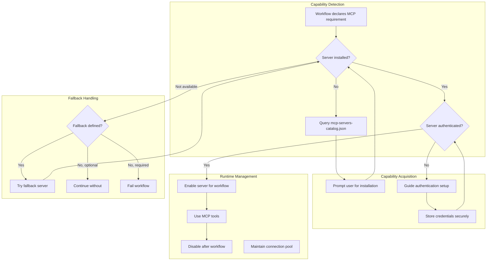
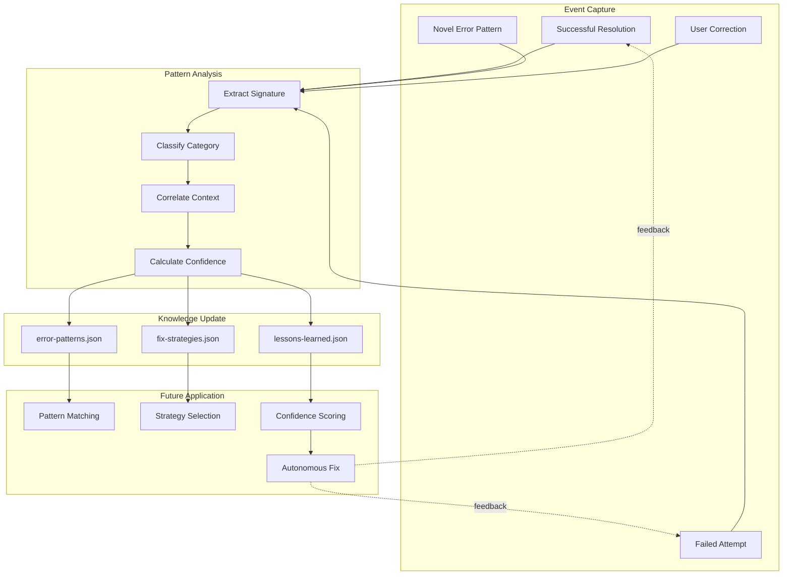
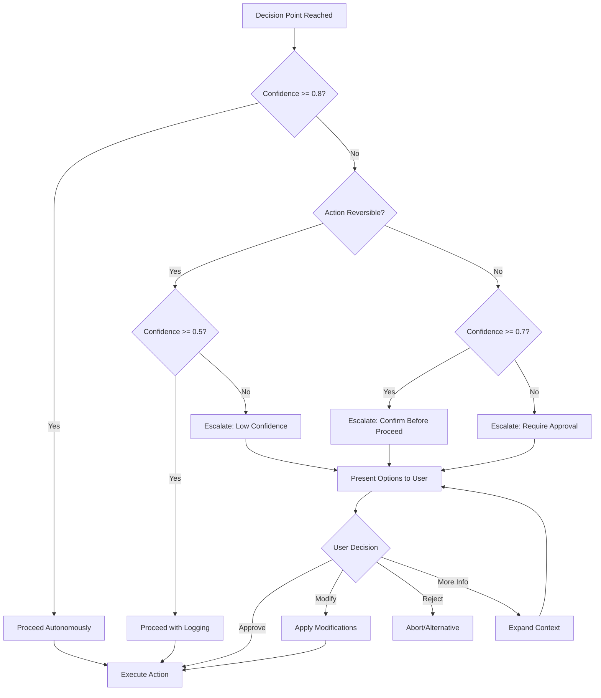
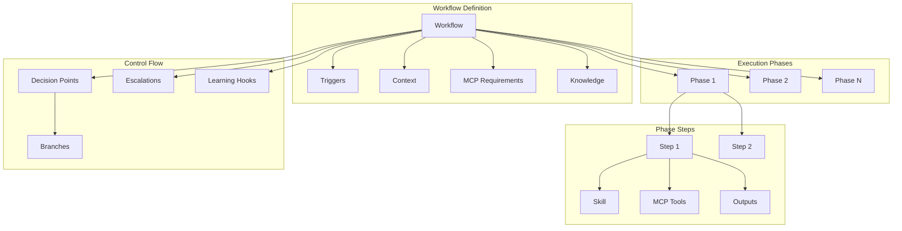
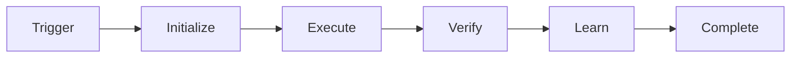
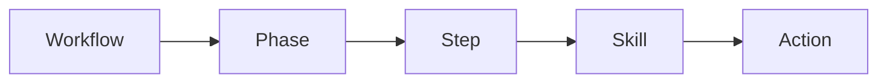
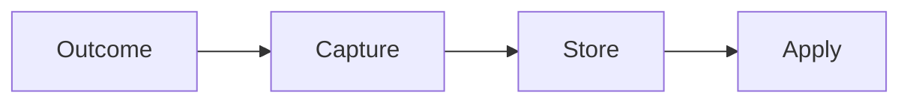

# Workflow System Architecture Diagrams

This document contains the architectural diagrams for the Cursor Agent Factory Workflow System.

## Entity Relationship Diagram

Shows how workflow entities relate to each other.

## Workflow Lifecycle State Machine

Shows all possible states and transitions during workflow execution.

## MCP Server Orchestration Flow

Shows how workflows dynamically acquire and manage MCP server capabilities.

## Learning Loop Architecture

Shows how workflows capture and apply learnings for continuous improvement.

## Escalation Decision Tree

Shows how workflows decide when and how to involve humans.

## Workflow Hierarchy

Shows the structural hierarchy of workflow entities.

## Quick Reference

### Workflow Lifecycle

### Entity Flow

### Learning Flow

## Related Documents

- **WORKFLOW_SYSTEM.md** - Conceptual architecture
- **WORKFLOW_AUTHORING.md** - Authoring guide
- **w-o-r-k-f-l-o-w-patterns.md** - Pattern catalog
