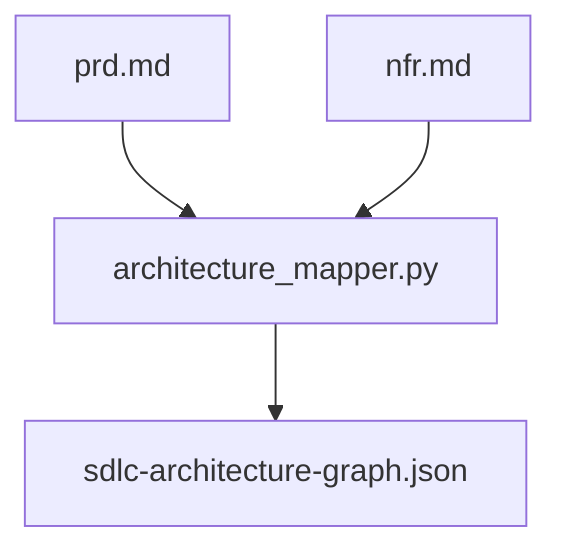

# AI System Design: AGENT-103 Architecture Implementation

## 1. Architectural Overview
- **Pattern**: Multi-Phase Orchestration (SDLC Meta-Workflow)
- **Storage**: JSON-based state tracking and relational architecture graph.
- **API Strategy**: Internal Python orchestration scripts (`scripts/orchestration/`).

## 2. Component Design
- **Agent Roles**:
  - `workflow-architect`: Responsible for system design and mapping.
  - `cognitive-cycle-engineer`: Orchestrates the transition between phases.
- **Service Interfaces**:
  - `architecture_mapper.py`: Takes PRD/NFR markdown as input, outputs JSON graph.
- **Data Flow Diagram**:


## 3. API Contracts (Draft)
```yaml
component: architecture_mapper
interface: CLI
input:
  - knowledge/prd.md
  - knowledge/nfr.md
output:
  - knowledge/sdlc-architecture-graph.json
```

## 4. Architectural Decision Records (ADRs)
- **ADR-001**: (Deprecated) Use JSON for SDLC state tracking
  - **Context**: Previously thought we needed a machine-readable format for phase transitions.
  - **Decision**: We have abandoned this pattern and deleted `docs/architecture/sdlc-architecture-spec.json` because it is not an operational location.
  - **Consequences**: We will find another place if this becomes necessary.

## 5. Phase Gate Checklist
- [x] System architecture diagrammed
- [x] API contracts specified
- [x] ADRs documented for major decisions
- [x] Knowledge Graph updated with design pointers
- [ ] Human Sign-off received
